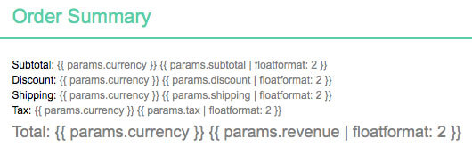
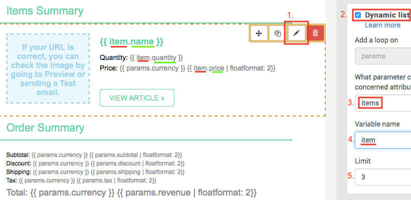
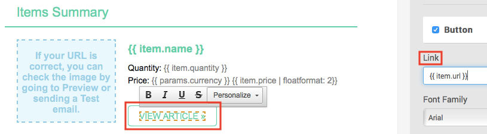
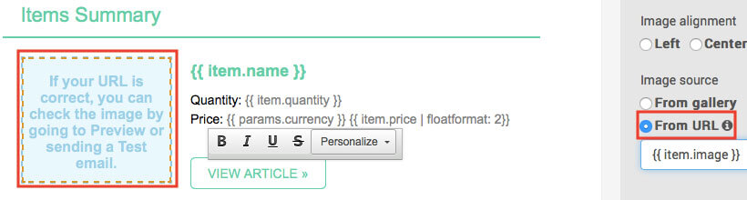
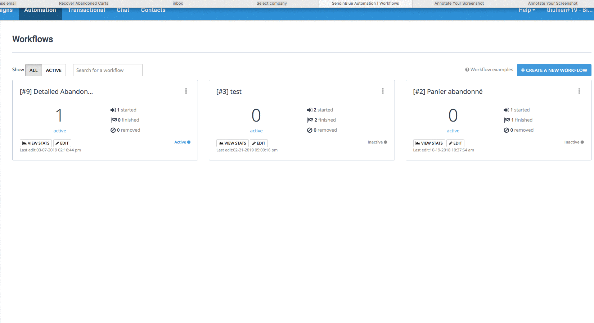
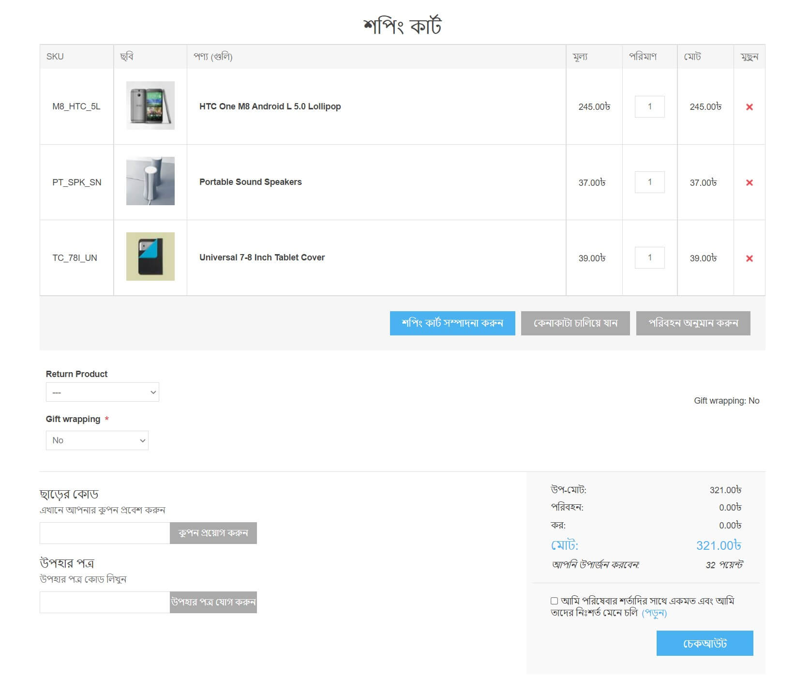
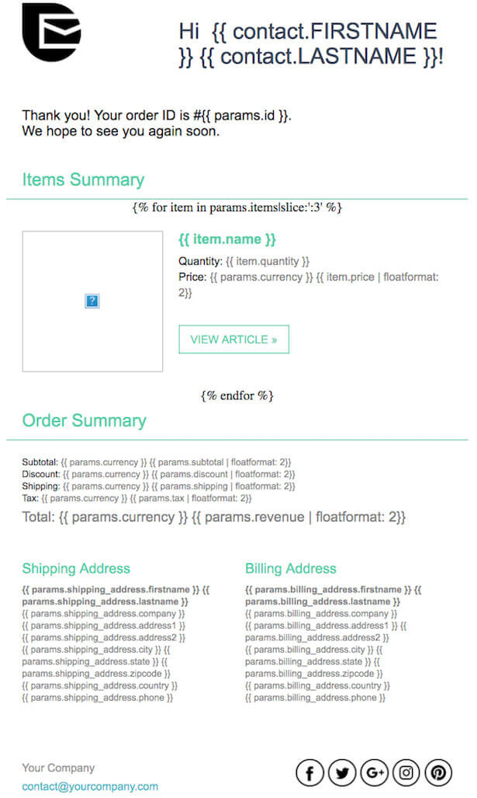
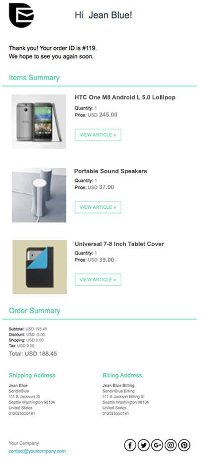

# অর্ডার কনফার্মেশন ইমেইল পাঠান

এই টিউটোরিয়ালে, আপনি শিখবেন কিভাবে অর্ডার কনফার্মেশন ইমেইল টেমপ্লেট তৈরি করতে হয় এবং ক্রেতাদের ব্যস্ত রাখতে একটি ওয়ার্কফ্লো সেট আপ করতে হয়। আপনি কোন নপকমার্স-এ অর্ডার ডেটা সেন্ডিনব্লু প্ল্যাটফর্মের সাথে সামঞ্জস্যপূর্ণ তাও শিখবেন।

## শুরু করার আগে

আপনি নিম্নলিখিত প্রয়োজন হবে:
* সেন্ডিন ব্লু অ্যাকাউন্টের শংসাপত্র। যদি আপনার না থাকে, [বিনামূল্যে সাইন আপ করুন](https://app.sendinblue.com/account/register/?utm_source=nopcommerce_plugin&utm_medium=plugin&utm_campaign=module_link)।
*নিশ্চিত করুন যে সেনডিনব্লু এর* [নতুন টেমপ্লেট ল্যাঙ্গুয়েজ](https://help.sendinblue.com/hc/en-us/articles/360000659260?utm_source=nopcommerce_plugin&utm_medium=plugin&utm_campaign=module_link) চালু আছে।
* এই [ধাপগুলি অনুসরণ করুন](xref:bn/running-your-store/promotional-tools/sendinblue-integration/set-up-sendinblue-plugin) সেনডিনব্লু প্লাগইন সেট আপ করতে।

## অর্ডার কনফার্মেশন ইমেইল টেমপ্লেট তৈরি করুন

প্রথমে আপনার সেনডিনব্লু অ্যাকাউন্টে লগ ইন করুন তারপর অটোমেশন প্ল্যাটফর্ম> [ইমেইল টেমপ্লেট](https://my.sendinblue.com/camp/lists/template?utm_source=nopcommerce_plugin&utm_medium=plugin&utm_campaign=module_link) এ যান। উপরের ডানদিকে **নতুন টেমপ্লে** বাটনে ক্লিক করুন।

ইমেল টেমপ্লেটটি বিভিন্ন ধরণের ডেটা দিয়ে ব্যক্তিগতকৃত করা যেতে পারে:
* [আপনার সেনডিনব্লু তালিকায় সংরক্ষিত যোগাযোগের বৈশিষ্ট্য](#personalize-your-email-with-contact-attributes)
* [অর্ডার বিবরণী](#personalize-your-email-with-the-order-details)
* [অর্ডারকৃত আইটেমের বিবরণ](#personalize-your-email-with-the-ordered-items-details)

### যোগাযোগের বৈশিষ্ট্যগুলির সাথে আপনার ইমেল ব্যক্তিগতকৃত করুন

আসুন [পরিচিতি বৈশিষ্ট্য](https://help.sendinblue.com/hc/en-us/articles/360001008200?utm_source=nopcommerce_plugin&utm_medium=plugin&utm_campaign=module_link) দিয়ে ব্যক্তিগতকরণ করে শুরু করা যাক।

নীচের উদাহরণে, আমরা একটি ব্যক্তিগতকরণ অন্তর্ভুক্ত করেছি:

* {{contact.FIRSTNAME}} ব্যবহার করে প্রাপকের প্রথম নাম
* {{contact.LASTNAME}} ব্যবহার করে প্রাপকের শেষ নাম

> [!NOTE]
> FIRSTNAME এবং LASTNAME আপনার Sendinblue অ্যাকাউন্টে বিদ্যমান বৈশিষ্ট্য থাকা উচিত।

### অর্ডারের বিবরণ সহ আপনার ইমেল ব্যক্তিগতকৃত করুন

নিম্নোক্ত ভেরিয়েবলগুলি সরাসরি আপনার Sendinblue টেমপ্লেট বিষয়বস্তুর মধ্যে অন্তর্ভুক্ত করা যেতে পারে:

| অর্ডার ডেটা | শিপিং ঠিকানা তথ্য | বিলিং ঠিকানা তথ্য |
| ------------- | ------------- | ------------- |
| {{params.affiliation}} | {{params.shipping.firstname}} | {{params.billing.firstname}} |
| {{params.currency}} | {{params.shipping.lastname}} | {{params.billing.lastname}} |
| {{params.date}} | {{params.shipping.company}} | {{params.billing.company}} |
| {{params.discount}} | {{params.shipping.phone}} | {{params.billing.phone}} |
| {{params.id}} | {{params.shipping.address1}} | {{params.billing.address1}} |
| {{params.revenue}} | {{params.shipping.address2}} | {{params.billing.address2}} |
| {{params.shipping}} | {{params.shipping.city}} | {{params.billing.city}} |
| {{params.subtotal}} | {{params.shipping.country}} | {{params.billing.country}} |
| {{params.tax}} | {{params.shipping.state}} | {{params.billing.state}} |
| {{params.total_before_tax}} | {{params.shipping.zipcode}} | {{params.billing.zipcode}} |
| {{params.url}} |

*ড্র্যাগ অ্যান্ড ড্রপ এডিটর* এ, আপনার পছন্দসই ব্লকটি নির্বাচন করুন যা অর্ডারের তথ্য প্রদর্শন করবে, তারপর আপনার ভেরিয়েবল যুক্ত করুন।

আমরা [floatformat](https://help.sendinblue.com/hc/en-us/articles/360000268730?utm_source=nopcommerce_plugin&utm_medium=plugin&utm_campaign=module_link#numbers) ব্যবহার করে সংখ্যা বিন্যাস করার সুপারিশ করি। নীচের উদাহরণে, আমরা যোগ করেছি:

* `{{params.currency | floatformat: 2}} ` - অর্ডারের মুদ্রা
* {{{params.subtotal | floatformat: 2}} ` - অর্ডারের উপ -মোট
* {{{params.discount | floatformat: 2}} ` - অর্ডারের ছাড়
* `{{params.total | floatformat: 2}} ` - অর্ডারের মোট

এখন আসুন অর্ডারকৃত আইটেম সহ ইমেল টেমপ্লেটকে ব্যক্তিগতকৃত করি। এটি করার জন্য, আমরা একটি নতুন টেমপ্লেট ভাষা ব্যবহার করছি [একটি গতিশীল তালিকা সন্নিবেশ করান](https://help.sendinblue.com/hc/en-us/articles/360000887379-Inserting-a-dynamic-list-in-the-Drag-Drop-editor-NEW-?utm_source=nopcommerce_plugin&utm_medium=plugin&utm_campaign=module_link)।

### অর্ডারকৃত আইটেমের বিবরণ দিয়ে আপনার ইমেল ব্যক্তিগতকৃত করুন

আপনার Sendinblue টেমপ্লেট বিষয়বস্তুর মধ্যে একটি গতিশীল তালিকা থেকে নিম্নলিখিত ভেরিয়েবলগুলি সরাসরি অন্তর্ভুক্ত করা যেতে পারে:

| আইটেম তথ্য | আপনার টেমপ্লেটে এই স্থানধারকটি সন্নিবেশ করান |
| ------------- | ------------- |
| নাম | {{item.name}} |
| এসকেইউ | {{item.sku}} |
| বিভাগ | {{item.category}} |
| আইডি | {{item.id}} |
| আইটেম বৈচিত্রের আইডি | {{item.variant_id}} |
| আইটেমের ভিন্নতার নাম | {{item.variant_name}} |
| মূল্য | {{item.price}} |
| পরিমাণ | {{item.quantity}} |
| কেনা আইটেমের স্টোরফ্রন্ট লিঙ্ক | {{item.url}} |
| ছবি | {{item.image}} |

*ড্র্যাগ অ্যান্ড ড্রপ এডিটর* এ, আপনার পছন্দসই ব্লকটি নির্বাচন করুন যা অর্ডারকৃত আইটেম প্রদর্শন করবে।

১। ডিজাইন ব্লকের সেটিংস সম্পাদনা করতে **পেন্সিল আইকন** এ ক্লিক করুন।

২। **গতিশীল তালিকা** বিকল্পটি সক্ষম করুন।

৩। **প্যারামিটার** ফিল্ডে, 'আইটেমস' লিখুন।

৪। **পরিবর্তনশীল** ক্ষেত্রের মধ্যে, `আইটেম` লিখুন।

৫। প্রদর্শিত আইটেমের সংখ্যার সীমা নির্ধারণ করুন। উদাহরণস্বরূপ, যদি ৫ টি আইটেম থাকে এবং আপনি ৩ টি সীমা হিসাবে সেট করেন তবে কেবল ৩ টি আইটেম ইমেলটিতে দেখানো হবে।

এখন আপনার ইমেইল টেমপ্লেটে ভেরিয়েবল যোগ করুন। উপরের উদাহরণে, আমরা যোগ করেছি:
* `{{item.name}}` - আইটেমের নাম
* `{{item.quantity}}` - - আইটেমের পরিমাণ
* `{{item.price | floatformat: 2}} ` - আইটেমের দাম

আইটেমের লিঙ্ক যোগ করতে, **কল-টু-অ্যাকশন (সিটিএ)** বাটন নির্বাচন করুন। ডান সাইডবারে, *লিঙ্ক* এর অধীনে, `{{item.url}} টাইপ করুন।

আইটেমের ছবি যোগ করতে, ছবিটি নির্বাচন করুন। ডান সাইডবারে, *ইমেজ সোর্স* এর অধীনে, *ইউআরএল থেকে* নির্বাচন করুন তারপর `{{item.image}} টাইপ করুন।

একবার আপনার নকশা সম্পন্ন হলে, সবুজ **সংরক্ষণ করুন এবং ছেড়ে যান** বোতামে ক্লিক করুন। তারপর **সংরক্ষণ করুন এবং সক্রিয় করুন** বাটনে ক্লিক করুন।

## অর্ডার কনফার্মেশন ওয়ার্কফ্লো তৈরি করা

> [!NOTE]
> একটি গ্রাহককে তার ইমেইল ঠিকানা দ্বারা চিহ্নিত করতে হবে কর্মপ্রবাহকে ট্রিগার করার জন্য, যেমন একজন গ্রাহককে আপনার নপকমার্স দোকানে তাদের অ্যাকাউন্টে লগ ইন করতে হবে অথবা চেকআউটের সময় তাদের ইমেল ঠিকানা ইনপুট করতে হবে।

আপনার Sendinblue অ্যাকাউন্টের [অটোমেশন](https://automation.sendinblue.com/?utm_source=nopcommerce_plugin&utm_medium=plugin&utm_campaign=module_link) ট্যাবে যান।

**+একটি নতুন ওয়ার্কফ্লো তৈরি করুন** এ ক্লিক করুন, তারপর **পণ্য ক্রয়** নির্বাচন করুন এবং ধাপগুলি অনুসরণ করুন।

১। **ধাপ ১/৩** - একটি ঘটনা ঘটে

* *নির্বাচন করুন* কাস্টম ইভেন্ট (ট্র্যাক ইভেন্ট)। টাইপ করুন `order_completed`।
**পরবর্তী** এ ক্লিক করুন।
২। **ধাপ ২/৩** - একটি বিলম্ব যোগ করুন

* একটি বিলম্ব চয়ন করুন উদাহরণস্বরূপ ৫ সেকেন্ড।
**পরবর্তী** এ ক্লিক করুন।
৩। **ধাপ ৩/৩** - একটি ইমেইল পাঠান

* ড্রপডাউন তালিকা থেকে, আপনি যে ইমেল টেমপ্লেটটি তৈরি করেছেন এবং সক্রিয় করেছেন তা নির্বাচন করুন।
* চেক করুন **ইমেইল কাস্টমাইজ করতে আমার ইভেন্ট ডেটা ব্যবহার করুন**।
* নির্বাচন করুন **ইভেন্ট ডেটা যা ওয়ার্কফ্লোকে ট্রিগার করে**।
**ফিনিশ** এ ক্লিক করুন।

খন আপনার ওয়ার্কফ্লো সম্পূর্ণ হয়, সেভ এবং অ্যাক্টিভেট করতে **সম্পন্ন** এ ক্লিক করুন।

## উদাহরণ

ধরা যাক গ্রাহক জিন ব্লু jean.blue@sendinblue.com আপনার দোকান থেকে নিম্নলিখিত ৩ টি জিনিস কিনেছে।

আপনার টেমপ্লেটটি দেখতে এইরকম হবে:

জিন ব্লু দ্বারা প্রাপ্ত ইমেল jean.blue@sendinblue.com এর মত দেখতে হবে:

## আরো জানুন
* [পরিত্যক্ত কার্টগুলি পুনরুদ্ধার করুন](xref:bn/running-your-store/promotional-tools/sendinblue-integration/recover-abandoned-carts)
