# সেন্ডিনব্লু প্লাগইন সেট আপ করুন

এই বিভাগে বর্ণনা করা হয়েছে কিভাবে আপনার দোকানে সেন্ডিনব্লু সংহত করা যায়।

## প্লাগইনটি ইনস্টল করুন এবং সক্ষম করুন

সেন্ডিনব্লু প্লাগইনটি একটি আউট অফ দ্য বক্স নপকমার্স-এ প্লাগইন। আপনি এটি এখানে খুঁজে পেতে পারেন: **কনফিগারেশন → স্থানীয় প্লাগইন**। প্লাগইনটি দ্রুত খুঁজে পেতে সার্চ প্যানেলে **গ্রুপ** ফিল্ড ব্যবহার করে প্লাগইনগুলিকে *বিবিধ* টাইপ দ্বারা ফিল্টার করুন:
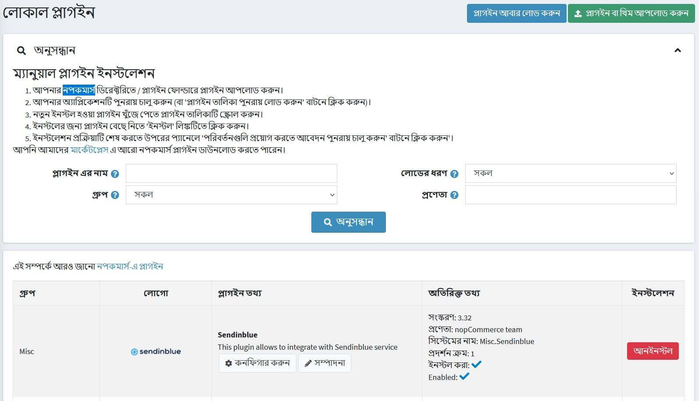

প্লাগইনটি ইনস্টল করুন যদি এটি আনইনস্টল হয় তবে **ইনস্টল করুন** বোতামটি ব্যবহার করুন। তারপরে **সম্পাদনা** বাটনে ক্লিক করে এটি সক্ষম করুন। আপনি এই ক্ষেত্রে *এডিট প্লাগইন ডিটেইলস* উইন্ডো দেখতে পাবেন। **সক্ষম হয়েছে** চেকবক্স ব্যবহার করে প্লাগইনটি সক্ষম হিসাবে চিহ্নিত করুন এবং **সংরক্ষণ** বাটনে ক্লিক করুন।

## কিভাবে প্লাগইন কনফিগার করতে হয়

১। **কনফিগার করুন** বাটনে ক্লিক করুন। আপনি দেখতে পাবেন *কনফিগার করুন - সেন্ডিনব্লু* উইন্ডো:
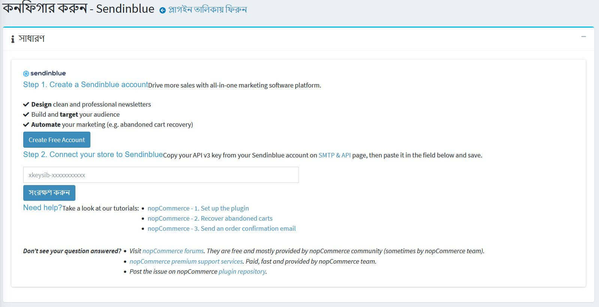

২। আপনাকে [এই লিঙ্ক](https://app.sendinblue.com/account/login/?utm_source=nopcommerce_plugin&utm_medium=plugin&utm_campaign=module_link) ব্যবহার করে একটি বিনামূল্যে সেন্ডিনব্লু অ্যাকাউন্ট তৈরি করতে হবে।

৩। [এসএমটিপি এবং এপিআই](https://account.sendinblue.com/advanced/api/?utm_source=nopcommerce_plugin&utm_medium=plugin&utm_campaign=module_link) এ আপনার সেন্ডিনব্লু অ্যাকাউন্ট থেকে আপনার **এপিআই ভি৩ কী** লিখুন

৪। **সেভ** বাটনে ক্লিক করুন।

৫। একবার আপনি এটি করার পরে আপনার অ্যাকাউন্টের বিবরণ দেখতে সক্ষম হওয়া উচিত।
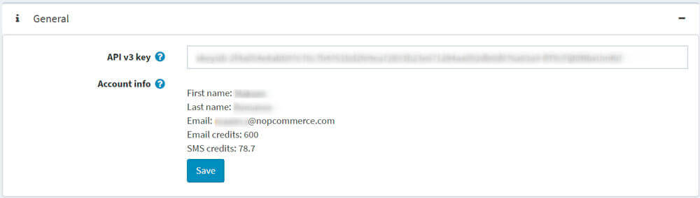

৬। আপনার নপকমার্স-এ গ্রাহকদের আপনার সেন্ডিনব্লু অ্যাকাউন্টের সাথে সিঙ্ক্রোনাইজ করতে **কন্টাক্টস** প্যানেলে যান।
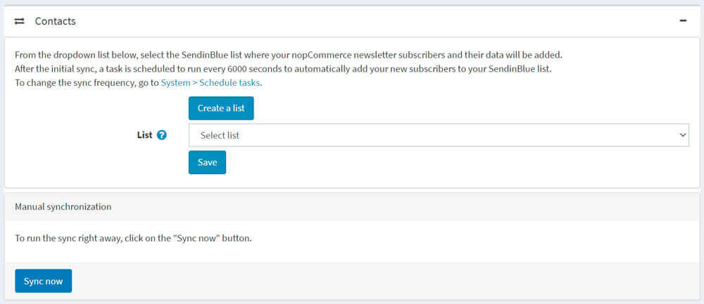

* একটি নতুন সেন্ডিনব্লু তালিকা তৈরি করতে, আপনার সেন্ডিনব্লু অ্যাকাউন্টে পুননির্দেশিত করার জন্য **একটি তালিকা তৈরি করুন** বাটনে ক্লিক করুন।
* ড্রপ-ডাউন তালিকা থেকে, সেই তালিকাটি নির্বাচন করুন যেখানে আপনার নপকমার্স-এ গ্রাহকদের পাশাপাশি তাদের যোগাযোগের তথ্য যোগ করা হবে। **সেভ** বাটনে ক্লিক করুন।

### কোন ডেটা সিঙ্ক হয়?

নিম্নলিখিত ফর্ম ক্ষেত্রগুলি যোগাযোগের বৈশিষ্ট্য হিসাবে সিঙ্ক করা হয়েছে:
* ইমেল
* নামের প্রথম অংশ
* নামের শেষাংশ
* খুদেবার্তা
* স্টোর_আইডি
* ব্যবহারকারীর নাম
* ফোন
* দেশ
* লিঙ্গ
* জন্ম তারিখ
* প্রতিষ্ঠান
* ঠিকানা ১
* ঠিকানা ২
* জিপ কোড
* শহর
* কাউন্টি
* অবস্থা
* ফ্যাক্স

> [!NOTE]
>
> সিঙ্কের জন্য, মনে রাখবেন যে এই ফর্ম ক্ষেত্রগুলি গ্রাহকদের জন্য সক্ষম করা প্রয়োজন। **কনফিগারেশন → সেটিংস → গ্রাহক সেটিংস → গ্রাহক ফর্ম ক্ষেত্র** এ যান।

অর্ডার ডেটা লেনদেনের বৈশিষ্ট্য হিসাবে সিঙ্ক করা হয়:
* ORDER_ID: অর্ডারের আইডি
* ORDER_PRICE: অর্ডারের পরিমাণ
* ORDER_DATE: অর্ডারের তারিখ

> [!NOTE]
>
> অর্ডারের পেমেন্ট স্ট্যাটাস পেমেন্ট করার সময় অর্ডার সিঙ্ক্রোনাইজ করা হয়।

### পরিচিতিগুলি কতবার সিঙ্ক হয়?

প্রাথমিক সিঙ্কের পরে, আপনার নতুন গ্রাহকদের স্বয়ংক্রিয়ভাবে আপনার সেন্ডিনব্লু তালিকায় যুক্ত করতে প্রতি ৬০০০ সেকেন্ডে একটি টাস্ক চালানোর পরিকল্পনা করা হয়েছে।

এখনই সিঙ্ক করার জন্য **সিঙ্ক এখন** বাটনে ক্লিক করুন।

সিঙ্ক ফ্রিকোয়েন্সি পরিবর্তন করতে, **সিস্টেম → সময়সূচী টাস্ক** এ যান।
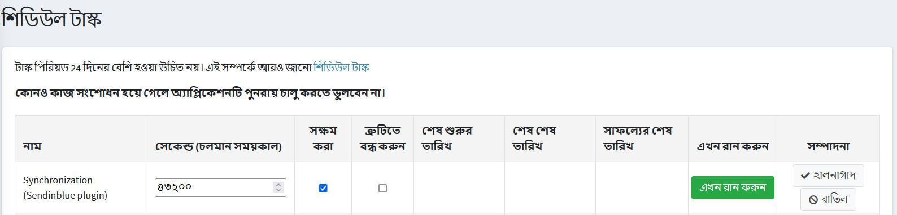

## লেনদেনের ইমেইল পাঠানো হচ্ছে

সেন্ডিনব্লু এসএমটিপি এর মাধ্যমে আপনার লেনদেনের ইমেইল পাঠানোর জন্য **লেনদেনের ইমেল** প্যানেলে যান।
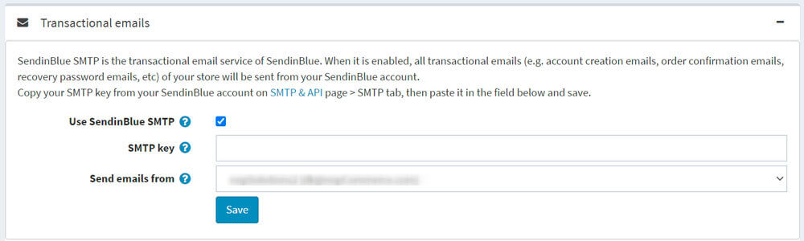

১। ব্যবহার করুন সেন্ডিনব্লু এসএমটিপি ** চেকবক্স।

২। আপনার এসএমটিপি পাসওয়ার্ড আটকান যা [এখানে] পাওয়া যাবে (https://account.sendinblue.com/advanced/api?utm_source=nopcommerce_plugin&utm_medium=plugin&utm_campaign=module_link)।

৩। ড্রপ-ডাউন তালিকা থেকে, আপনি যে ইমেল পাঠাতে চান সেই প্রেরক নির্বাচন করুন।

৪। **সেভ** বাটনে ক্লিক করুন।

আপনি তারপর ইমেল বিজ্ঞপ্তি তালিকা দেখতে সক্ষম হওয়া উচিত। এটি আপনার পাঠানো সমস্ত লেনদেনের ইমেল (অর্ডার কনফার্মেশন ইত্যাদি) তালিকাভুক্ত করে।
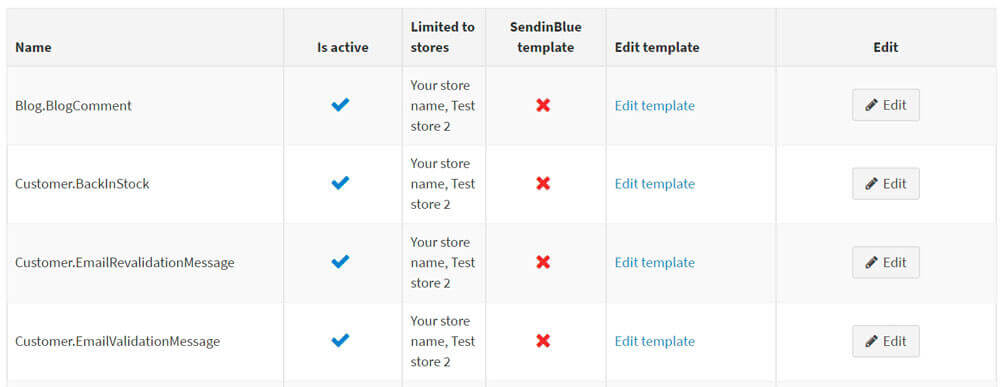

প্রতিটি টেমপ্লেটের জন্য, আপনি পারেন:
* এটি সক্রিয় বা নিষ্ক্রিয় কিনা তা চয়ন করুন।
* ডিফল্ট নপকমার্স-এ টেমপ্লেট অথবা সেন্ডিনব্লু টেমপ্লেট এর মধ্যে বেছে নিন। এটা করতে:
১। **সম্পাদনা করুন** বাটনে ক্লিক করুন

২। ড্রপডাউন থেকে, আপনার টেমপ্লেট নির্বাচন করুন

৩। ক্লিক করুন **আপডেট**
* এর বিষয়বস্তু সম্পাদনা করুন।

> [!NOTE]
>
> যদি আপনি **সেন্ডিনব্লু ইমেইল টেমপ্লেট** চেক করে থাকেন, তাহলে আপনার সেন্ডিনব্লু অ্যাকাউন্টে আপনার টেমপ্লেটের বিষয়বস্তু সম্পাদনা করতে **টেমপ্লেট সম্পাদনা করুন** এ ক্লিক করুন।
আপনি যদি **সেন্ডিনব্লু ইমেইল টেমপ্লেট** চেক না করেন, তাহলে **এডিট টেমপ্লেট** এ ক্লিক করলে আপনাকে নপকমার্স-এ অ্যাডমিন এলাকায় মেসেজ টেমপ্লেজ এডিট পেজে নিয়ে যাবে। বার্তা টেমপ্লেট সম্পাদনা প্রক্রিয়া [এখানে](xref:bn/running-your-store/content-management/message-template)  সম্পর্কে আরও পড়ুন। আপনি বিষয়বস্তু চেক করতে সেই পৃষ্ঠা থেকে একটি পরীক্ষার ইমেলও পাঠাতে পারেন। মনে রাখবেন প্রতিটি ইমেইলের জন্য একটি ইমেইল ক্রেডিট ব্যবহার করা হবে।

## এসএমএস পাঠানো

ইমেইল ছাড়াও আপনার গ্রাহকদের এসএমএস বিজ্ঞপ্তি পাঠানোর জন্য **এসএমএস** প্যানেলে যান।
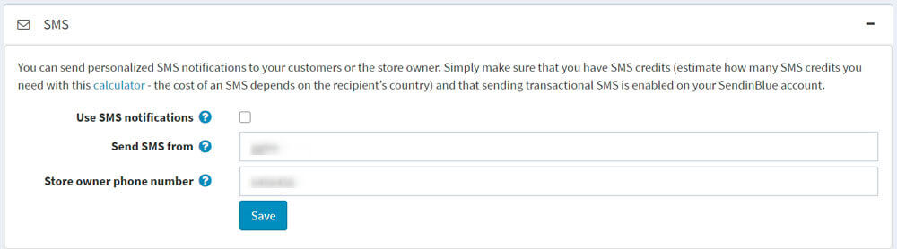

১। **এসএমএস বিজ্ঞপ্তি ব্যবহার করুন** চেকবক্স চেক করুন।

২। একটি বর্ণানুক্রমিক প্রেরক (সর্বাধিক ১১ টি অক্ষর) লিখুন।
টেলিফোন আপনার টেলিফোন নম্বর লিখুন

৩। **সেভ** বাটনে ক্লিক করুন।

একটি সেন্ডিনব্লু তালিকায় একটি এসএমএস প্রচারণা পাঠাতে:
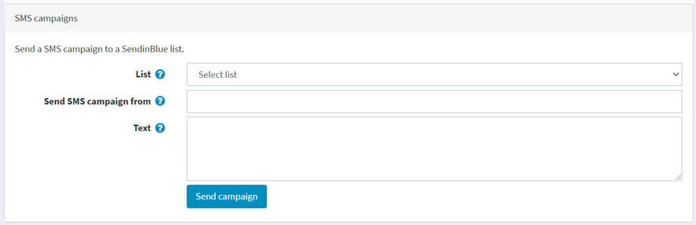

১। **এসএমএস ক্যাম্পেইন** ব্লকে যান।

২। এসএমএস ক্যাম্পেইন পাঠানোর জন্য পরিচিতির **তালিকা** বেছে নিন।

৩। **প্রেরকের নাম লিখুন** ক্ষেত্র থেকে এসএমএস ক্যাম্পেইন পাঠান। অক্ষরের সংখ্যা ১১ (আলফানিউমেরিক ফরম্যাট) -এ সীমাবদ্ধ।

৪। **টেক্সট** ফিল্ড ব্যবহার করে এসএমএস ক্যাম্পেইনের বিষয়বস্তু নির্দিষ্ট করুন। একটি বার্তার জন্য অক্ষরের সংখ্যা ১৬০ পর্যন্ত সীমাবদ্ধ।

৫। **সেভ ক্যাম্পেইন** ক্লিক করুন।

প্লাগইনটি এখন কনফিগার করা হয়েছে। আপনি সেন্ডিনব্লু থেকে সরাসরি আপনার সমস্ত লেনদেনের ইমেল পরিসংখ্যান অ্যাক্সেস করতে পারেন।

## মার্কেটিং অটোমেশন ওয়ার্কফ্লো সেট আপ করা

> [!NOTE]
>
> একটি গ্রাহককে তার ইমেইল ঠিকানা দ্বারা চিহ্নিত করতে হবে একটি কর্মপ্রবাহ ট্রিগার করার জন্য অর্থাৎ একজন গ্রাহক যিনি ননপ্যাকার্স-এ স্টোরে তাদের অ্যাকাউন্টে লগ ইন করেছেন বা চেকআউটের সময় তাদের ইমেল ঠিকানা ইনপুট করেছেন।

আপনার দোকানে ক্রেতাদের কার্যকলাপ ট্র্যাক করার জন্য মার্কেটিং অটোমেশন ট্র্যাকিং স্ক্রিপ্ট ইনস্টল করতে **মার্কেটিং অটোমেশন** প্যানেলে যান। দর্শনার্থীর সাইন আপ হয়ে গেলে, একটি সম্ভাব্য তাদের কার্ট পরিত্যাগ করে, একজন গ্রাহক কেনাকাটা করে, ইত্যাদি ইমেইল বা এসএমএস পাঠানোর মাধ্যমে আপনি আপনার বিপণনকে স্বয়ংক্রিয় করতে সক্ষম হবেন।
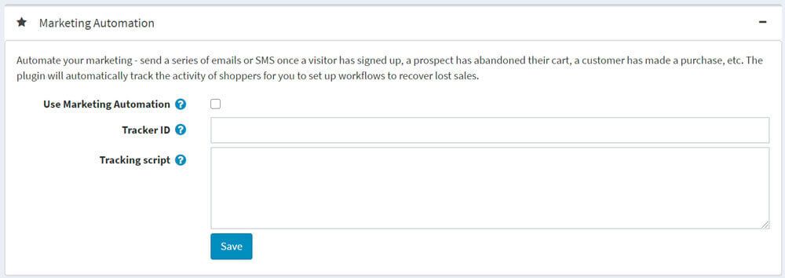

১। **ব্যবহার করুন মার্কেটিং অটোমেশন** চেকবক্স।

২। যদি আপনার সেন্ডিনব্লু অ্যাকাউন্টে *মার্কেটিং অটোমেশন প্ল্যাটফর্ম* চালু থাকে, তাহলে প্লাগইনটি আপনার **ট্র্যাকার আইডি** স্বয়ংক্রিয়ভাবে পূরণ করবে।

৩। সেন্ডিনব্লু দ্বারা তৈরি ট্র্যাকিং স্ক্রিপ্টটি **ট্র্যাকিং স্ক্রিপ্ট** ফিল্ডে আটকান। {TRACKING_ID} এবং {CUSTOMER_EMAIL} গতিশীলভাবে প্রতিস্থাপিত হবে।

৪। নিশ্চিত করুন যে সেন্ডিনব্লু উইজেটটি **কনফিগারেশন → উইজেটস** পৃষ্ঠায় সক্রিয় করা আছে।

৫। **সেভ** বাটনে ক্লিক করুন।

একবার মার্কেটিং অটোমেশন চালু হয়ে গেলে এবং সঠিকভাবে কাজ করলে, আপনি আপনার সেন্ডিনব্লু অ্যাকাউন্টে **অটোমেশন → লগস → ইভেন্ট লগস** এর অধীনে নিম্নলিখিত লগগুলি পাবেন:

* পৃষ্ঠা
* চিহ্নিত করুন
* ট্র্যাক ইভেন্ট

প্লাগইনটি স্বয়ংক্রিয়ভাবে ক্রেতাদের ক্রিয়াকলাপ ট্র্যাক করবে যাতে আপনি হারানো বিক্রয় পুনরুদ্ধার করতে এবং নিশ্চিতকরণ কর্মপ্রবাহ পুনরুদ্ধারের জন্য ওয়ার্কফ্লো সেট আপ করতে পারেন। ৩ টি ট্র্যাক ইভেন্ট পাস হয়েছে:

* cart_updated পাস করা হয় যখন একটি আইটেম একটি কার্ট যোগ করা হয়।
* cart_deleted পাস করা হয় যখন একটি কার্ট খালি করা হয়।
* অর্ডার করা হলে অর্ডার সম্পন্ন হয়। এর অর্থ হল পেমেন্ট স্ট্যাটাস "পেইড"।
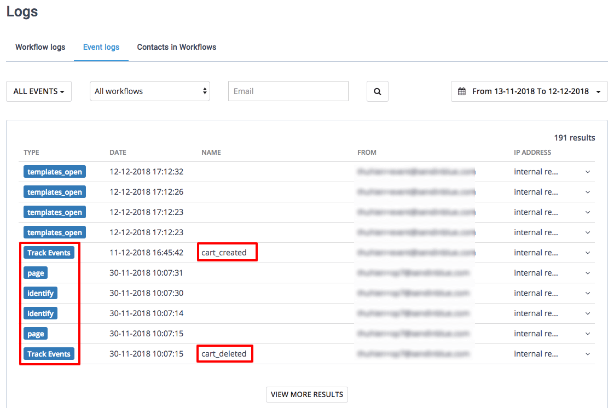

## আরো জানুন

* কীভাবে [একটি পরিত্যক্ত কার্ট ইমেল তৈরি করতে হয়](xref:bn/running-your-store/promotional-tools/sendinblue-integration/recover-abandoned-carts)জানুন।
* কীভাবে [অর্ডার কনফার্মেশন ইমেল তৈরি করতে হয়](xref:bn/running-your-store/promotional-tools/sendinblue-integration/send-an-order-confirmation-email)জানুন।

প্রতিটি টেমপ্লেটের জন্য, আপনি পারেন:
* এটি সক্রিয় বা নিষ্ক্রিয় কিনা তা চয়ন করুন।
* ডিফল্ট নপকমার্স-এ টেমপ্লেট অথবা সেন্ডিনব্লু টেমপ্লেট এর মধ্যে বেছে নিন। এটা করতে:
১। **সম্পাদনা করুন** বাটনে ক্লিক করুন

২। ড্রপডাউন থেকে, আপনার টেমপ্লেট নির্বাচন করুন

৩। ক্লিক করুন **আপডেট**
* এর বিষয়বস্তু সম্পাদনা করুন।

> [!NOTE]
>
> যদি আপনি **সেন্ডিনব্লু ইমেইল টেমপ্লেট** চেক করে থাকেন, তাহলে আপনার সেন্ডিনব্লু অ্যাকাউন্টে আপনার টেমপ্লেটের বিষয়বস্তু সম্পাদনা করতে **টেমপ্লেট সম্পাদনা করুন** এ ক্লিক করুন।
আপনি যদি **সেন্ডিনব্লু ইমেইল টেমপ্লেট** চেক না করেন, তাহলে **এডিট টেমপ্লেট** এ ক্লিক করলে আপনাকে নপকমার্স-এ অ্যাডমিন এলাকায় মেসেজ টেমপ্লেজ এডিট পেজে নিয়ে যাবে। বার্তা টেমপ্লেট সম্পাদনা প্রক্রিয়া [এখানে](xref:bn/running-your-store/content-management/message-template)  সম্পর্কে আরও পড়ুন। আপনি বিষয়বস্তু চেক করতে সেই পৃষ্ঠা থেকে একটি পরীক্ষার ইমেলও পাঠাতে পারেন। মনে রাখবেন প্রতিটি ইমেইলের জন্য একটি ইমেইল ক্রেডিট ব্যবহার করা হবে।

## এসএমএস পাঠানো

ইমেইল ছাড়াও আপনার গ্রাহকদের এসএমএস বিজ্ঞপ্তি পাঠানোর জন্য **এসএমএস** প্যানেলে যান।

১। **এসএমএস বিজ্ঞপ্তি ব্যবহার করুন** চেকবক্স চেক করুন।

২। একটি বর্ণানুক্রমিক প্রেরক (সর্বাধিক ১১ টি অক্ষর) লিখুন।
টেলিফোন আপনার টেলিফোন নম্বর লিখুন

৩। **সেভ** বাটনে ক্লিক করুন।

একটি সেন্ডিনব্লু তালিকায় একটি এসএমএস প্রচারণা পাঠাতে:

১। **এসএমএস ক্যাম্পেইন** ব্লকে যান।

২। এসএমএস ক্যাম্পেইন পাঠানোর জন্য পরিচিতির **তালিকা** বেছে নিন।

৩। **প্রেরকের নাম লিখুন** ক্ষেত্র থেকে এসএমএস ক্যাম্পেইন পাঠান। অক্ষরের সংখ্যা ১১ (আলফানিউমেরিক ফরম্যাট) -এ সীমাবদ্ধ।

৪। **টেক্সট** ফিল্ড ব্যবহার করে এসএমএস ক্যাম্পেইনের বিষয়বস্তু নির্দিষ্ট করুন। একটি বার্তার জন্য অক্ষরের সংখ্যা ১৬০ পর্যন্ত সীমাবদ্ধ।

৫। **সেভ ক্যাম্পেইন** ক্লিক করুন।

প্লাগইনটি এখন কনফিগার করা হয়েছে। আপনি সেন্ডিনব্লু থেকে সরাসরি আপনার সমস্ত লেনদেনের ইমেল পরিসংখ্যান অ্যাক্সেস করতে পারেন।

## মার্কেটিং অটোমেশন ওয়ার্কফ্লো সেট আপ করা

> [!NOTE]
>
> একটি গ্রাহককে তার ইমেইল ঠিকানা দ্বারা চিহ্নিত করতে হবে একটি কর্মপ্রবাহ ট্রিগার করার জন্য অর্থাৎ একজন গ্রাহক যিনি ননপ্যাকার্স-এ স্টোরে তাদের অ্যাকাউন্টে লগ ইন করেছেন বা চেকআউটের সময় তাদের ইমেল ঠিকানা ইনপুট করেছেন।

আপনার দোকানে ক্রেতাদের কার্যকলাপ ট্র্যাক করার জন্য মার্কেটিং অটোমেশন ট্র্যাকিং স্ক্রিপ্ট ইনস্টল করতে **মার্কেটিং অটোমেশন** প্যানেলে যান। দর্শনার্থীর সাইন আপ হয়ে গেলে, একটি সম্ভাব্য তাদের কার্ট পরিত্যাগ করে, একজন গ্রাহক কেনাকাটা করে, ইত্যাদি ইমেইল বা এসএমএস পাঠানোর মাধ্যমে আপনি আপনার বিপণনকে স্বয়ংক্রিয় করতে সক্ষম হবেন।

১। **ব্যবহার করুন মার্কেটিং অটোমেশন** চেকবক্স।

২। যদি আপনার সেন্ডিনব্লু অ্যাকাউন্টে*মার্কেটিং অটোমেশন প্ল্যাটফর্ম*চালু থাকে, তাহলে প্লাগইনটি আপনার **ট্র্যাকার আইডি** স্বয়ংক্রিয়ভাবে পূরণ করবে।

৩। সেন্ডিনব্লু দ্বারা তৈরি ট্র্যাকিং স্ক্রিপ্টটি **ট্র্যাকিং স্ক্রিপ্ট** ফিল্ডে আটকান। {TRACKING_ID} এবং {CUSTOMER_EMAIL} গতিশীলভাবে প্রতিস্থাপিত হবে।

৪। নিশ্চিত করুন যে সেন্ডিনব্লু উইজেটটি **কনফিগারেশন → উইজেটস** পৃষ্ঠায় সক্রিয় করা আছে।

৫। **সেভ** বাটনে ক্লিক করুন।

একবার মার্কেটিং অটোমেশন চালু হয়ে গেলে এবং সঠিকভাবে কাজ করলে, আপনি আপনার সেন্ডিনব্লু অ্যাকাউন্টে *অটোমেশন → লগস → ইভেন্ট লগস *এর অধীনে নিম্নলিখিত লগগুলি পাবেন:

* পৃষ্ঠা
* চিহ্নিত করুন
* ট্র্যাক ইভেন্ট

প্লাগইনটি স্বয়ংক্রিয়ভাবে ক্রেতাদের ক্রিয়াকলাপ ট্র্যাক করবে যাতে আপনি হারানো বিক্রয় পুনরুদ্ধার করতে এবং নিশ্চিতকরণ কর্মপ্রবাহ পুনরুদ্ধারের জন্য ওয়ার্কফ্লো সেট আপ করতে পারেন। ৩ ট্র্যাক ঘটনা পাস করা হয়:

* cart_updated পাস করা হয় যখন একটি আইটেম একটি কার্ট যোগ করা হয়।
* cart_deleted পাস করা হয় যখন একটি কার্ট খালি করা হয়।
* অর্ডার করা হলে অর্ডার সম্পন্ন হয়। এর অর্থ হল পেমেন্ট স্ট্যাটাস "পেইড"।

## আরো জানুন

* কীভাবে [একটি পরিত্যক্ত কার্ট ইমেল তৈরি করতে হয়](xref:bn/running-your-store/promotional-tools/sendinblue-integration/recover-abandoned-carts) শিখুন
* কিভাবে [অর্ডার কনফার্মেশন ইমেল তৈরি করতে হয়](xref:bn/running-your-store/promotional-tools/sendinblue-integration/send-an-order-confirmation-email) শিখুন।