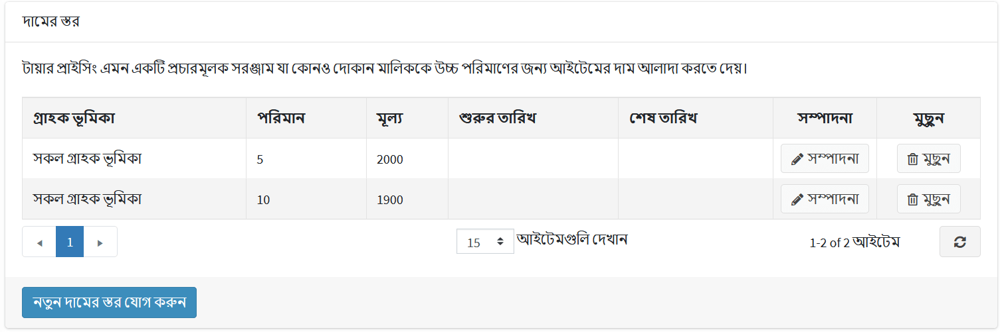
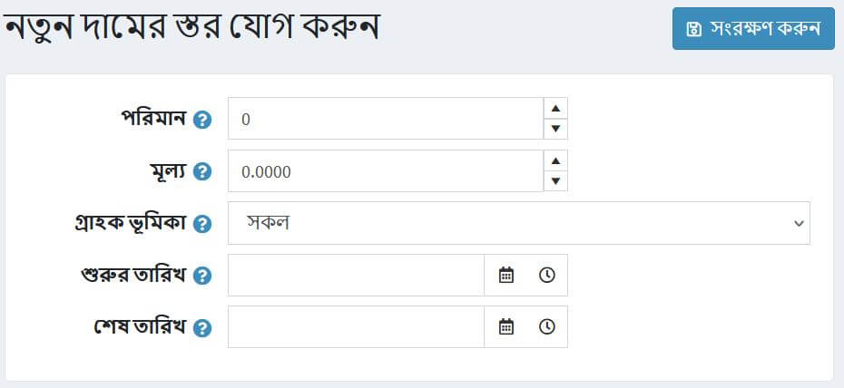
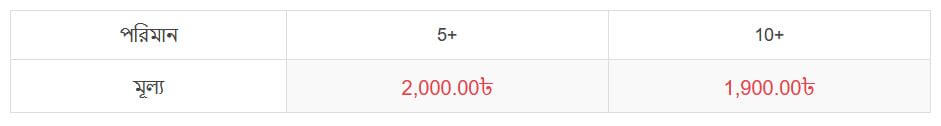

# স্তরের দাম

টিয়ার মূল্য একটি প্রচারমূলক হাতিয়ার যা একটি দোকানের মালিককে বিশেষ মূল্য প্রদানের অনুমতি দেয় যখন গ্রাহকরা একটি নির্দিষ্ট পণ্য বেশি পরিমাণে কেনেন। এই সরঞ্জামটি সাধারণত পাইকারী বিক্রিতে ব্যবহৃত হয়, তবে খুচরা বিক্রেতারা ক্রেতাদের উৎসাহিত করতে এবং আরও বিক্রয় চালাতে এটি প্রয়োগ করতে পারে।

প্রোডাক্ট এডিট পেজে একটি প্রোডাক্টে টায়ারের দাম প্রয়োগ করা যেতে পারে। **ক্যাটালগ → পণ্য** এ যান, একটি পণ্য নির্বাচন করুন যা আপনি একটি স্তরের মূল্য যোগ করতে চান এবং **সম্পাদনা করুন** ক্লিক করুন। একটি নতুন স্তর মূল্য যোগ করার জন্য *টিয়ার মূল্য* প্যানেল দেখুন:

> [!NOTE]
> 
> প্রোডাক্ট পৃষ্ঠার জন্য টায়ার মূল্য যোগ করার আগে আপনাকে পণ্যটি সংরক্ষণ করতে হবে।

## স্তরের দাম যোগ করা

একটি নতুন স্তরের মূল্য যোগ করতে **নতুন স্তরের দাম যোগ করুন** বাটনে ক্লিক করুন। *নতুন স্তরের মূল্য যোগ করুন* উইন্ডো প্রদর্শিত হবে:

- **পরিমাণ** এবং **মূল্য** ক্ষেত্রগুলিতে, পণ্যের একটি নির্দিষ্ট পরিমাণে প্রযোজ্য মূল্য নির্ধারণ করুন।
- যদি আপনি বেশ কয়েকটি দোকান চালান, তবে **স্টোর** ড্রপ-ডাউন তালিকা থেকে, যেটি আপনি স্তরের মূল্য প্রয়োগ করার পরিকল্পনা করছেন তা নির্বাচন করুন।
- **গ্রাহকের ভূমিকা** ড্রপ-ডাউন তালিকা থেকে, গ্রাহকের ভূমিকা নির্বাচন করুন যার ভিত্তিতে স্তরের মূল্য নির্ধারণ করা হবে, যেমন। *সকল* গ্রাহক,*নিবন্ধিত*,*অতিথি*।
- **শুরুর তারিখ** এবং **সমাপ্তির তারিখ** ক্ষেত্রগুলিতে টিয়ার মূল্য প্রাপ্যতার সময়কাল লিখুন। প্রযোজ্য না হলে এই ক্ষেত্রগুলি খালি রাখুন।

**সেভ** ক্লিক করুন। *টিয়ার মূল্য* টেবিলটি নতুন ডেটা দিয়ে আপডেট করা হয়।

আপনি এখন পাবলিক স্টোরে আপডেট পণ্যের বিবরণ পৃষ্ঠা দেখতে পারেন:

যখন একজন গ্রাহক তাদের কার্টে একটি নির্দিষ্ট পরিমাণ পণ্য যোগ করেন, তখন মূল্যটি স্বয়ংক্রিয়ভাবে পরিবর্তিত হচ্ছে ডিসকাউন্ট প্রতিফলিত করতে।

## টিউটোরিয়াল

- [স্তরের মূল্য ব্যবস্থাপনা](https://www.youtube.com/watch?v=ERE08UEDU58&t=10s)
