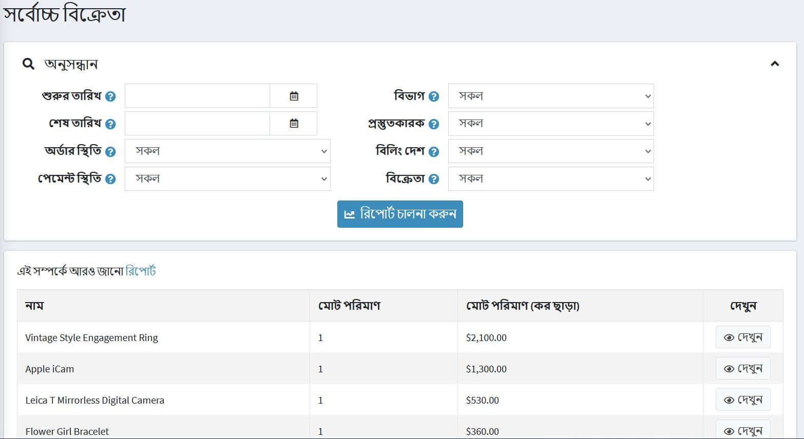

# রিপোর্ট

রিপোর্ট ব্যবস্থাপনার জন্য গুরুত্বপূর্ণ, তারা স্টোরের পারফরম্যান্স পর্যবেক্ষণ করতে, কী মেট্রিকগুলি ট্র্যাক করতে এবং সিদ্ধান্ত গ্রহণে সহায়তা করার অনুমতি দেয়। নপকমার্স রিপোর্ট বিক্রয় এবং গ্রাহকের তথ্য অ্যাক্সেস প্রদান করে।

## ড্যাশবোর্ড

অ্যাডমিন এলাকা অ্যাক্সেস করার সময় ড্যাশবোর্ড হল প্রথম পৃষ্ঠা। এটি আপনাকে আপনার স্টোরের পরিসংখ্যান দেখতে সক্ষম করে, যার মধ্যে আপনার পছন্দের সময়কাল (বছর, মাস, সপ্তাহ), নিবন্ধিত গ্রাহক, কম স্টক পণ্য, আপনার দোকানের সর্বাধিক জনপ্রিয় পণ্য ইত্যাদি প্রসেস করা হয়েছিল।

ড্যাশবোর্ডে বেশ কয়েকটি ব্লক রয়েছে:

### নপকমার্সের খবর

নতুন সংস্করণ রিলিজের মত সাধারণ নপকমার্সের সংবাদ প্রদর্শন করে।

### সাধারণ পরিসংখ্যান

এখানে আপনি আরও বিস্তারিত প্রতিবেদনের লিঙ্কগুলি খুঁজে পেতে পারেন:

- বিক্রয় → আদেশ
- বিক্রয় → ফেরত অনুরোধ
- গ্রাহক → নিবন্ধিত গ্রাহক
- রিপোর্ট → কম স্টক

### অর্ডার

এই চিত্রটি আপনাকে গত সপ্তাহে, মাসে, বছরে প্রক্রিয়া করা অর্ডারের সংখ্যা জানতে সক্ষম করে।

### নতুন গ্রাহক

এই চিত্রটি গত সপ্তাহ, মাস, বছরে নিবন্ধিত গ্রাহকদের সংখ্যা দেখায়।
[নতুন গ্রাহক](_static/reports/customers.jpg)

### মোট অর্ডার

এই বিভাগটি আপনাকে সর্বশেষ দিন, সপ্তাহ, মাস, বছরে প্রক্রিয়া করা মোট অর্ডার জানতে সক্ষম করে। অর্ডার অর্ডার স্ট্যাটাস দ্বারা দেখানো হয়।

### অসম্পূর্ণ আদেশ

এই বিভাগটি আপনাকে বর্তমানে অসম্পূর্ণ অর্ডারের সংখ্যা জানতে সক্ষম করে।
[অর্ডার অসম্পূর্ণ](_static/reports/order-incomplete.png)

### সর্বশেষ অর্ডার

সর্বশেষ আদেশ বিভাগ আপনাকে সর্বশেষ স্থাপিত আদেশগুলি দেখায়।
[সর্বশেষ আদেশ](_static/reports/order-latest.png)

### জনপ্রিয় সার্চ কিওয়ার্ড

এই ব্লকটি সর্বাধিক ব্যবহৃত কীওয়ার্ড প্রদর্শন করে।

[কীওয়ার্ড](_static/reports/keywords.png)

### বেস্টসেলার রিপোর্ট

এই বিভাগটি পরিমাণ এবং পরিমাণ দ্বারা বেস্টসেলার প্রদর্শন করে।
[বেস্টসেলার](_static/reports/bestsellers.png)

## বিক্রয় সারাংশ

এই প্রতিবেদনটি মোট অর্ডারের সারাংশ উপস্থাপন করে। একটি প্রতিবেদন তৈরি করতে আপনি নিম্নলিখিত ফিল্টারগুলি ব্যবহার করতে পারেন:

-**অনুসন্ধানের তারিখ** অনুসন্ধানের জন্য।
- অনুসন্ধানের জন্য **শেষ তারিখ**
- **অর্ডার স্ট্যাটাস** একটি নির্দিষ্ট অর্ডার স্ট্যাটাস দ্বারা অনুসন্ধান করতে যেমন সম্পূর্ণ।
- **পেমেন্ট স্ট্যাটাস** একটি নির্দিষ্ট পেমেন্ট স্ট্যাটাস অনুসারে অনুসন্ধান করতে উদা পরিশোধিত।
- **বিভাগ** একটি নির্দিষ্ট বিভাগে অনুসন্ধান করতে
- **প্রস্তুতকারক** একটি নির্দিষ্ট প্রস্তুতকারকের মধ্যে অনুসন্ধান করতে।
- **বিলিং দেশ** অর্ডার বিলিং দেশ দ্বারা ফিল্টার করতে।
- **পণ্য** একটি নির্দিষ্ট পণ্য দ্বারা অনুসন্ধান করতে।
- **সময় দ্বারা গ্রুপ করার জন্য** যখন এই বিকল্পটি "দিন" এ সেট করা হয় তখন এটি একটি নির্বাচিত সময়ের জন্য তারিখের একটি তালিকা প্রদর্শন করবে (শুরু/শেষ তারিখ)। উদাহরণস্বরূপ, "৪ ই নভেম্বর, ২০২০", "৭ ই নভেম্বর, ২০২০", ইত্যাদি। ইত্যাদি)। যখন এটি "মাস" এ সেট করা হয়, এটি মাসের একটি তালিকা প্রদর্শন করবে (যেমন "ডিসেম্বর ২০২০", "নভেম্বর ২০২০, ইত্যাদি)।

তারপর **রান রিপোর্ট** এ ক্লিক করুন।

## কম স্টক রিপোর্ট

কম স্টক রিপোর্টে বর্তমানে স্টকের অধীনে থাকা পণ্যগুলির একটি তালিকা রয়েছে। নীচে দেখানো উদাহরণে, ন্যূনতম স্টক পরিমাণ ২০ এবং স্টকের পরিমাণ ০, তাই এই পণ্যের জন্য কম স্টক রিপোর্ট তৈরি করা হয়েছে। পণ্য যোগ করার সময় আপনি কম স্টক সেটিংস সেট করতে পারেন।

কম স্টক রিপোর্ট দেখতে, **রিপোর্ট → কম স্টক** এ যান। *নিম্ন স্টক* রিপোর্ট উইন্ডোটি নিম্নরূপ প্রদর্শিত হয়:

কম স্টক রিপোর্টগুলি **প্রকাশিত** সম্পত্তি দ্বারা ফিল্টার করা যেতে পারে, যা পণ্যের*প্রকাশিত*সম্পত্তি প্রতিনিধিত্ব করে।

প্রদর্শিত টেবিলে, পণ্যের বিবরণ পৃষ্ঠা দেখতে **দেখুন** ক্লিক করুন যেখানে স্টক পরিমাণ আপডেট করা যাবে।

## বেস্টসেলার এবং কখনো কেনা হয়নি

বেস্টসেলিং প্রোডাক্ট এবং যেসব পণ্য কখনো কেনা হয়নি তা জানা যে কোন দোকানের মালিকের জন্য খুবই গুরুত্বপূর্ণ।

প্রথমত, এটি আরও ভাল ক্রয়ের সিদ্ধান্ত নিতে সাহায্য করতে পারে: আপনি আপনার জনপ্রিয় আইটেমগুলিকে বাড়িয়ে তুলতে পারেন এবং আপনার পণ্য তালিকা থেকে অপ্রিয় জিনিসগুলি বাদ দিতে পারেন। বিশ্লেষণ করার সময়, বিবেচনা করুন, উদাহরণস্বরূপ, কিছু রং দ্রুত বিক্রি হয় কিনা, অথবা আপনার পণ্যের বিক্রয় কোন ঋতু নির্ভর করে কিনা।

দ্বিতীয়ত, সর্বাধিক এবং সর্বনিম্ন বিক্রিত পণ্যের সংজ্ঞা আপনাকে পণ্যের নকশা এবং বিপণন *পুনরায় মূল্যায়ন করতে সাহায্য করতে পারে। হয়তো আপনার সেরা আইটেমগুলি আপনার ওয়েব স্টোরে তাদের বসানোর কারণে, অথবা একটি ভাল বিবরণের কারণে দ্রুততর হয়ে যায়। বিভিন্ন বিকল্প নিয়ে আসুন এবং তাদের পরীক্ষা করুন। এটি আরও কার্যকরভাবে করতে, আপনার গ্রাহকদের সাথে যুক্ত থাকুন। * বিভিন্ন জরিপ পরিচালনা করুন* কেন সেরা বিক্রিত আইটেমগুলি পছন্দ করা হয়, সেগুলি আপনার ক্রেতাদের জন্য বিশেষ করে তোলে। আপনার মার্কেটিং উন্নত করতে এবং বিক্রয় বাড়ানোর জন্য অন্তর্দৃষ্টি ব্যবহার করুন।

### সর্বোচ্চ বিক্রেতা

NopCommerce এ বেস্টসেলার দেখতে, **রিপোর্টস → বেস্টসেলার** এ যান। প্রতিবেদনটি চালানোর জন্য নিচের এক বা একাধিক অনুসন্ধান মানদণ্ড লিখুন:

- **শুরুর তারি** এবং/অথবা **শেষ তারিখ**।
- **স্টোর**, যদি আপনি আপনার কোন একটি স্টোর সিলেক্ট করতে চান।
- **অর্ডার স্ট্যাটাস**, যেমন *সব*,*মুলতুবি*,*প্রক্রিয়াকরণ*,*সম্পূর্ণ*, অথবা*বাতিল*।
- **পেমেন্ট স্ট্যাটাস**, যেমন *সব*,*মুলতুবি*,*অনুমোদিত*,*পেমেন্ট*,*ফেরত দেওয়া*,*আংশিকভাবে ফেরত*, অথবা*বাতিল*।
- **বিভাগ** বেছে নিন।
- **প্রস্তুতকারক** বেছে নিন।
- **বিলিং দেশ** বেছে নিন।
- **বিক্রেতা** বেছে নিন।

তারপর **রান রিপোর্ট** এ ক্লিক করুন।

প্রতিবেদনটি বিক্রি হওয়া এবং আয়ের উপর ভিত্তি করে আপনার সর্বাধিক বিক্রিত পণ্যগুলি ভেঙে দেবে:

### পণ্য কখনো কেনা হয়নি

কখনই কেনা পণ্যগুলি দেখতে, **প্রতিবেদন → পণ্যগুলি কখনও কেনা হয়নি** এ যান। প্রতিবেদনটি চালানোর জন্য নিচের এক বা একাধিক অনুসন্ধান মানদণ্ড লিখুন:

- **বিভাগ** বেছে নিন।
- **প্রস্তুতকারক** বেছে নিন।
- **স্টোর**, যদি আপনি আপনার কোন একটি স্টোর সিলেক্ট করতে চান।
- **বিক্রেতা** বেছে নিন।
- **শুরুর তারিখ** এবং/অথবা **শেষ তারিখ**।

তারপর **রান রিপোর্ট** এ ক্লিক করুন।

## দেশি বিক্রয়

কান্ট্রি রিপোর্টে অর্ডারের একটি তালিকা থাকে যাতে প্রতিটি দেশে অর্ডারের সংখ্যা এবং মোট অর্ডারের যোগফল অন্তর্ভুক্ত থাকে। এটি দোকান মালিকদের প্রতি দেশ অর্ডার দেখতে সক্ষম করে।

দেশের বিক্রয় প্রতিবেদন দেখতে, **প্রতিবেদন → দেশি বিক্রয়** এ যান।

প্রতিবেদনটি সেট আপ করতে, নিম্নলিখিত অনুসন্ধান মানদণ্ডগুলির মধ্যে একটি বা একাধিক লিখুন:

- **শুরুর তারিখ** অনুসন্ধানের জন্য।
- অনুসন্ধানের জন্য **শেষ তারিখ**
- **অর্ডার স্ট্যাটাস**, যেমন *সব*,*মুলতুবি*,*প্রক্রিয়াকরণ*,*সম্পূর্ণ*, অথবা*বাতিল*।
- **পেমেন্ট স্ট্যাটাস**, যেমন *সব*,*মুলতুবি*,*অনুমোদিত*,*পেমেন্ট*,*ফেরত দেওয়া*,*আংশিকভাবে ফেরত*, অথবা*বাতিল*।

তারপর **রান রিপোর্ট** এ ক্লিক করুন।

## গ্রাহক রিপোর্ট

গ্রাহক রিপোর্টগুলি একটি দোকানের মালিককে নিবন্ধিত গ্রাহক এবং তাদের অর্ডার সম্পর্কে সাধারণ তথ্য দেয়। আপনি **প্রতিবেদন → গ্রাহক প্রতিবেদন** মেনুতে বিভিন্ন প্রতিবেদন খুঁজে পেতে পারেন।

### নিবন্ধিত গ্রাহকরা

এই প্রতিবেদনটি চালানোর জন্য **প্রতিবেদন → গ্রাহক প্রতিবেদন → নিবন্ধিত গ্রাহক** এ যান।
এই প্রতিবেদনটি নির্দিষ্ট সময়ের জন্য নিবন্ধিত গ্রাহকদের সংখ্যা প্রদর্শন করে।
আপনি শেষ দিন, সপ্তাহ, দুই সপ্তাহ, মাস এবং বছরের মধ্যে নিবন্ধিত ব্যবহারকারীর সংখ্যা ট্র্যাক করতে পারেন।

### মোট অর্ডার অনুযায়ী গ্রাহক

এই প্রতিবেদনটি চালানোর জন্য **প্রতিবেদন → গ্রাহক প্রতিবেদন → গ্রাহকদের মোট অর্ডার** এ যান।
এই প্রতিবেদনে, আপনি গ্রাহকদের দ্বারা অর্জিত মোট অর্ডার এবং গ্রাহকদের দ্বারা অর্ডারের সংখ্যা দেখতে পারেন।

একটি প্রতিবেদন সংকলনের জন্য এক বা একাধিক অনুসন্ধান মানদণ্ড লিখুন:

- নিবন্ধন **শুরুর তারিখ**।
- নিবন্ধন **শেষ তারিখ**।
- **অর্ডার স্ট্যাটাস**, যেমন *সব*,*মুলতুবি*,*প্রক্রিয়াকরণ*,*সম্পূর্ণ*, অথবা*বাতিল*।
- **পেমেন্ট স্ট্যাটাস**, যেমন *সব*,*মুলতুবি*,*অনুমোদিত*,*পেমেন্ট*,*ফেরত দেওয়া*,*আংশিকভাবে ফেরত*, অথবা*বাতিল*।
- **শিপিং স্ট্যাটাস** হিসাবে *সব*,*শিপিংয়ের প্রয়োজন নেই*,*এখনো পাঠানো হয়নি*,*আংশিক পাঠানো*,*শিপড*,*ডেলিভার্ড*।

তারপর **রান রিপোর্ট** এ ক্লিক করুন।

### অর্ডার সংখ্যা দ্বারা গ্রাহক

এই প্রতিবেদনটি চালানোর জন্য **প্রতিবেদন → গ্রাহক প্রতিবেদন orders গ্রাহকের সংখ্যা অনুসারে** যান।
এই প্রতিবেদনটি জারি করা মোট অর্ডারের সংখ্যার উপর ভিত্তি করে শীর্ষ 20 গ্রাহকদের প্রদর্শন করে।

একটি প্রতিবেদন সংকলনের জন্য এক বা একাধিক অনুসন্ধান মানদণ্ড লিখুন:

- নিবন্ধন **শুরুর তারিখ**।
- নিবন্ধন **শেষ তারিখ**।
- **অর্ডার স্ট্যাটাস**, যেমন *সব*,*মুলতুবি*,*প্রক্রিয়াকরণ*,*সম্পূর্ণ*, অথবা*বাতিল*।
- **পেমেন্ট স্ট্যাটাস**, যেমন *সব*,*মুলতুবি*,*অনুমোদিত*,*পেমেন্ট*,*ফেরত দেওয়া*,*আংশিকভাবে ফেরত*, অথবা*বাতিল*।
- **শিপিং স্ট্যাটাস** হিসাবে *সব*,*শিপিংয়ের প্রয়োজন নেই*,*এখনো পাঠানো হয়নি*,*আংশিক পাঠানো*,*শিপড*,*ডেলিভার্ড*।

তারপর ** রান রিপোর্ট ** এ ক্লিক করুন।

## টিউটোরিয়াল
- [নপকমার্স এ রিপোর্ট চালানো](https://www.youtube.com/watch?v=IbfoppTG9tM)
