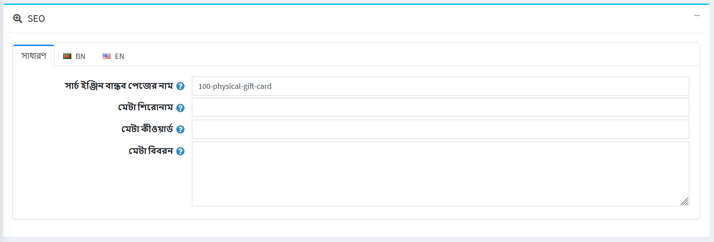
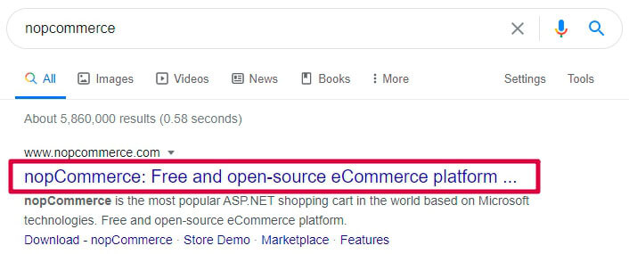
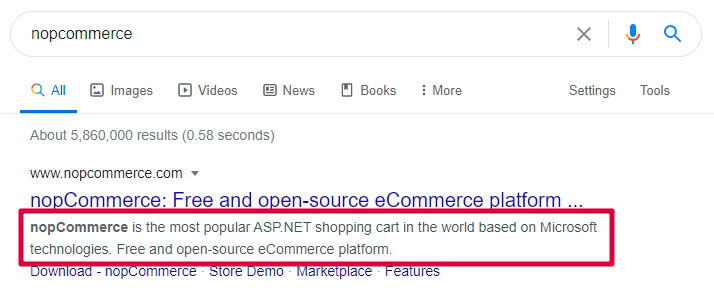
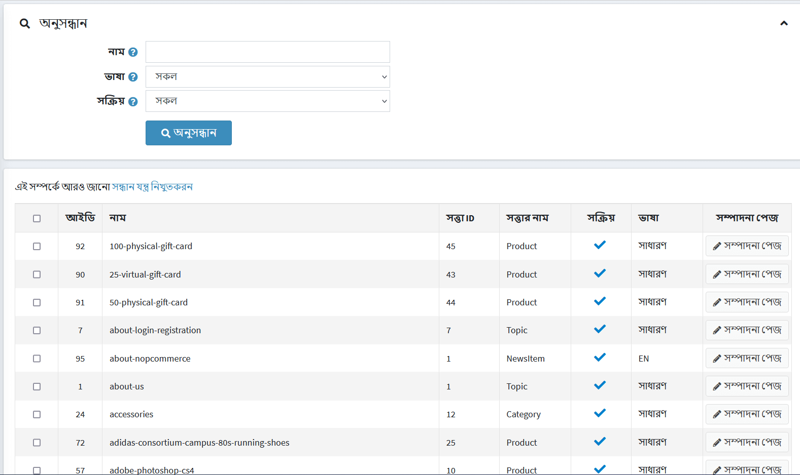

# সন্ধান যন্ত্র নিখুতকরন

এসইও মানে সার্চ ইঞ্জিন অপটিমাইজেশন, এটি সার্চ ইঞ্জিনে "বিনামূল্যে", "জৈব," "সম্পাদকীয়" বা "প্রাকৃতিক" সার্চ ফলাফল থেকে ট্রাফিক পাওয়ার একটি প্রক্রিয়া। সমস্ত প্রধান সার্চ ইঞ্জিনের প্রাথমিক অনুসন্ধান ফলাফল থাকে, যেখানে ওয়েব পেজ এবং অন্যান্য বিষয়বস্তু যেমন ভিডিও বা স্থানীয় তালিকা দেখানো হয় এবং একটি সার্চ ইঞ্জিন ব্যবহারকারীদের জন্য সবচেয়ে প্রাসঙ্গিক মনে করে তার ভিত্তিতে স্থান দেওয়া হয়।

নপকমার্স আপনার দোকানের বিভিন্ন ধরনের পেজের এসইও কৌশল সমর্থন করে। [আরও দেখুন](#See-also) বিভাগে তাদের একটি তালিকা খুঁজুন।

- **ডিফল্ট পৃষ্ঠার শিরোনাম** ক্ষেত্রে, আপনার দোকানের পৃষ্ঠাগুলির জন্য ডিফল্ট শিরোনাম লিখুন।
- **পৃষ্ঠা শিরোনাম এসইও সমন্বয়** ক্ষেত্র থেকে, প্রয়োজনীয় পৃষ্ঠার শিরোনাম এসইও সমন্বয় নির্বাচন করুন, নিম্নরূপ:

  - শিরোনামে একটি দোকানের নামের পরে একটি পৃষ্ঠার নাম আসে:
  `YOURSTORE.COM` | PAGENAME

  - শিরোনামে একটি পৃষ্ঠার নামের পরে একটি দোকানের নাম আসে:
  PAGENAME | `YOURSTORE.COM`

- **পৃষ্ঠা শিরোনাম বিভাজক** নির্দিষ্ট করুন।
- আপনার দোকানের পৃষ্ঠাগুলির জন্য **ডিফল্ট মেটা কীওয়ার্ড** লিখুন। এটি পৃথক বিভাগ, নির্মাতারা, পণ্য এবং কিছু অন্যান্য পৃষ্ঠার জন্য ওভাররাইড করা যেতে পারে।
- আপনার দোকানের পৃষ্ঠাগুলির জন্য **ডিফল্ট মেটা বর্ণনা** লিখুন। এটি পৃথক বিভাগ, নির্মাতারা এবং পণ্য এবং কিছু অন্যান্য পৃষ্ঠার জন্য ওভাররাইড করা যেতে পারে।
- আপনার দোকানের হোম পেজ পৃষ্ঠার জন্য **হোম পেজের শিরোনাম** লিখুন।
- আপনার দোকানের হোম পেজ পৃষ্ঠার জন্য **হোম পেজ মেটা বিবরণ** লিখুন।
- পণ্যের সংক্ষিপ্ত বিবরণের উপর ভিত্তি করে স্বয়ংক্রিয়ভাবে পণ্যের মেটা বিবরণ (যদি পণ্যের বিবরণ পৃষ্ঠায় নির্দিষ্ট না থাকে) উৎপন্ন করার জন্য **জেনারেট প্রোডাক্ট মেটা ডেসক্রিপশন** নির্বাচন করুন।
- **WWW উপসর্গ প্রয়োজন** চয়ন করুন। উদাহরণস্বরূপ, `http: // yourStore.com/` স্বয়ংক্রিয়ভাবে `http: // www.yourStore.com /` এ পুননির্দেশিত হতে পারে। নিম্নলিখিত বিকল্পগুলির মধ্যে একটি নির্বাচন করুন:
  - *কোন ব্যাপার না*
  - *পেজে WWW উপসর্গ থাকতে হবে*
  - *পেজে WWW উপসর্গ থাকা উচিত নয়*
- এসইও নামের অ্যাকসেন্ট অপসারণ করতে **কনভার্ট নন-ওয়েস্টার্ন অক্ষর** চেকবক্স নির্বাচন করুন। উদাহরণস্বরূপ, é কে ই -তে রূপান্তর করুন।
- **ক্যানোনিকাল ইউআরএল সক্ষম করুন** চেকবক্স নির্বাচন করুন, একটি ইউআরএলকে একটি ক্যানোনিকাল ইউআরএলে রূপান্তর করার জন্য দুটি সিনট্যাকটিক্যালি আলাদা ইউআরএল সমতুল্য সামগ্রী সহ একটি পৃষ্ঠায় নিয়ে যেতে পারে কিনা তা নির্ধারণ করতে সক্ষম করুন।
- পণ্যের বিবরণ পৃষ্ঠায় টুইটার মেটা ট্যাগ তৈরি করতে **টুইটার মেটা ট্যাগ** চেকবক্সে টিক দিন।
- পণ্যের বিবরণ পৃষ্ঠায় ওপেন গ্রাফ মেটা ট্যাগ তৈরি করতে **ওপেন গ্রাফ মেটা ট্যাগ** চেকবক্সে টিক দিন।
- পণ্যের বিবরণ পৃষ্ঠায় মাইক্রোডাটা ট্যাগ তৈরি করতে **মাইক্রোডাটা ট্যাগ** চেকবক্সে টিক দিন।
- **কাস্টম &#60;head&#62; ট্যাগ** প্রবেশ করান। উদাহরণস্বরূপ, কিছু কাস্টম &#60; মেটা &#62; ট্যাগ অথবা এই সেটিং উপেক্ষা করলে খালি রাখুন।

## এসইও প্যানেল

নপকমার্স এ বিভিন্ন ধরনের পেজ আছে যার জন্য আপনি মেটা কিওয়ার্ড, মেটা ডেসক্রিপশন, মেটা টাইটেল এবং সার্চ ইঞ্জিন ফ্রেন্ডলি পেজের নাম সহ পৃথক এসইও সেটিংস সেট করতে পারেন। এটি সংশ্লিষ্ট অ্যাডমিন এলাকা বিভাগের এসইও প্যানেলে করা হয়।

- **সার্চ ইঞ্জিন বান্ধব পৃষ্ঠার নাম** ফিল্ডে, সার্চ ইঞ্জিন দ্বারা ব্যবহৃত পৃষ্ঠার নাম লিখুন। আপনি যদি কিছুই না লিখেন তাহলে ওয়েব পেজ ইউআরএল পৃষ্ঠার নাম ব্যবহার করে গঠিত হয়। যদি আপনি *custom-seo-page-name* লিখেন, তাহলে নিচের কাস্টম URL ব্যবহার করা হবে: `http: // www.yourStore.com/custom-seo-page-name`।

- **মেটা শিরোনাম** ক্ষেত্রে, প্রয়োজনীয় শিরোনাম লিখুন। শিরোনাম ট্যাগ আপনার ওয়েব পৃষ্ঠার শিরোনাম নির্দিষ্ট করে। এটি ওয়েব ব্রাউজার দ্বারা পুনরুদ্ধার করা হয় এবং সার্চ ইঞ্জিন যেমন গুগল সার্চ ফলাফলে একটি ওয়েব পেজ প্রদর্শন করতে ব্যবহার করে:
  

- প্রয়োজনীয় **মেটা কীওয়ার্ড** লিখুন। তারা একটি ওয়েব পেজের বিষয়বস্তু শীঘ্রই এবং সংক্ষিপ্তভাবে বর্ণনা করে এবং সেইজন্য সার্চ ইঞ্জিনের জন্য একটি ওয়েবসাইটের বিষয়বস্তুর গুরুত্বপূর্ণ সূচক। মেটা কীওয়ার্ড সার্চ ইঞ্জিনকে বলতে সাহায্য করে যে পেজের টপিক কি। কীওয়ার্ডগুলি সাধারণত ছোট ক্ষেত্রে লেখা হয়।

- **মেটা বর্ণনা** ফিল্ডে, পৃষ্ঠার একটি বিবরণ লিখুন। মেটা বর্ণনা একটি ওয়েব পেজের সারাংশ প্রদান করে। সার্চ ইঞ্জিন যেমন গুগল প্রায়ই সার্চ ফলাফলে মেটা বর্ণনা প্রদর্শন করে, যা ক্লিক-থ্রু রেটকে প্রভাবিত করতে পারে:
  
  মেটা বর্ণনা যেকোনো দৈর্ঘ্যের হতে পারে, কিন্তু গুগল সাধারণত স্নিপেটগুলিকে ~ ১৫৫-১৬০ অক্ষরে ছোট করে। মেটা বর্ণনাগুলিকে যথেষ্ট সময় ধরে রাখা ভাল যে সেগুলি যথেষ্ট বর্ণনামূলক, তাই ৫০-১৬০ অক্ষরের মধ্যে বর্ণনা লেখার সুপারিশ করা হয়। নোট করুন যে "অনুকূল" দৈর্ঘ্য পরিস্থিতির উপর নির্ভর করে পরিবর্তিত হবে এবং আপনার প্রাথমিক লক্ষ্য মান এবং ড্রাইভ ক্লিক প্রদান করা উচিত।
  
## সার্চ ইঞ্জিন বান্ধব পৃষ্ঠার নাম

দোকানে ব্যবহৃত সমস্ত সার্চ ইঞ্জিন বান্ধব পৃষ্ঠার নাম দেখতে, **সিস্টেম → সার্চ ইঞ্জিন বান্ধব পৃষ্ঠার নাম** এ যান।

এখানে আপনি সার্চ ইঞ্জিন বান্ধব পৃষ্ঠার নামগুলিকে **নাম**, **ভাষা** বা **সক্রিয়** সম্পত্তি দ্বারা ফিল্টার করতে পারেন। আপনি একটি বা একাধিক নির্বাচিত ফিল্টার সার্চ ইঞ্জিন বন্ধুত্বপূর্ণ পৃষ্ঠার নাম মুছে ফেলতে পারেন **মুছে ফেলা** বাটন ব্যবহার করে। **পৃষ্ঠা সম্পাদনা করুন** কলামে আপনি উপযুক্ত পৃষ্ঠায় নেভিগেট করতে ব্যবহৃত বোতামটি দেখতে পারেন।

## আরো দেখুন

- [পণ্য যোগ করা](xref:bn/running-your-store/catalog/products/add-products)
- [পণের ধরন](xref:bn/running-your-store/catalog/categories)
- [নির্মাতারা](xref:bn/running-your-store/catalog/manufacturers)
- [বিক্রেতারা](xref:bn/running-your-store/vendor-management)
- [বিষয় (পাতা)](xref:bn/running-your-store/content-management/topics-pages)
- [খবর](xref:bn/running-your-store/content-management/news)
- [ব্লগ](xref:bn/running-your-store/content-management/blog)

## টিউটোরিয়াল

- [নপকমার্স এ এসইও সেটিংস বোঝা](https://youtu.be/UxqM_nJyv১Q)
