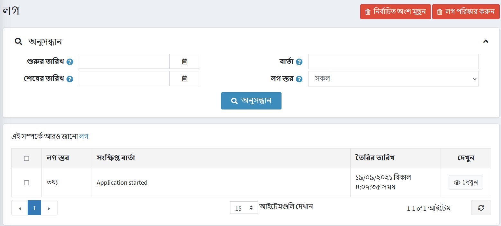
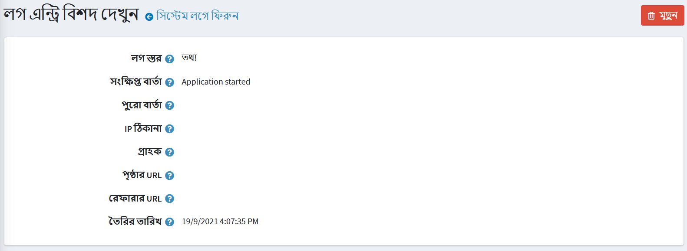

---
title: লগ
uid: bn/running-your-store/system-administration/log
author: git.AndreiMaz
contributors: git.MDRashedKhanMenon
---

# লগ

সিস্টেম লগ রিপোর্ট সিস্টেমে তৈরি সমস্ত ত্রুটি, সতর্কতা এবং তথ্য বার্তার একটি তালিকা প্রদর্শন করে। লগ দেখতে **সিস্টেম → লগ** এ যান। নিম্নরূপ *লগ* উইন্ডো প্রদর্শিত হয়:

একটি লগ আইটেমে লগের ধরন, ত্রুটির বিবরণ এবং তারিখ অন্তর্ভুক্ত থাকে। আপনি নির্বাচিত লগ আইটেমগুলি অপসারণ করতে **মুছে ফেলা** বোতামটি ক্লিক করতে পারেন অথবা সমস্ত লগ সাফ করতে **পরিষ্কার লগ** বাটনে ক্লিক করতে পারেন।

সিস্টেম লগ অনুসন্ধানের জন্য নিচের এক বা একাধিক তথ্য লিখুন:
  **থেকে তৈরি** ক্ষেত্র থেকে, অনুসন্ধানের জন্য শুরু তারিখ নির্বাচন করুন।
  **তৈরি করা** ক্ষেত্র থেকে, অনুসন্ধানের শেষ তারিখ নির্বাচন করুন।
  **মেসেজ** ফিল্ডে, সার্চ করার জন্য মেসেজ বা মেসেজের অংশ নির্বাচন করুন।
  **লগ লেভেল** ড্রপডাউন তালিকা থেকে, প্রদর্শনের জন্য লগ তথ্যের ধরন নির্বাচন করুন, নিম্নরূপ:
  * *সব*
  * *ডিবাগ*
  * *তথ্য*
  * *সতর্কতা*
  * *ত্রুটি*
  * *মারাত্মক*

**অনুসন্ধান** ক্লিক করুন। অনুসন্ধান মানদণ্ডের উপর ভিত্তি করে লগ সিস্টেম উইন্ডো প্রদর্শিত হবে।

## সিস্টেম লগের বিবরণ দেখুন

**দেখুন** ক্লিক করলে ত্রুটিটির অতিরিক্ত বিবরণ প্রদর্শিত হয়, নিম্নরূপ:

প্রয়োজনে সিস্টেম থেকে একটি লগ অপসারণ করতে আপনি **মুছুন** ক্লিক করতে পারেন।