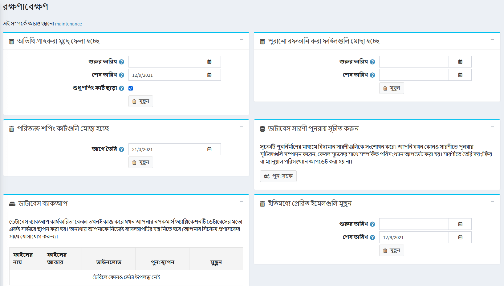

# রক্ষণাবেক্ষণ

**সিস্টেম** মেনু থেকে, **রক্ষণাবেক্ষণ** নির্বাচন করুন। *রক্ষণাবেক্ষণ* উইন্ডোটি নিম্নরূপ প্রদর্শিত হয়:

## অতিথি গ্রাহকের রেকর্ড মুছে দিন

*অতিথি গ্রাহকদের মুছে ফেলা* প্যানেল থেকে, **মুছুন** বোতামে ক্লিক করুন। এই বিকল্পটি আপনাকে অতিথি দর্শকদের জন্য তৈরি গ্রাহক রেকর্ড মুছে ফেলতে সক্ষম করে।

> [!NOTE]
>
> শুধুমাত্র অর্ডার বা লিখিত গ্রাহক সামগ্রী (যেমন পণ্য পর্যালোচনা বা সংবাদ মন্তব্য) ছাড়া অতিথি মুছে ফেলা হবে।

## পুরানো রপ্তানি করা ফাইল মুছে ফেলা

*পুরানো রপ্তানি করা ফাইল মুছে ফেলা* প্যানেল থেকে, **মুছুন** বাটনে ক্লিক করুন। সমস্ত রপ্তানি ও উৎপন্ন ফাইল (যেমন, পিডিএফ এবং এক্সেল ফাইল) ডাটাবেস থেকে মুছে ফেলা হবে।

## পরিত্যক্ত শপিং কার্ট এবং ইচ্ছা তালিকা মুছুন

*পরিত্যক্ত শপিং কার্ট মুছে ফেলা* প্যানেল থেকে, **মুছুন** বাটনে ক্লিক করুন। নির্দিষ্ট তারিখের আগে তৈরি সমস্ত শপিং কার্ট এবং উইশলিস্ট আইটেম মুছে ফেলা হবে।

## ডাটাবেস টেবিল পুনরায় সূচী করুন

*রি-ইনডেক্স ডাটাবেস টেবিল* প্যানেল থেকে, **রি-ইনডেক্স** বাটনে ক্লিক করুন। এই পদ্ধতিটি সূচক পুনর্নির্মাণের মাধ্যমে বিদ্যমান টেবিলগুলি পরিবর্তন করে। যখন আপনি একটি টেবিলে পুনরায় সূচীকরণ চালান, তখন শুধুমাত্র সূচকের সাথে সম্পর্কিত পরিসংখ্যান আপডেট করা হয়। টেবিলে তৈরি স্বয়ংক্রিয় বা ম্যানুয়াল পরিসংখ্যান (একটি সূচকের পরিবর্তে) আপডেট করা হয় না।

## ডাটাবেস ব্যাকআপ

*ডাটাবেস ব্যাকআপ* প্যানেল থেকে, ডাটাবেস ব্যাকআপ তৈরি করতে **এখন ব্যাকআপ** বাটনে ক্লিক করুন।

> [!NOTE]
>
> ডাটাবেসের ব্যাকআপ কার্যকারিতা তখনই কাজ করে যখন আপনার নপকমার্স অ্যাপ্লিকেশনটি ডাটাবেসের মতো একই সার্ভারে স্থাপন করা হয়। অন্যথায় আপনাকে নিজের ব্যাকআপের যত্ন নিতে হবে (আপনার সিস্টেম প্রশাসকের সাথে যোগাযোগ করুন)।

## টিউটোরিয়াল

[সিস্টেম রক্ষণাবেক্ষণ বিকল্পগুলির ওভারভিউ](https://www.youtube.com/watch?v=CNgTJZoWHTA)