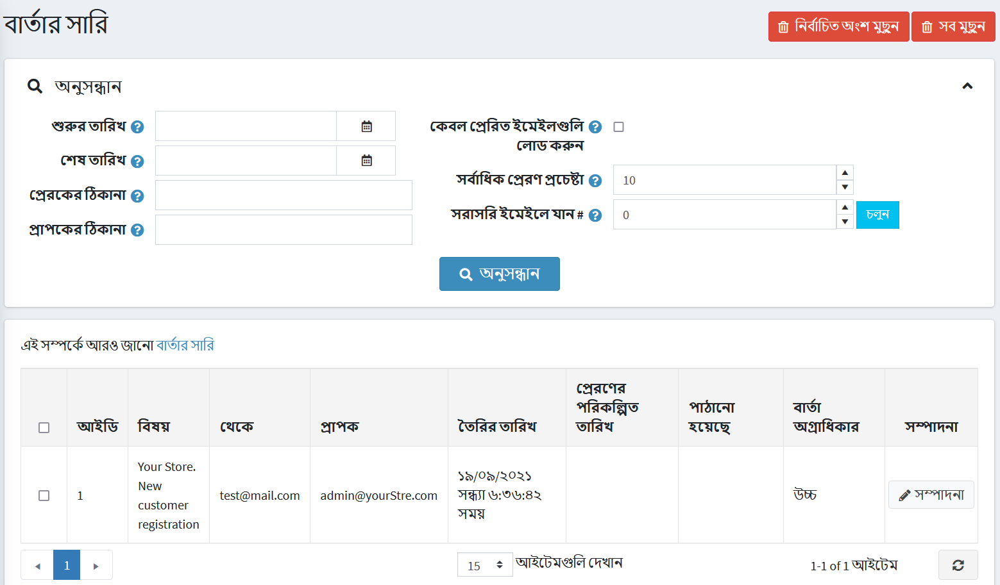
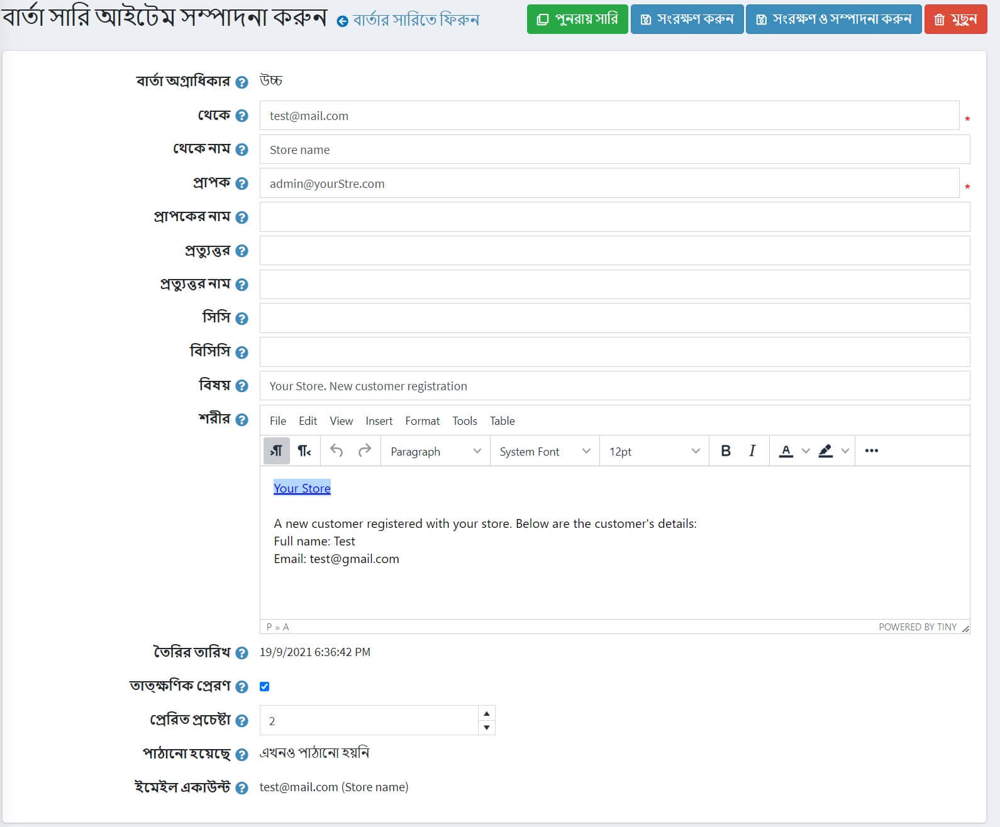

# বার্তার সারি

ইমেইল নপকমার্স-এ অবিলম্বে পাঠানো হয় না। তারা সারিবদ্ধ। বার্তা সারিতে এমন সব ইমেইল রয়েছে যা ইতিমধ্যেই পাঠানো হয়েছে বা এখনও পাঠানো হয়নি।

বার্তা সারি লোড করতে, **সিস্টেম** মেনু থেকে, **বার্তা সারি** নির্বাচন করুন। *বার্তা সারি* উইন্ডোটি নিম্নরূপ প্রদর্শিত হয়:

বার্তাগুলি অনুসন্ধান করার জন্য নিচের এক বা একাধিক মানদণ্ড লিখুন:

* **শুরু তারিখ** ক্ষেত্র থেকে, শুরুর তারিখ নির্বাচন করুন।
* **শেষ তারিখ** ক্ষেত্র থেকে, শেষ তারিখ নির্বাচন করুন।
* **ঠিকানা থেকে** ক্ষেত্রের মধ্যে, একটি বার্তার উৎস ঠিকানা লিখুন।
* **ঠিকানা দিতে** ক্ষেত্রের মধ্যে, একটি বার্তার লক্ষ্য ঠিকানা লিখুন।
* এখনও পাঠানো হয়নি এমন ইমেল লোড করতে **লোড না পাঠানো ইমেলগুলি** চেকবক্সে টিক দিন।
* **সর্বোচ্চ পাঠানোর প্রচেষ্টা** ক্ষেত্রটিতে, বার্তা পাঠানোর সর্বোচ্চ সংখ্যক প্রচেষ্টা লিখুন।
* **সরাসরি ইমেল#** ফিল্ডে যান, ইমেইল নম্বর লিখুন এবং প্রয়োজনীয় ইমেইল প্রদর্শন করতে **যাওয়া** ক্লিক করুন।

মানদণ্ডের সাথে মিলে যাওয়া বার্তার সারি লোড করতে **অনুসন্ধান** ক্লিক করুন।

এই পৃষ্ঠায়, আপনি গ্রিড থেকে নির্বাচিত ইমেলগুলি মুছে ফেলার জন্য **মুছে ফেলা** বোতামটি ক্লিক করতে পারেন। সব ইমেইল অপসারণ করতে আপনি **সব মুছুন** ক্লিক করতে পারেন।

## বার্তা সারির আইটেমের বিবরণ

বার্তা সারি আইটেমের বিবরণ দেখতে বার্তার পাশে **সম্পাদনা** বাটনে ক্লিক করুন। *বার্তা সারি আইটেম সম্পাদনা করুন* উইন্ডো প্রদর্শিত হবে:

এই উইন্ডোতে আপনি **মুছে ফেলা** বাটনে ক্লিক করে বার্তাটি মুছে ফেলতে পারেন। অথবা আপনি **রিকিউ** বাটন ব্যবহার করে বার্তাটি অনুরোধ করতে পারেন।

এই পৃষ্ঠায় আপনি নিম্নলিখিত বার্তার বিবরণ সম্পাদনা করতে পারেন:

* **থেকে** ইমেল ঠিকানা।
* **নাম থেকে**।
* **থেকে** ইমেল ঠিকানা।
* **নাম দিতে**।
* **উত্তর দিতে** ইমেল ঠিকানা।
* **উত্তর দিতে নাম**।
* **সিসি** ইমেল ঠিকানা।
* **বিসিসি** ইমেল ঠিকানা।
* ইমেল বার্তা **বিষয়**।
* ইমেল বার্তা **শরীর**।
* অবিলম্বে এই বার্তাটি পাঠাতে **অবিলম্বে পাঠান** চেকবক্সে টিক দিন।
* **পাঠানো প্রচেষ্টার সংখ্যা** লিখুন। এই বার্তাটি পাঠানোর চেষ্টা করার সংখ্যা এটি।

বার্তার বিবরণ সংরক্ষণ করতে **সংরক্ষণ করুন** বা **সংরক্ষণ করুন এবং সম্পাদনা চালিয়ে যান** ক্লিক করুন।
