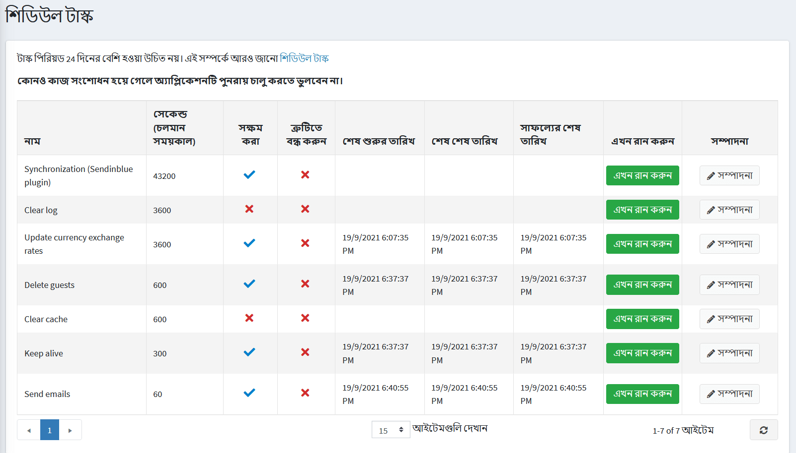
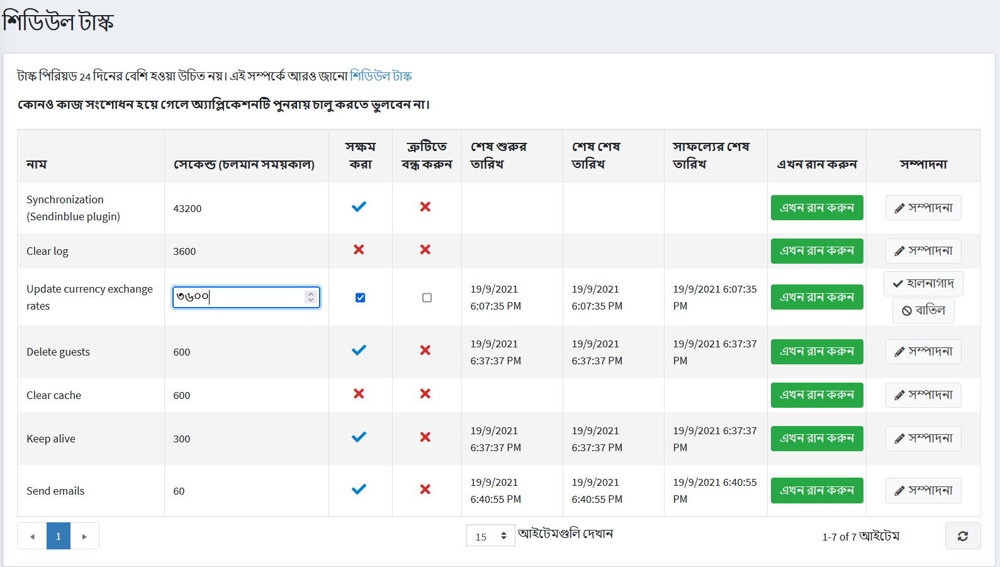

# কাজের সময়সূচী

*শিডিউল টাস্কস* উইন্ডো স্টোরের মালিককে ব্যাকগ্রাউন্ডে নির্দিষ্ট সময়ের মধ্যে একটি টাস্ক চালানোর সময় নির্ধারণ করতে এবং টাস্ক সম্পর্কিত দরকারী তথ্য দেখতে এবং এটি সফলভাবে সম্পন্ন হয়েছে কিনা তা সক্ষম করে। উদাহরণস্বরূপ, নপকমার্স পর্যায়ক্রমে সারিবদ্ধ ইমেল পাঠায়। কাজগুলি এসপি.নেট থ্রেড পুল থেকে আসা একটি পৃথক থ্রেডে চলে।

নির্ধারিত কাজগুলি দেখতে, **সিস্টেম** মেনু থেকে, **কর্মের সময়সূচী** নির্বাচন করুন।  *শিডিউল টাস্ক* উইন্ডোটি নিম্নরূপ প্রদর্শিত হয়:

একটি নির্ধারিত কাজ সম্পাদনা করতে, টাস্কের পাশে **সম্পাদনা করুন** বাটনে ক্লিক করুন। উইন্ডোটি প্রসারিত করা হয়েছে, নিম্নরূপ:

আপনি নিম্নলিখিত পদ্ধতিতে নির্ধারিত কাজ সম্পাদনা করতে পারেন:

* **নাম** সম্পাদনা করুন।
* **সেকেন্ডের সংখ্যা (রান পিরিয়ড)** সম্পাদনা করুন। কাজের সময়কাল ২৪ দিনের বেশি হওয়া উচিত নয়।
* টাস্কটি সক্ষম করতে **সক্ষম** চেকবক্সে টিক দিন।
* একটি ত্রুটি ঘটলে কাজটি বন্ধ করার জন্য **স্টপ অন এরার** চেকবক্সে টিক দিন।

আপনার পরিবর্তনগুলি সংরক্ষণ করতে **আপডেট** ক্লিক করুন।

> [!NOTE]
>
> একটি টাস্ক পরিবর্তিত হওয়ার পরে অ্যাপ্লিকেশনটি পুনরায় চালু করতে ভুলবেন না।

যদি প্রয়োজন হয়, আপনি অন-ডিমান্ড একটি নির্ধারিত কাজ চালানোর জন্য **এখনই চালান** ক্লিক করতে পারেন।
