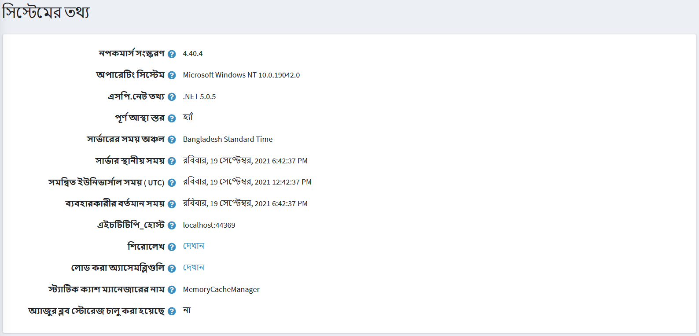

# পদ্ধতিগত তথ্য

নিম্নোক্ত পদ্ধতিটি বর্ণনা করে কিভাবে দোকান এবং সিস্টেম সার্ভারের সিস্টেম তথ্য দেখতে হয়।

সিস্টেমের তথ্য দেখতে **সিস্টেম** মেনুতে যান, **সিস্টেম তথ্য** নির্বাচন করুন। *সিস্টেম তথ্য* প্রদর্শিত হবে, নিম্নরূপ:

