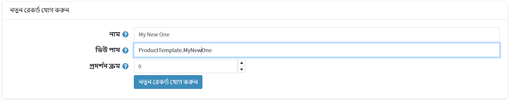
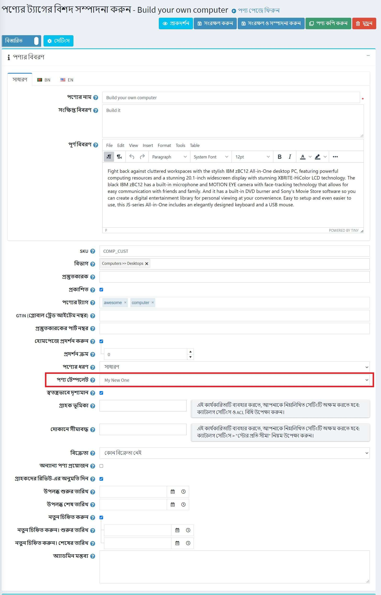

# টেমপ্লেট

নপকমার্স-এ আপনি একটি বিভাগ, নির্মাতা, পণ্য এবং বিষয়ের জন্য একটি বিকল্প লেআউট টেমপ্লেট নির্দিষ্ট করতে পারেন। আপনি **সিস্টেম → টেমপ্লেট** পৃষ্ঠায় বিদ্যমান টেমপ্লেটগুলির একটি তালিকা দেখতে পারেন:

ডিফল্টরূপে, সিস্টেমে একটি বিভাগ টেমপ্লেট, একটি প্রস্তুতকারকের টেমপ্লেট, একটি বিষয় টেমপ্লেট এবং দুটি পণ্য টেমপ্লেট রয়েছে।

অ্যাডমিন এলাকায় প্রতিটি বিভাগ, প্রস্তুতকারক, পণ্য এবং বিষয় বিবরণ পৃষ্ঠা আপনাকে একটি সত্তা সম্পাদনা করার সময় টেমপ্লেট চয়ন করতে দেয়। উদাহরণ স্বরূপ:

> [!NOTE]
>
> আপনি টেমপ্লেট ড্রপডাউন তালিকা দেখতে পাবেন যদি আপনার একাধিক বিভাগ, নির্মাতা এবং বিষয়গুলির জন্য তৈরি টেমপ্লেট থাকে।

> [!NOTE]
>
> যেহেতু আমাদের দুটি পণ্যের ধরন রয়েছে, *সহজ* এবং *গোষ্ঠীভুক্ত (বৈচিত্র সহ পণ্য)*, আমাদের ডিফল্টরূপে দুটি উপযুক্ত পণ্য টেমপ্লেট রয়েছে:
> 
> অতএব, পণ্যের বিবরণ পৃষ্ঠায় টেমপ্লেট ড্রপডাউন তালিকা দেখতে আপনাকে দুটি প্রোডাক্ট টেমপ্লেট তৈরি করতে হবে যা বেছে নেওয়া প্রোডুট টাইপের সাথে মানানসই। এটি কীভাবে করবেন তা নীচে পড়ুন।

## একটি নতুন টেমপ্লেট যোগ করুন

আসুন দেখি কিভাবে পণ্য টেমপ্লেট উদাহরণে একটি টেমপ্লেট তৈরি করা যায়। ধরা যাক আপনি এটি *সহজ* পণ্যের প্রকারের জন্য তৈরি করতে চান।

১। প্রথমত, আপনাকে একটি উপযুক্ত টেমপ্লেট ফাইল তৈরি করতে হবে। আপনার যদি ইতিমধ্যেই ডান ফোল্ডারে একটি থাকে তবে এই পদক্ষেপটি এড়িয়ে যান।

- `Views \ Product` ফোল্ডারে যান।
- `ProductTemplate.Simple.cshtml` ফাইলটি অনুলিপি করুন এবং এটির নাম পরিবর্তন করুন। ধরা যাক এটি হবে `ProductTemplate.MyNewOne.cshtml`।
- আপনার প্রয়োজন অনুসারে `ProductTemplate.MyNewOne.cshtml` ফাইলের কোড পরিবর্তন করুন।

২। **সিস্টেম → টেমপ্লেট** পৃষ্ঠায় যান এবং *পণ্য টেমপ্লেট* প্যানেলে যান:

৩। *নতুন রেকর্ড যোগ করুন* ব্লকে নিম্নলিখিত ফর্মটি পূরণ করুন:

- টেমপ্লেটের **নাম** লিখুন। আমাদের ক্ষেত্রে এটি `মাই নিউ ওয়ান`।
- **দেখুন পথ** প্রবেশ করুন। আমাদের ক্ষেত্রে এটি `ProductTemplate.MyNewOne`।
- এই টেমপ্লেটের **ডিসপ্লে অর্ডার** লিখুন। ১ তালিকার শীর্ষে প্রতিনিধিত্ব করে।
- *শুধুমাত্র পণ্য টেমপ্লেটের জন্য। অন্যান্য টেমপ্লেটগুলির জন্য প্রযোজ্য নয়:* **উপেক্ষা করা পণ্যের ধরন আইডি (উন্নত)** লিখুন। ডিফল্টরূপে, আমাদের দুটি পণ্যের ধরন এবং উপযুক্ত পণ্যের ধরন আইডি আছে: *সহজ* (আইডি ৫) এবং *গোষ্ঠীভুক্ত (আইডি ১০)*। যেহেতু আমরা *সিম্পল* প্রোডাক্ট টাইপের জন্য একটি টেমপ্লেট তৈরি করি তাই আমাদের আইডি ১০ দিয়ে *গ্রুপড* প্রোডাক্ট টাইপ উপেক্ষা করা উচিত।

সুতরাং ফর্মটি নিম্নরূপ দেখাবে:

৪। নতুন টেমপ্লেট সংরক্ষণ করতে **নতুন রেকর্ড যোগ করুন** বাটনে ক্লিক করুন।

আপনি নতুন টেমপ্লেটটি সংরক্ষণ করার পরে আপনি এটি পণ্যের বিবরণ পৃষ্ঠায় দেখতে পাবেন এবং এখন আপনি দুটি পণ্য টেমপ্লেট থেকে চয়ন করতে পারেন:

> [!NOTE]
>
> **উপেক্ষিত পণ্যের ধরন আইডি (উন্নত)** ক্ষেত্র ব্যবহার করে একটি পণ্য টেমপ্লেটকে সীমাবদ্ধ করার প্রয়োজন নেই। আপনি যদি এই ক্ষেত্রটি খালি রাখেন তবে আপনি সমস্ত ধরণের পণ্যের জন্য পণ্য টেমপ্লেট ব্যবহার করতে সক্ষম হবেন।
