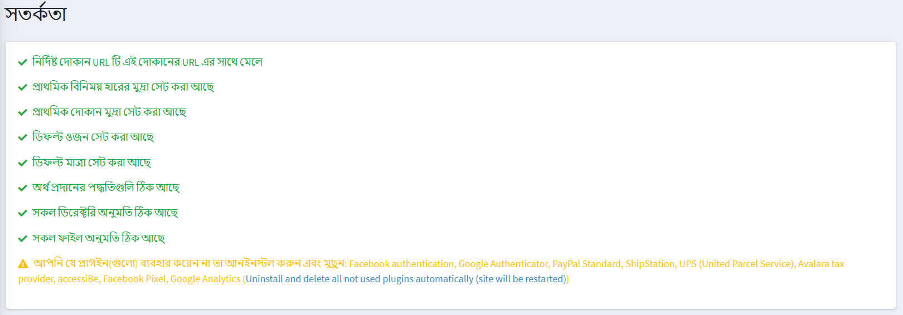

# Warnings

The following procedure describes how to view all the warnings that currently exist in the store.

To view store warnings go to **System → Warnings**. The *Warnings* window will be displayed, as follows:

We recommend you to fix all warnings if exist. Otherwise, it affects your store efficiency and performance.

Refer the following articles in order to fix the existing warnings:
* [Your store information](xref:en/getting-started/advanced-configuration/your-store-information)
* [Currencies](xref:en/getting-started/configure-payments/advanced-configuration/currencies)
* [Measures](xref:en/getting-started/configure-shipping/advanced-configuration/measures)
* [Payment methods](xref:en/getting-started/configure-payments/payment-methods/index)
* [Plugins in nopCommerce](xref:en/getting-started/advanced-configuration/plugins-in-nopcommerce)