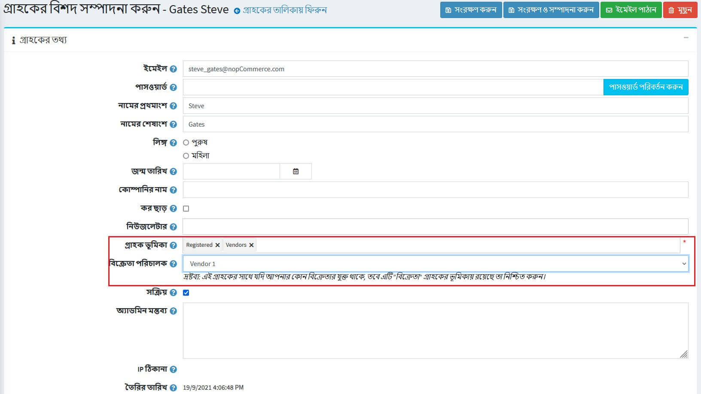

# বিক্রেতা ব্যবস্থাপনা

*বিক্রেতারা* গ্রাহকদের একটি বিশেষ শ্রেণী যা আলাদাভাবে বিবেচনা করা উচিত।

নপকমার্স- এ *মাল্টি-ভেন্ডার* এবং ড্রপ শিপিং এর জন্য সরঞ্জাম রয়েছে যা আপনাকে স্টক বা জাহাজের অর্ডার না রেখে অনলাইনে বিক্রি করতে সক্ষম করে। এই ক্ষেত্রে, প্রতিটি পণ্য একটি নির্দিষ্ট বিক্রেতার জন্য নির্ধারিত হয় যার বিবরণ (ইমেল ঠিকানা সহ) সংরক্ষণ করা হয়।

যখন একটি অর্ডার দেওয়া হয় তখন একটি ইমেইল অর্ডারে প্রতিটি পণ্যের একজন বিক্রেতার কাছে পাঠানো হয়। ইমেইলে পণ্য, পরিমাণ ইত্যাদি অন্তর্ভুক্ত থাকে।

একাধিক স্বাধীন বিক্রেতাদের পণ্যগুলি সাধারণ পণ্য ক্যাটালগে প্রদর্শিত হয় এবং আপনার ওয়েবসাইটের ভিজিটররা একটি ওয়েব স্টোরে কেনাকাটা করতে পারে, এমনকি যদি আপনার পণ্য সারা বিশ্ব থেকে শত শত বিভিন্ন বিক্রেতারা সরবরাহ করে।

প্রতিটি বিক্রেতাকে তাদের পণ্য পরিচালনা, বিক্রয় প্রতিবেদন পর্যালোচনা এবং তাদের পণ্য সম্পর্কিত অর্ডারের বিশদ বিবরণের জন্য প্রশাসক প্যানেল অ্যাক্সেস প্রদান করা যেতে পারে। বিক্রেতারা একে অপরের কার্যক্রম দেখতে পারে না।

টাকা চলে যায় স্টোর অ্যাডমিনিস্ট্রেটরের বণিক অ্যাকাউন্টে, যিনি তখন অর্ডার হিস্ট্রি অনুযায়ী বিক্রেতাদের মধ্যে ম্যানুয়ালি ফান্ড বিতরণ করেন, যা প্রতিটি প্রদানকারীর জন্য আলাদাভাবে ট্র্যাক এবং ম্যানেজ করা হয়। এই পদ্ধতিতে, গ্রাহক শুধুমাত্র মূল কোম্পানির কাছ থেকে একটি চার্জ দেখেন।

নিম্নোক্ত পদ্ধতি বর্ণনা করে কিভাবে বিক্রেতা পোর্টাল সাইটে প্রবেশের সাথে একটি বিক্রেতার রেকর্ড সেট আপ এবং প্রদান করতে হয়।

## একটি বিক্রেতা অ্যাকাউন্ট সেট আপ করুন

**গ্রাহক → বিক্রেতাদের** এ যান। *বিক্রেতারা* উইন্ডো প্রদর্শিত হয়:

**নতুন যোগ করুন** ক্লিক করুন।

### বিক্রেতার তথ্য

*বিক্রেতার তথ্য* প্যানেলে, নিম্নলিখিত বিক্রেতার বিবরণ সংজ্ঞায়িত করুন:

**বিক্রেতার নাম**।
**বিক্রেতার জন্য** বর্ণনা।
*বিক্রেতার **ইমেইল**। এই ইমেইলে "অর্ডার করা হয়েছে" বিজ্ঞপ্তি পাঠানো হবে।
*বিক্রেতা সক্রিয় করতে **সক্রিয়** চেকবক্সে টিক দিন।
*একজন বিক্রেতা **ছবি** আপলোড করুন।
**প্রশাসনিক মন্তব্য** অভ্যন্তরীণ ব্যবহারের জন্য একটি ঐচ্ছিক মন্তব্য বা তথ্য।

> [!NOTE]
> 
> কিছু বিক্রেতা বার্তা টেমপ্লেট, যেমন *OrderPaid.VendorNotification *এবং *OrderPlaced.VendorNotification*, ডিফল্টরূপে নিষ্ক্রিয় করা হয়। [বার্তা টেমপ্লেট](xref:bn/running-your-store/content-management/message-templates) বিভাগে এটি কীভাবে পরিবর্তন করবেন তা দেখুন।

### বিক্রেতার বৈশিষ্ট্য

যখন আপনি কিছু অতিরিক্ত বিক্রেতা গুণাবলী তৈরি করেন তখন *বিক্রেতা গুণাবলী* প্যানেলটিও প্রদর্শিত হবে।

একটি দোকানের মালিকরা একটি বিক্রেতার জন্য গুণাবলী তৈরি করতে সক্ষম হয় যেমন তারা একটি পণ্যের জন্য করতে পারে। এটি মাল্টি-ভেন্ডার স্টোরগুলিকে গ্রাহকদের কাছে বিক্রেতা সম্পর্কে আরও তথ্য সংগ্রহ এবং প্রদর্শন করার অনুমতি দেবে।

 বিক্রেতার গুণাবলী এবং সেগুলি কীভাবে তৈরি করবেন সে সম্পর্কে [বিক্রেতার গুণাবলী](#বিক্রেতা-বৈশিষ্ট্য) বিভাগে আরও জানুন।

### ঠিকানা (ঐচ্ছিক)
*ঠিকানা (ঐচ্ছিক)* প্যানেলে বিক্রেতার ঠিকানা লিখুন।

### প্রদর্শন

*ডিসপ্লে* প্যানেলে নিম্নলিখিত ডিসপ্লে প্যারামিটার সংজ্ঞায়িত করুন:

***গ্রাহকদের বিকল্পের পূর্বনির্ধারিত তালিকা থেকে পৃষ্ঠার আকার নির্বাচন করতে দিন***।
*যদি আগের চেকবক্সে টিক দেওয়া থাকে **পেজ সাইজ অপশন** (কমা আলাদা) নির্ধারণ করুন*।
*যদি পূর্ববর্তী চেকবক্সটি অনির্বাচিত হয় তবে **পৃষ্ঠার আকার** লিখুন*।
**বিক্রেতার ডিসপ্লে অর্ডার**।

### এসইও

এসইও সেট আপ করার জন্য [এসইও প্যানেল](xref:bn/running-your-store/search-engine-optimization#seo-panels) বিভাগটি পড়ুন।

## একজন বিক্রেতাকে গ্রাহকের রেকর্ডে নিয়োগ দেওয়া

এই পদক্ষেপটি alচ্ছিক এবং শুধুমাত্র তখনই প্রয়োজন যখন আপনি চান আপনার বিক্রেতারা তাদের প্রশাসন পোর্টালে লগইন করতে এবং তাদের পণ্য, অর্ডার ইত্যাদি পরিচালনা করতে সক্ষম হবেন।

যদি আপনি না চান যে অ্যাডমিন এলাকায় বিক্রেতাদের প্রবেশাধিকার থাকে তবে দোকানের মালিককে সমস্ত বিক্রেতা ম্যাপিং পরিচালনা করার অনুমতি দেওয়ার জন্য এই পদক্ষেপটি উপেক্ষা করুন।

**গ্রাহক → গ্রাহক** এ যান। *গ্রাহক* উইন্ডো প্রদর্শিত হয়:

একটি নতুন গ্রাহক তৈরি করুন অথবা একটি ক্রেতা রেকর্ডের পাশে **সম্পাদনা করুন** ক্লিক করুন যা আপনি একজন বিক্রেতাকে বরাদ্দ করতে চান। গ্রাহক তৈরির বিষয়ে আরও তথ্যের জন্য [নতুন গ্রাহক যোগ করুন](xref:bn/running-your-store/customer-management/management-customers#add-a-new-customer) দেখুন।

* *গ্রাহক তথ্য* প্যানেলে, নিশ্চিত করুন যে বিক্রেতাদের **গ্রাহকের ভূমিকা** **গ্রাহকের ভূমিকা** ক্ষেত্রে নির্বাচিত হয়েছে।
  > [!NOTE]
  > 
  > একজন বিক্রেতা গ্রাহক অ্যাকাউন্ট ডিফল্ট *প্রশাসক* গ্রাহকের ভূমিকার অন্তর্ভুক্ত হতে পারে না।

**গ্রাহক তথ্য** প্যানেলে, **বিক্রেতার ম্যানেজার** ক্ষেত্র খুঁজুন। পূর্বে তৈরি একটি বিক্রেতা রেকর্ড নির্বাচন করুন।

বিক্রেতার গ্রাহক অ্যাকাউন্ট সেট আপ করার পরে, বিক্রেতা পণ্য, অর্ডার, শিপমেন্ট এবং রিপোর্ট দেখার জন্য এই গ্রাহক অ্যাকাউন্ট ব্যবহার করতে পারেন। পাবলিক স্টোরের শীর্ষে *প্রশাসন* লিঙ্কটি লগ ইন করার পরে প্রদর্শিত হবে।

> [!TIP]
> 
> [ইউটিউব টিউটোরিয়াল: বিক্রেতাদের পরিচালনা করা](https://www.youtube.com/watch?v=MH6r6tqfLF8&list=PLnL_aDfmRHwsbhj621A-RFb1KnzeFxYz4&index=9)

## বিক্রেতার সেটিংস

এই বিভাগটি বর্ণনা করে কিভাবে আপনার দোকানের বিক্রেতা সেটিংস সংজ্ঞায়িত করা যায়। এর মধ্যে প্রদর্শিত বিক্রেতার সংখ্যা, দোকানের পণ্যের বিবরণ পৃষ্ঠাগুলিতে বিক্রেতাকে দেখানো বা না করা এবং আরও অনেক কিছু অন্তর্ভুক্ত রয়েছে।

**কনফিগারেশন → সেটিংস → বিক্রেতা সেটিংস** এ যান।

এই পৃষ্ঠাটি মাল্টি-স্টোর কনফিগারেশন সক্ষম করে, এর মানে হল যে একই স্টোরিং সকল স্টোরের জন্য সংজ্ঞায়িত করা যেতে পারে, অথবা স্টোর থেকে স্টোরে আলাদা হতে পারে। আপনি যদি একটি নির্দিষ্ট দোকানের জন্য সেটিংস পরিচালনা করতে চান, মাল্টি-স্টোর কনফিগারেশন ড্রপ-ডাউন তালিকা থেকে তার নামটি চয়ন করুন এবং তাদের জন্য কাস্টম মান নির্ধারণ করতে বাম পাশে সমস্ত প্রয়োজনীয় চেকবক্সে টিক দিন। আরও তথ্যের জন্য [মাল্টি-স্টোর](xref:bn/get-start/advanced-configuration/multi-store) পড়ুন।
	
### সাধারণ

*সাধারণ* প্যানেলে নিম্নলিখিত বিক্রেতার সেটিংস সংজ্ঞায়িত করুন:

* **গ্রাহকদের বিক্রেতা অ্যাকাউন্টের জন্য আবেদন করার অনুমতি দিন**। প্রথমত, একজন বিক্রেতার অনুরোধ একটি ব্যবহারকারী দ্বারা পূরণ করা হয়, এইভাবে একটি বিক্রেতা অ্যাকাউন্ট তৈরি করা হয়। তারপর অনুরোধটি স্টোর-মালিকের কাছে উপস্থাপন করা হয় (ইমেল বিজ্ঞপ্তির মাধ্যমে) গ্রহণ করার জন্য।
  > [!NOTE]
  > 
  >একজন দোকান মালিককে অ্যাডমিন এলাকায় প্রবেশাধিকার দিতে চাইলে ম্যানুয়ালি "বিক্রেতাদের" ভূমিকায় উপযুক্ত গ্রাহক রেকর্ড যোগ করতে হবে। উপরে [একটি গ্রাহক রেকর্ডে একজন বিক্রেতাকে নিয়োগ করা] (#assign-a-vendor-to-a-a-customer-record) বিভাগে পড়ুন।

  * যদি পূর্ববর্তী চেকবক্সটি চেক করা থাকে তবে আপনি নিবন্ধনের সময় বিক্রেতাদের পরিষেবার শর্তাবলী গ্রহণ করার জন্য **পরিষেবার শর্তাবলী** টিক দিতে পারেন।
    > [!NOTE]
    >
    > এই পরিষেবার শর্তাবলী সম্পাদনা করতে **বিষয়বস্তু ব্যবস্থাপনা → বিষয় (পৃষ্ঠা)** এ যান। **বিক্রেতার শর্তাবলী** আইটেমটি খুঁজুন এবং **সম্পাদনা করুন** এ ক্লিক করুন। [বিষয় (পৃষ্ঠাগুলি)](xref:bn/running-your-store/content-management/topic-pages) বিভাগে এটি সম্পর্কে আরও পড়ুন।

* **বিক্রেতাদের তথ্য সম্পাদনা করার অনুমতি দিন** বিক্রেতাদের পাবলিক স্টোরে ব্যক্তিগত তথ্য প্রদানের অনুমতি দেয়।
  *বিক্রেতার তথ্য পরিবর্তনের বিষয়ে **একজন প্রশাসককে অবহিত করতে** বিক্রেতার তথ্য পরিবর্তনের বিষয়ে বিজ্ঞপ্তি দেওয়া হবে কিনা তা চয়ন করুন।

* **বিক্রেতার প্রতি সর্বাধিক সংখ্যক পণ্য**।
* **বিক্রেতাদের পণ্য আমদানি করার অনুমতি দিন** বিক্রেতাদের পণ্য আমদানি করার অনুমতি দেয়।

### ক্যাটালগ

*ক্যাটালগ* প্যানেলে নিম্নলিখিত বিক্রেতার সেটিংস সংজ্ঞায়িত করুন:

* **গ্রাহকদের বিক্রেতাদের সাথে যোগাযোগ করার অনুমতি দিন** (যোগাযোগ ফর্ম ব্যবহার করে ইমেল পাঠান)। এই কার্যকারিতা পাবলিক স্টোরের একটি বিক্রেতার বিবরণ পৃষ্ঠায় উপলব্ধ।
**একটি উন্নত অনুসন্ধান পৃষ্ঠায় গ্রাহকদের কাছে** বিক্রেতার দ্বারা অনুসন্ধানের অনুমতি দিন।
**পণ্যের বিবরণ পৃষ্ঠায় বিক্রেতা দেখান কিনা** (যদি যুক্ত থাকে)।
**অর্ডার বিশদ পৃষ্ঠায় বিক্রেতার নাম দেখান কিনা** (যদি যুক্ত থাকে)।
**অ্যাডমিন এলাকায় বিক্রেতা নেভিগেশন ব্লকে** প্রদর্শিত বিক্রেতাদের সংখ্যা।

### বিক্রেতার বৈশিষ্ট্য

আপনি যে কোন সংখ্যক বিক্রেতার বৈশিষ্ট্য তৈরি করতে পারেন। কিছু ভিন্ন বৈশিষ্ট্য যা তৈরি করা যেতে পারে তা হল ব্যবসার নাম, ওয়েবসাইট এবং ইত্যাদি।

#### একটি নতুন বৈশিষ্ট্য যোগ করুন
একটি নতুন বিক্রেতার বৈশিষ্ট্য এবং তার মান তৈরি করতে **নতুন যোগ করুন** ক্লিক করুন। *নতুন বিক্রেতার বৈশিষ্ট্য যুক্ত করুন* উইন্ডোটি নিম্নরূপ প্রদর্শিত হবে:

*বৈশিষ্ট্য তথ্য* প্যানেলে, নিম্নলিখিত তথ্য সংজ্ঞায়িত করুন:
***নাম** - বিক্রেতার বৈশিষ্ট্যের নাম।
** **আবশ্যক** - যখন কোনো বৈশিষ্ট্যের প্রয়োজন হয়, তখন বিক্রেতাদের অব্যাহত রাখার আগে একটি উপযুক্ত বৈশিষ্ট্য মান নির্বাচন করতে হবে।
**কন্ট্রোল টাইপ** ড্রপ-ডাউন তালিকা থেকে, অ্যাট্রিবিউট মান প্রদর্শনের জন্য প্রয়োজনীয় পদ্ধতি নির্বাচন করুন:
***ডিসপ্লে অর্ডার** - বিক্রেতা বৈশিষ্ট্য প্রদর্শন অর্ডার।

> [!NOTE]
> 
> ড্রপডাউন তালিকা, রেডিও তালিকা, চেকবক্স এবং পঠনযোগ্য চেকবক্সের জন্য স্টোরের মালিককে মান নির্ধারণ করতে হবে। টেক্সটবক্স এবং মাল্টিলাইন টেক্সটবক্স কন্ট্রোল টাইপের জন্য স্টোরের মালিককে মান নির্ধারণ করতে হয় না কারণ বিক্রেতাদের এই টেক্সটবক্স ফিল্ডগুলো পূরণ করতে হবে।

*মান* প্যানেলে এগিয়ে যেতে **সংরক্ষণ করুন এবং সম্পাদনা চালিয়ে যান** ক্লিক করুন।

#### একটি নতুন বৈশিষ্ট্য মান যোগ করুন

*মান* প্যানেলে, একটি নতুন বৈশিষ্ট্য মান তৈরি করতে **একটি নতুন বৈশিষ্ট্য মান যোগ করুন** ক্লিক করুন।

*একটি নতুন বৈশিষ্ট্য মান যোগ করুন* উইন্ডোতে, নিম্নলিখিত তথ্য সংজ্ঞায়িত করুন:

***নাম** - বৈশিষ্ট্য মান নাম।
*গ্রাহকের জন্য অ্যাট্রিবিউট ভ্যালু প্রি-সিলেক্ট করা আছে তা নির্দেশ করতে **প্রি-সিলেক্টেড** চেকবক্সে টিক দিন।
***ডিসপ্লে অর্ডার** - অ্যাট্রিবিউট ভ্যালুর অর্ডার নম্বর প্রদর্শন করুন।

আপনি *মান* প্যানেলে অ্যাট্রিবিউট মানগুলির পাশে সংশ্লিষ্ট বোতামে ক্লিক করে বৈশিষ্ট্য মানগুলি সম্পাদনা এবং অপসারণ করতে পারেন।

**সেভ** ক্লিক করুন। নতুন বৈশিষ্ট্য পাবলিক স্টোরে প্রদর্শিত হবে।