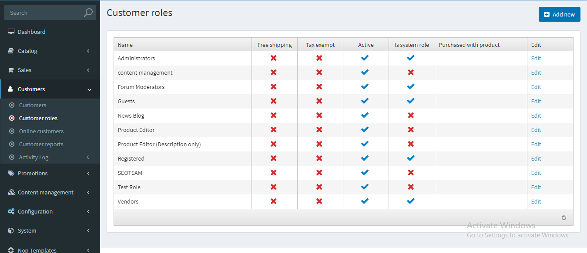
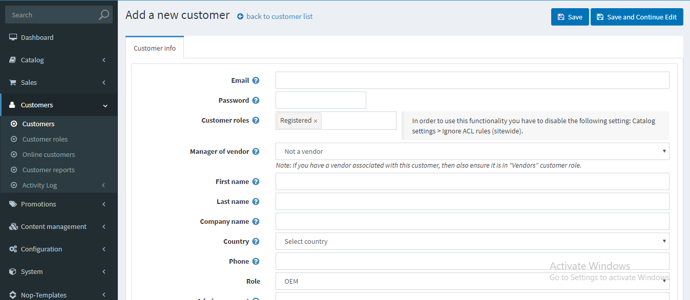
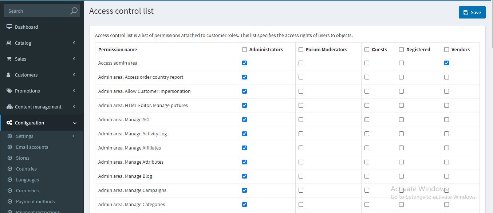

# Brief description of permission
## Overview
nopcommerce has two different application section/area. Website where every user can visit and navigate through different products, view price for products, perform search etc. without any restriction whatsoever. nopCommerce also has admin section from where all the content displayed in the main website are managed, but not everyone can have access to admin panel. So in order to restrict unauthorized users to access admin panel nopCommerce has the list of rules named "Access Control List" (ACL).

## What is ACL
One of the most important features in building robust web applications is ensuring that users have access to just the areas or web pages they need. So to achieve that nopCommerce uses ACL. Access Control List (ACL) is a list of rules which is responsible for controlling the accessibility of certain part or portion of software for certain users using authorization system. This is usually achieved by creating different roles and assigning users to the roles created. So, nopcommerce also uses the Role based authorization system. These roles define what a user can and cannot do in the web application. In role based authorization system users with certain roles have access to certain portion of application and only can perform certain operations within that portion of application. These operations typically include Read, Write, Update, and Delete. For example, in our application let us suppose we have two separate module, One for Sales Management and another for Stock Management. Here we want sales persons to access sales management module of our application but do not want them to access the Stock Management module. Also, we may want the stock manager to access stock management module but not the sales management module. We can further control what operation users can perform within the accessed modules by using permissions. For example, we may want certain users with certain permission who have access to certain module can perform insert and view operation but cannot perform update or delete operation.

## Database Structure for Access Control
nopCommerce has some database tables dedicated to store information’s for access control. Here we will be exploring what tables are responsible for storing access control information, what is its structure, what are the relationships among those tables.
* Customer
* CustomerRole
* Customer_CustomerRole_Mapping
* PermissionRecord
* PermissionRecord_Role_Mapping

### Customer
Here nopCommerce uses the customer table to store all members or users who are registered in nopCommerce store. This table is not exactly related to ACL, but this is the table that stores information of users whom we want to apply rules for access control. 
### CustomerRole
This table is responsible to store information about roles. Each customer may have one or many roles defining the access level to the application.
Customer_CustomerRole_Mapping
Since customer and CustomerRole has many to many relationship we cannot store relationship information in individual table so this table is used as the mapping between “Customer” and “CustomreRole”.
### PermissionRecord
In this table we store information about permissions. This table is not directly related to the customer. This table has many to many relationship with CustomerRole.
### PermissionRecord_Role_Mapping
Since “CustomerRole” and “PermissionRecord” has many to many relationship this table is used to map relationship among those two tables.

## How to isolate the admin panel by depending on the ACL
As we know admin panel is to manage the content that is shown in the website, we do not want everybody to access it. So, in order to give access to admin panel to specific users and restrict all other users, nopCommerce relies on Access Control List (ACL). Now the question is how we can isolate the admin panel. nopCommerce already has that feature implementation out of the box. As a developer we just need to use that logic in our code. Let us say we are creating a new plugin which is supposed to be accessed by users who have permission to access the admin panel. So in order to do that we need to decorate our plugin’s controllers or actions with `[AuthorizeAdmin]` attributes and that’s it. Now whatever controller or action you have decorated with this attribute can only be accessed by users with in some role which has “Access admin area” permission assigned to that role.

```cs
[AuthorizeAdmin] //confirms access to the admin panel
public class ExampleController : BasePluginController
{
    [HttpGet]
    public IActionResult Index()
    {
        //Index Action Logic...
        return Ok();
    }

    [HttpPost]
    public IActionResult Example(object data)
    {
        //Index Action Logic...
        return Ok();
    }
}
```
OR
```cs
public class ExampleController : BasePluginController
{
    [HttpGet]
    public IActionResult Index()
    {
        //Index Action Logic...
        return Ok();
    }

    [AuthorizeAdmin] //confirms access to the admin panel
    [HttpPost]
    public IActionResult Example(object data)
    {
        //Index Action Logic...
        return Ok();
    }
}
```

In the first example we are decorating whole controller with `[AuthorizeAdmin]` attribute. It will restrict to access all actions inside that controller. But In second example only one action is decorated with `[AuthorizeAdmin]` attribute users can access “Index” action even if users don’t have permission to access admin panel. 

## How AuthorizeAdmin works
If you navigate to AuthorizeAdmin class by pressing F12, you  will be navigated to a class named AuthorizeAdminAttribute class there you will see the implementation of this attribute. If you want then you can go to that file and explore yourself to get better understanding of this. Here let me summarize for you about how this works.
Whenever control hits any “Controller” or “Action” that is decorated by “AuthorizeAdmin” attribute, a new instance of “AuthorizeAdminAttribute” is created and OnAuthorization method from “AuthorizedAdminAttribute” is invoked, before code inside that Action that is decorated by this attribute is executed. This attribute class checks to validate if the user requisition for the resource has permission to access that resource or not. It does that by checking if user requisition for resource is in the role that has permission “Access admin area” associated to it. If user has the role then this will return true which means user is authorized else returns false. If true is returned then code block inside the “Action” will be executed and proper response will be sent otherwise if false is returned then this means that the user is not authorized and redirected to login page.
“Access admin area” is a permission created by nopcommerce system during nopCommerce database seeding process while installing nopCommerce application for the first time. There are a bunch of roles and permission created by nopcommerce during the installation process. These roles and permissions are used by nopCommerce for its prebuilt functions that ships with nopcommerce installation. For example you can see inside “List” Action of ProductController for Admin which can be found inside directory `{ProjectRootDirectory}\Presentation\Nop.Web\Areas\Admin\Controllers`. In the first line you will see code something like

```cs
if (!_permissionService.Authorize(StandardPermissionProvider.ManageProducts))
return AccessDeniedView();
```
This is checking if the user requesting for this action has permission to “manage product” or not, if it do not have that permission then access denied view is returned. Here `StandardPermissionProvider` is a partial class that holds all of the Roles and Permissions associated to certain roles. The same version of data is also stored in database tables we mentioned above. Here nopCommerce is accessing default roles and permissions from this `StandardPermissionProvider` class. ManageProduct property of this class holds a Permission Record

```cs
new PermissionRecord { 
Name = "Admin area. Manage Products", 
SystemName = "ManageProducts", 
Category = "Catalog" 
};
```
## How to create new Roles
As nopCommerce has some pre-defined roles which we can use to manage access control in our application while extending its functionality. But we are not limited to those pre-defined roles, as we can create new roles according to our requirement.
We can create new role from Admin panel. Go to Admin panel and under customer menu you will see a menu “Customer roles”, or you can directly go to the page from URL `{yourSiteDomain/ Admin/CustomerRole/List}`. Here we can see all list of roles previously existing in our database. 



From here we can edit existing roles, delete existing roles or create new roles. We can create a new role by using “Add new” button that present on the right top corner.

## How to assign roles to Users/Customers
In nopCommerce users can be registered from two place. Users can register themselves from the E-Commerce site by using register form. Users registered from register form will be assigned “Registered” role by default. But site admin can register new customer from admin panel. To register user from admin panel we need to go to Admin panel and under customer menu you will see a menu “Customer”, or you can directly go to the page from URL `{YourSiteDomain/Admin/Customer/Create}`.



While registering customers from admin panel we can assign roles to that customer, however customer registered from website only have “Register” role assigned to it by default, but we can edit those customers and assign new roles from admin panel. For that we need to go to customer menu from admin panel, from the list we can edit any customer registered to our store and assign new roles to those customers.

## How to add new Permissions
nopCommerce already has some per defined roles and permission. We already know how to create roles using admin panel. But we don’t have any UI(User Interface) available to create new permissions. We may come into a situation where we need to create a new permission. Like we may want to create a new plugin and want users to access that plugin with some custom permissions. So, in that case we need to create a new permission. For that reason we need to create a class implementing an interface IPermissionProvider. Here we need to implement two methods `GetPermissions()` and `GetDefaultPermissions()` from IPermissionProvider interface. GetPermission method returns an IEnumerable of PermissionRecord and GetDefaultPermission method returns IEnumerable of DefaultPermissionRecord. After that we need to inject PermissionService via the constructor dependency injection mechanism in the class that inherent from BasePlugin class. Now by using InstallPermissions method from PermissionService we can save the permission record and role that permission is assign to into our database if they don’t exist previously. It is common to delete resources while uninstalling the plugin that was created during installation, we can delete the permission record by using the UninstallPermissions method from PermissionService in uninstall method of plugin. Final code should look something like this.

```cs
public class CustomPermissionProvider : IPermissionProvider
{
    public static readonly PermissionRecord AccessExamplePlugin = new PermissionRecord
    { 
Name = "Access example plugin", 
SystemName = "AccessExamplePlugin", 
Category = "Plugin" 
    };

    /// <summary>
    /// Get permissions
    /// </summary>
    /// <returns>Permissions</returns>
    public IEnumerable<PermissionRecord> GetPermissions()
    {
        return new[]
        {
            AccessExamplePlugin
        };
    }

    /// <summary>
    /// Get default permissions
    /// </summary>
    /// <returns>Permissions</returns>
    public IEnumerable<DefaultPermissionRecord> GetDefaultPermissions()
    {
        return new[] {
            new DefaultPermissionRecord(){
                CustomerRoleSystemName = NopCustomerDefaults.AdministratorsRoleName,
                PermissionRecords = new[]
                {
                    AccessExamplePlugin
                }
            }
        };
    }

}

public class DistOfCustByCountryPlugin: BasePlugin
{
    private IWebHelper _webHelper;
    private readonly IPermissionService _permissionService;
    public DistOfCustByCountryPlugin(IWebHelper webHelper, IPermissionService permissionService)
    {
        _webHelper = webHelper;
        _permissionService = permissionService;
    }

    public override string GetConfigurationPageUrl()
    {
        return $"{_webHelper.GetStoreLocation()}Admin/TutorialCustomersByCountry/Configuration";
    }

    public override void Install()
    {
        //Code you want to run while installing the plugin goes here.
        _permissionService.InstallPermissions(new CustomPermissionProvider());
        base.Install();
    }

    public override void Uninstall()
    {
        //Code you want to run while Uninstalling the plugin goes here.
        _permissionService.UninstallPermissions(new CustomPermissionProvider());
        base.Uninstall();
    }
}
```

Now after implementing this code, when we install the plugin a new permission with SystemName “AccessExamplePlugin” will be created in our database and is assigned the "Administrators" role. To verify you can go to the access control list under admin panel there you can see new permission assigned to the administrators role.

## How to manage Permissions for Roles
We can manage permissions and roles from admin panel. For that go to admin panel => Configuration => Access Control List menu.



Here we can edit permissions for role by checking and uncheck the checkbox to assign and remove permission from specific roles.