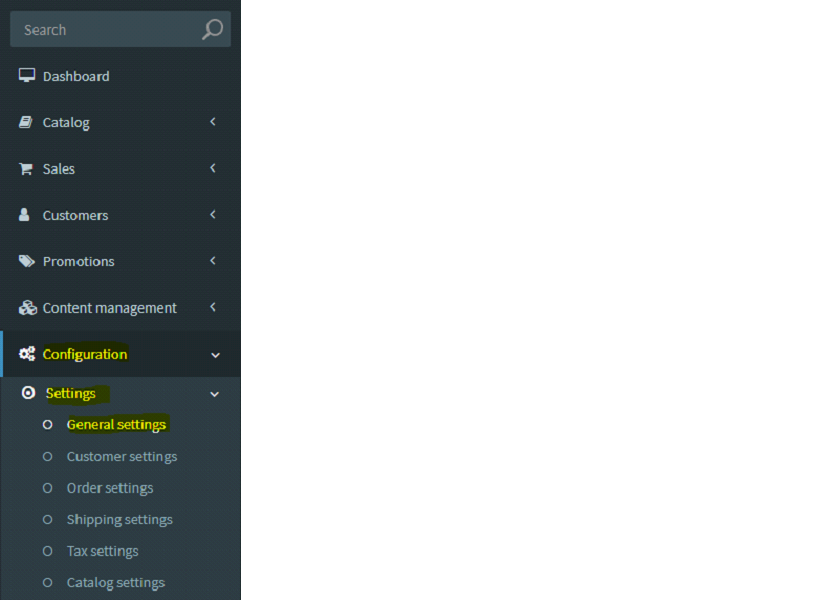
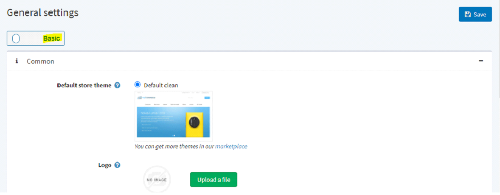
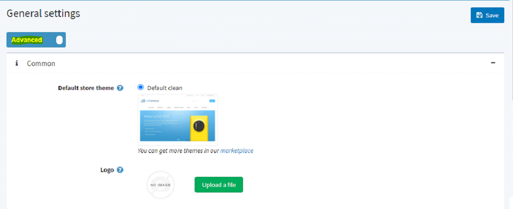
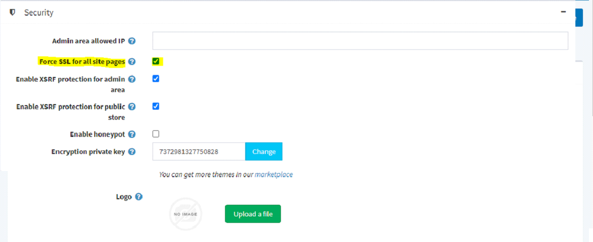

# Transition from HTTP to HTTPs

## Introduction to HTTP and HTTPs

### Overview

HTTP and HTTPs are the two main methods used for transferring data across the internet. HTTPS has an added layer of security, which HTTP doesn't. Traffic moving between a computer and website using HTTP is transmitted 'in the clear', which is to say if it were to be intercepted the person looking in would be able to read all the data as plainly as if it were written on a piece of paper.

### HTTP

HTTP stands for Hypertext Transfer Protocol. At its most basic, it allows for the communication between different systems. Its most commonly used to transfer data from a web server to a browser in order to allow users to view web pages. HTTP uses TCP (Transmission Control Protocol), generally over port 80, to send and receive data packets over the web. To put it simply it is a protocol that's used by a client and server which allows you to communicate with other websites.

### HTTPs

HTTPS transmits its data security using an encrypted connection. Basically it uses a public key which is then decrypted on the recipient side. The public key is deployed on the server, and included in what you know as an SSL certificate. It uses SSL (secure socket layer) and TLS (transport layer security) to encrypt the information in transit, meaning that if it's intercepted it will appear as a random jumble of letters and numbers.

## Implementing HTTPs in nopCommerce

To implement the HTTPs in nopCommerce user needs to consider following steps.

**Step 1:-** Go to the administrator dashboard.

**Step 2:-** Go to Configurations on side menu.

**Step 3:-** Go to Settings.

**Step 4:-** Go to General Settings.

**Step 5:-** In the "General setting" page if the setting is "Basic" then toggle to "Advance" by clicking toggle button present at the top of the page.

After toggle.

**Step 6:-** Under Security panel - Check the option (Force SSL for all site pages)

