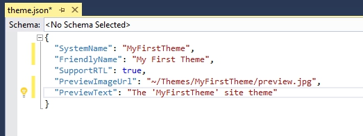

# Creating / Writing your own theme (using current / default theme)

Open your nopCommerce solution or website (web version) in Visual Studio - Go to this location:

* If using source code: `\Nop.Web\Themes\`
* If using web version: `\[Project Root]\Themes\`

1. Select any default / current theme

    

1. Now, Right click on the theme → select COPY

    

1. Now select "Theme" folder → right click → PASTE

    

1. You will get something like "Copy of default/current theme"

    

1. Rename it - whatever you like to be the name of your new theme – For an instance, let's say: MyFirstTheme

    

1. Now inside your New theme folder "MyFirstTheme" → open `theme.json`

    

1. Change the current / existing theme name with your new theme name "MyFirstTheme"

    

1. Now, inside your new theme folder "MyFirstTheme" → Content → Images add your new images in "images” directory and start updating / customizing your `style.css` according to your requirements.

    If you would like to test the changes → Go to Admin section → Apply your new theme → Save change and preview your public store.

    
