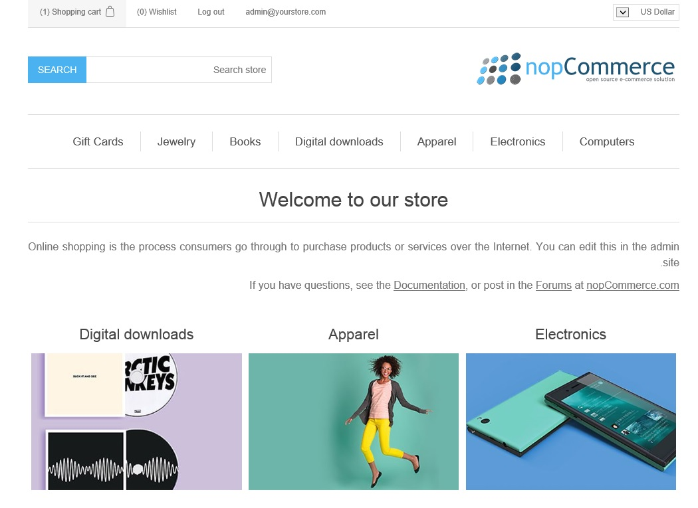

# Right To Left Theme

nopCommerce also supports the RTL version of the public store theme.

nopCommerce default public store theme **DefaultClean** comes with the feature of a right to a left version style sheet.

To enable the "Right to Left" version of the theme, please go to `Administration → Configuration → Languages`, click on **Edit** a language, and ensure that the **Right-to-Left** option is enabled.

Now, if you see the public store, it will look like this:

Styles used for RTL support are located in the `styles.rtl.css` file.

