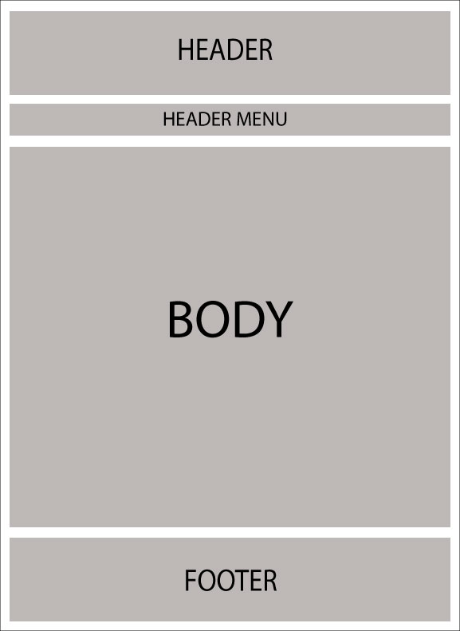
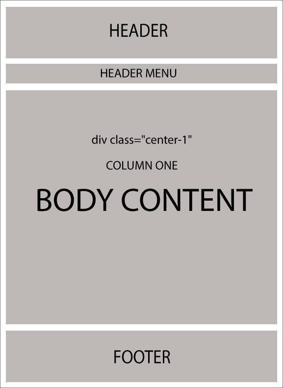
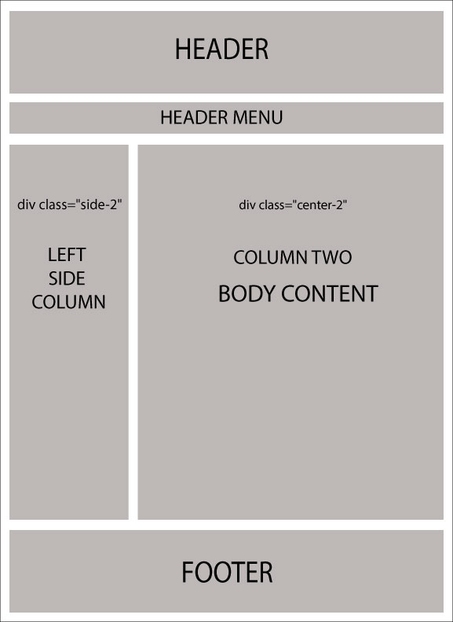

# Understanding Layout / Design

What are layouts? Every web developer/designer wants to maintain a consistent look and feel across all of the pages within the website. Back in the days, the concept of "Master Pages" was introduced in ASP.NET 2.0 which helps in maintaining a consistent look of the website by mapping it with .aspx pages.

Razor also supports this similar concept with a feature called "Layouts". Basically, it allows you to define a common site template and then inherit its look and feel across all the views/pages on your website.

In nopCommerce, there are 2 different kinds of layouts:

* `_ColumnsOne.cshtml`
* `_ColumnsTwo.cshtml`

All these 2 layouts are inherited from one main layout called: `_Root.cshtml`. The `_Root.cshtml` itself is inherited from `_Root.Head.cshtml`. `_Root.Head.cshtml` is the file you need to look into if you are linked css stylesheet and jquery files (you can add/link more `.css` and `.js` files here). The location of all these layouts in nopCommerce is as follows: nopCommerce root `directory/Views/Shared/...`. If you are using source code version then: `\Presentation\Nop.Web\Views\Shared\...`

* **Layout of _Root.cshtml**

    

* **Layout of `_Root.cshtml` (in respect of css class)**

    

Now the following 2 layouts override the body of `_Root.cshtml`:

* `_ColumnsOne.cshtml`

    In this case, there is no change in the layout of the body, so the structure remains pretty much the same as `_Root.cshtml`:

    

* `_ColumnsTwo.cshtml`

    In this case, there are 2 columns in the body structure:

    
