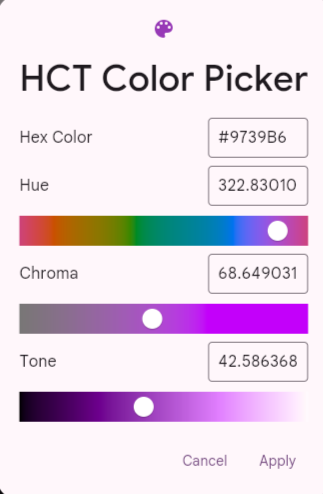
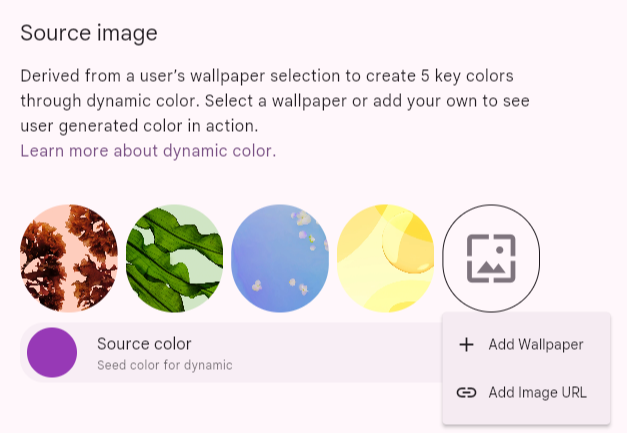
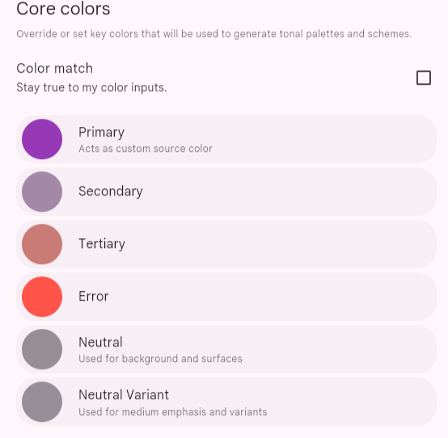
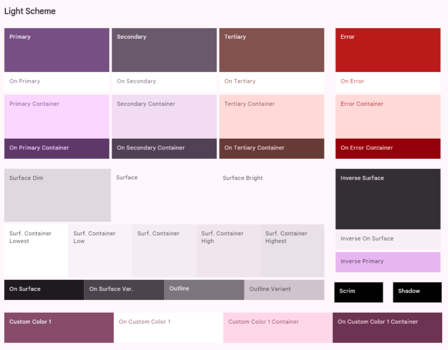
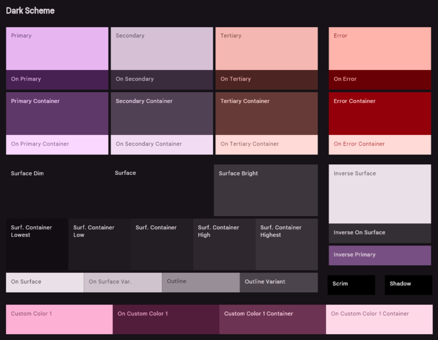
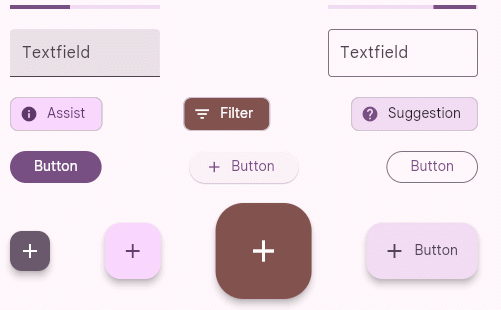
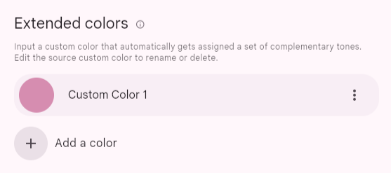
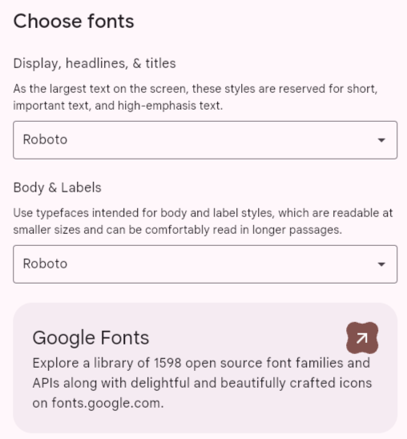
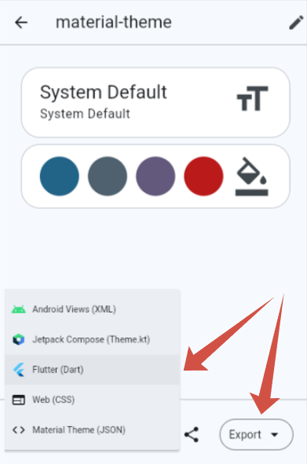

# Mobile app documentation

## Introduction

nopCommerce team provides a [mobile application for iOS and Android](https://www.nopcommerce.com/ecommerce-mobile-app). It will bring enormous value to your business. The mobile app is completely ready-to-go, so you can start selling your products and services straight away. Like the nopCommerce platform, the mobile app comes with the source code and offers unlimited customization options. What’s more, it can seamlessly adapt to your online store design and functionality. No coding or designing skills are required to integrate the app with your nopCommerce store, configure its content and features, publish it on the Google Play Store and App Store, and manage its workflow.

Here are some other significant features that will ensure efficient mobile eCommerce launching, customization, and maintenance:

- Build with latest version of Flutter and Dart

- Compatible with Android and iOS

- Used Riverpod (state management) features

- Easy to use UI and beautiful Material design 3

- Token-Based Authentication

- Internationalization support

- Dark and Light theme support

- Free icons

## Setup

With the "nopCommerce mobile app" plugin, in addition to the "Web API Frontend" plugin, it is possible to manage some application settings.


The following functions are available:

1. It is possible to transfer certain settings to the mobile application. This is done on purpose so as not to give access to absolutely all application settings. If you need additional settings, you must ensure that they are supported in the mobile application.
1. Slider control on the main screen. You can also specify which products users will go to if they click on each slider image.

## Visual Studio Code

The recommended development environment for Flutter is [Android Studio](https://developer.android.com/studio). A convenient alternative is the VS Studio Code editor, below are the basic settings that help you comfortably work with the code, as well as a set of extensions necessary for development and debugging.

### Editor settings

```json
{
    "[dart]": {
        "editor.codeActionsOnSave": {
            "source.fixAll": true
        },
        "editor.selectionHighlight": false,
        "editor.suggest.snippetsPreventQuickSuggestions": false,
        "editor.suggestSelection": "first",
        "editor.tabCompletion": "onlySnippets",
        "editor.wordBasedSuggestions": false,
    },
    "dart.warnWhenEditingFilesOutsideWorkspace": false,
    "dart.renameFilesWithClasses": "prompt",
    "editor.bracketPairColorization.enabled": true,
    "editor.inlineSuggest.enabled": true,
    "editor.formatOnSave": true,
    "explorer.compactFolders": false,
    "dart.debugExternalPackageLibraries": false,
    "dart.debugSdkLibraries": false,
    "editor.minimap.enabled": false
}
```

### Extensions

For development, you will need to install the following extensions:

Name: **Flutter**\
Id: Dart-Code.flutter\
Description: Flutter support and debugger for Visual Studio Code.\
Publisher: Dart Code\
VS Marketplace Link: <https://marketplace.visualstudio.com/items?itemName=Dart-Code.flutter>

Name: **Dart**\
Id: Dart-Code.dart-code\
Description: Dart language support and debugger for Visual Studio Code.\
Publisher: Dart Code\
VS Marketplace Link: <https://marketplace.visualstudio.com/items?itemName=Dart-Code.dart-code>

## Start development and customization

Open the source code from the archive that you will receive after purchasing the application in the Visual Studio Code editor.

Immediately after opening the project in the code editor, you will be prompted to download the included libraries. You can also do it yourself by running the following command in the terminal:

```bash
flutter pub get
```

Now you need to specify an endpoint to connect to the server to access the API. This setting is in the `lib\constants\app_constants.dart` file:

```dart
class AppConstants {
  static const String storeUrl = 'https://yourstore.com';
}
```

Now everything is ready to run the application:

```bash
flutter run
```

## Project structure

A mobile application developed on Flutter carries the functions of interacting with a public store using the Web API (Frontend). All the main processes of user interaction with the application are presented in the diagram below:


The approach that focuses on the fact that the functions of the application are root folders will be applied. And inside this folder, we describe the architectural layers inherent in this particular function in the form of subfolders. Thus, everything related to the functionality of interest to us is located in one folder, which greatly simplifies the understanding of the code.


## Technology stack

Frameworks & Libraries used:

- Flutter SDK 3.35.1
- Dart SDK 3.9.0
- flutter_riverpod: 2.6.1
- go_router: 16.1.0
- flutter_secure_storage: 9.2.4
- dio: 5.9.0

> [!IMPORTANT]
>
> For correct operation of the application, it is recommended to use the package versions specified in the configuration.

## App architecture

The application architecture is built according to generally accepted standards, described in the [Android documentation](https://developer.android.com/topic/architecture). Since the project uses the Riverpod state management system, the architecture has been extended and looks like this:


## Navigation - go_router

For navigation in the application, the [go_router](https://pub.dev/packages/go_router) library is used. It is a declarative routing system built on top of the [Flutter Router API](https://api.flutter.dev/flutter/widgets/Router-class.html).

The navigation map in the app looks like this:

```bash
├─/splash (SplashScreen)
└─ (ShellRoute)
  ├─/home 
  ├─/catalog 
  │ ├─/catalog/category/:id (CategoryDetailsScreen)
  │ ├─/catalog/manufacturer/:id (ManufacturerDetailsScreen)
  │ ├─/catalog/vendor/:id (VendorDetailsScreen)
  │ ├─/catalog/productsByTag/:id (ProductsByTagScreen)
  │ ├─/catalog/productSearch/:q (ProductsSearchScreen)
  │ └─/catalog/product/:id (ProductDetailsScreen)
  │   ├─/catalog/product/:id/review (ProductReviewScreen)
  │   └─/catalog/product/:id/addReview 
  ├─/cart 
  │ └─/cart/checkout 
  └─/account 
    ├─/account/logincheckout 
    ├─/account/login 
    │ └─/account/login/forgotPassword (ForgotPasswordScreen)
    ├─/account/register 
    ├─/account/settings 
    ├─/account/contactUs 
    ├─/account/wishlist (WishlistScreen)
    ├─/account/accountInfo (AccountInfoScreen)
    ├─/account/accountAddresses (AccountAddressesScreen)
    │ └─/account/accountAddresses/createUpdateAddress/:id teAddressScreen)
    ├─/account/accountOrders (AccountOrdersScreen)
    │ └─/account/accountOrders/orderDetails/:id (OrderDetailsScreen)
    ├─/account/accountDownloadableProducts nloadableProductsScreen)
    ├─/account/accountBackInStock (AccountBackInStockScreen)
    ├─/account/accountRewardPoints (AccountRewardPointsScreen)
    ├─/account/accountChangePassword (AccountChangePassword)
    ├─/account/accountProductReviews (AccountProductReviewsScreen)
    ├─/account/accountGdprTools (AccountGdprToolsScreen)
    ├─/account/accountReturnRequests (AccountReturnRequestsScreen)
    └─/account/returnRequest/:id (ReturnRequestScreen)
```

## Web API client generation

Istall the [OpenAPI Generator](https://openapi-generator.tech/) (Requires [Node.js](https://nodejs.org/en/download/))

To update the version of OpenAPI Generator, use the following command and select the latest stable version from the list provided.

```bash
openapi-generator-cli version-manager list
```

Create a file *openapitools.json*.
Use the [dart-dio](https://openapi-generator.tech/docs/generators/dart-dio) generator.

```json
{
  "$schema": "node_modules/@openapitools/openapi-generator-cli/config.schema.json",
  "spaces": 2,
  "generator-cli": {
    "version": "7.14.0",
    "generators": {
        "frontend": {
            "input-spec": "swagger.json",
            "generator-name": "dart-dio",
            "output": "frontend_api",
            "additionalProperties": {
                "pubName": "frontend_api"
            }
        }
    }
  }
}
```

> [!NOTE]
>
> To update the generator version, run the following command:
>
> ```bash
> openapi-generator-cli version-manager list
>```

It is necessary that the OpenAPI schema *swagger.json* be in the directory with the generator installed.

1. Call the following command to generate the client:

    ```bash
    openapi-generator-cli generate
    ```

1. The standard openapi-generator will only generate base code that uses libraries that rely on Dart's own code generation. Therefore, after the completion of the base generation, it is necessary to start the Dart generator:

    ```bash
    cd frontend_api
    flutter pub get  
    dart run build_runner build -d
    ```

    As a result, we get a ready-made package, which will be located where you specified in  the configuration file or console command. It remains to include it in *pubspec.yaml*:

    ```yaml
    frontend_api: # <- nopCommerce generated api library
        path: lib/frontend_api
    ```

## Localization

To localize the interface of the application itself, you need to place a file with locales in the `\lib\localization` folder. It is important that the file name is in the following format:

`intl_`**{your_language_code_from_server}**`.arb`

As a basis, you can take the *intl_en.arb* file already in the kit and translate its resources into the target language.

Run the following command in a terminal to generate the required resource files for localization.

```bash
flutter gen-l10n
```

You can make sure that all the necessary resources are generated correctly in the `lib\localization\generated\i18n` path.


> [!WARNING]
>
> Do not make any changes to this file as this part of the code is auto-generated. All localization changes should be made strictly in the `intl_`**{your_language_code_from_server}**`.arb` file located along the path `\lib\localization`.

Now, when switching the language in the application settings, the application interface will also be localized.

> [!IMPORTANT]
>
> The language code that will be embedded in the name of the localization file must match the one added on your server. Otherwise, the interface will be localized by the default locales (i.e. `en`).

## Designing the user interface

To maintain a unified and consistent look across devices, we harnessed the potential of design tokens provided by Material 3. These tokens allow for storing styles, fonts, and animation values, enabling us to use the same style values in both design files and code.

Using tokens provides several advantages:

- Consistency: Tokens ensure consistent design across screens and components.
- Theming: Easily switch between light/dark/dynamic themes by swapping the ColorScheme or ThemeData.
- Maintainability: Change the look of the entire app from one place (no need to search and replace color codes).
- Design/Dev collaboration: Tokens serve as a bridge between Figma and Flutter.

### Integrating Tokens from Design Tools

**Material Theme Builder** (MTB) is a designer/developer tool for creating Material Design 3 (M3) color & type tokens and exporting them as code (Flutter, Compose, Android XML, design tokens, etc.). It helps you produce coordinated light/dark `ColorScheme`s from a seed/brand color, preview components, and export ready-to-use artifacts for implementation.

#### Generate a color scheme

1. Open the **[Material Theme Builder](https://m3.material.io/theme-builder)**.

1. Pick a seed / primary color

   - Enter a hex value, use the color picker, or use an eyedropper. The seed (primary) color is the single starting point from which tonal palettes are generated.

     

   - You can also enable *dynamic color* input (wallpaper/image) or import an image to extract colors — MTB will derive tonal palettes from that source.

     

1. Choose or tweak secondary / tertiary / error / neutral colors

   MTB shows slots for common roles (secondary, tertiary, error, neutral, etc.). You can accept automatically-generated values or override specific role colors (enter hex values manually). The builder keeps role relationships consistent with M3 rules.

   

   Here you need to select the base colors for the entire scheme. You can enter them manually, for example, if your brand colors are already defined. On the **Dynamic** panel, you can upload an image and extract colors from it. It is recommended to use the service [https://coolors.co/](https://coolors.co/) to generate harmonious colors.

   Сlick **Start the generator**:

   

   You can delete the extra blocks until only 3 remain, and then press the spacebar to generate variations.

1. Switch between Light and Dark previews

   Toggle Light/Dark to immediately see both schemes;

   

   MTB generates paired light/dark `ColorScheme`s so contrast & visual hierarchy are preserved across brightness modes.

   

1. Preview components and surfaces

   The builder has live previews (app bars, buttons, chips, cards, list items, navigation bars, dialogs). Use them to validate how your palette behaves on surfaces, text, icons, and interactive controls.

   

1. Use color-matching / harmonization

   If you have brand colors that clash with generated tonal palettes, MTB offers color-matching or harmonization modes that nudge palettes to harmonize with brand hues while still following M3 tonal rules. This is useful when starting from multiple brand colors.

   

1. Typography

   Select base font family. MTB can produce tokens for typography (weights, sizes, line heights) to accompany your color tokens.

   

1. Export

    Choose the export format - **Flutter (Dart)**, then export/download a ZIP with code artifacts and token files. For Flutter, the builder typically generates `theme.dart` that you can drop into your project.

    

#### Overview of the theme.dart file

Once you've created your color palette in *Material Theme Builder* and exported it, you'll get a `theme.dart` file. This file is the starting point for styling your app. Typically, its main content is two `ColorScheme` objects:

- `lightScheme`: Defines a set of colors for your app's light theme (e.g. background, text, and accent colors in light mode).

- `darkScheme`: Defines the same colors for your dark theme.

These schemes are generated based on the seed color you choose and ensure a harmonious and consistent color combination throughout your app, following the principles of Material Design 3.

#### Integration `theme.dart` into the project

To keep your project structure organized, it is recommended to store theme-related files in a separate directory.

Peplace the generated `ColorScheme` objects from `theme.dart` into - `lib/themes/material_theme.dart`.

As your design system grows, you may need to introduce custom tokens (e.g., specific brand colors, semantic states). Use extensions. This code demonstrates which extension tokens are used in the mobile application.

```dart
ThemeData theme(ColorScheme colorScheme) => ThemeData(
        useMaterial3: true,
        brightness: colorScheme.brightness,
        colorScheme: colorScheme,
        textTheme: textTheme.apply(
          bodyColor: colorScheme.onSurface,
          displayColor: colorScheme.onSurface,
        ),
        scaffoldBackgroundColor: colorScheme.surface,
        canvasColor: colorScheme.surface,
        // defailt extensions - BEGIN
        extensions: [
          CustomColors(
            subTextColor: colorScheme.onSurfaceVariant,
            ratingStarColor: colorScheme.secondary,
            pictureIndicatorColor: colorScheme.surfaceContainerHighest,
            pictureIndicatorCurrentColor: colorScheme.primary,
            inStockColor: colorScheme.tertiary,
            outOfStockColor: colorScheme.error,
          ),
        ],
        // defailt extensions - END
      );
```

>[!NOTE]
>
> You can use the entire contents of the `theme.dart` file, but don't forget to include the default extensions that are available in the `custom_color_scheme.dart` file.

That’s it — restart the application and enjoy your new color scheme.

## Publishing to the Google Play Store

The process for releasing your Flutter app on the Google Play Store involves preparing, building, and then uploading your application to the Google Play Console.

Key Steps:

1. Sign Up for a Google Play Developer Account: You'll need to register for a developer account.
1. Prepare the App for Release: This includes configuring the app's name, icon, and version number in the `pubspec.yaml` file and setting up necessary permissions.
1. Sign the Application: You must generate an upload keystore and sign your app with it to verify your identity.
1. Build the Release Version: Use the `flutter build appbundle` command to create an Android App Bundle (*.aab*) of your application.
1. Publish on the Google Play Console: Create a new app listing in your Play Console, fill out all the required store listing details (title, description, screenshots, privacy policy), and upload your *.aab* file for review.

Official Documentation: [Build and release an Android app](https://docs.flutter.dev/deployment/android)

## Publishing to the Apple App Store

Deploying to the Apple App Store requires enrolling in the Apple Developer Program and using Xcode to manage the final steps of the process.

Key Steps:

1. Enroll in the Apple Developer Program: This is a paid annual subscription that grants you access to publish on the App Store.
1. Configure the Project in Xcode: Open the `ios` folder of your project in Xcode to set up the Bundle ID, version number, and code signing settings.
1. Create an App Store Connect Listing: Log in to App Store Connect to create a new app record. Here, you will enter all the metadata for your app, such as its name, description, screenshots, keywords, and privacy information.
1. Build and Archive the App: Use Xcode to create a build archive (*.ipa*) of your application.
1. Upload to App Store Connect: Upload the archived build using Xcode or the Transporter tool.
1. Submit for Review: Once the build is processed and all metadata is complete, you can submit the app to Apple for review.

Official Documentation: [Build and release an iOS app](https://docs.flutter.dev/deployment/ios)
