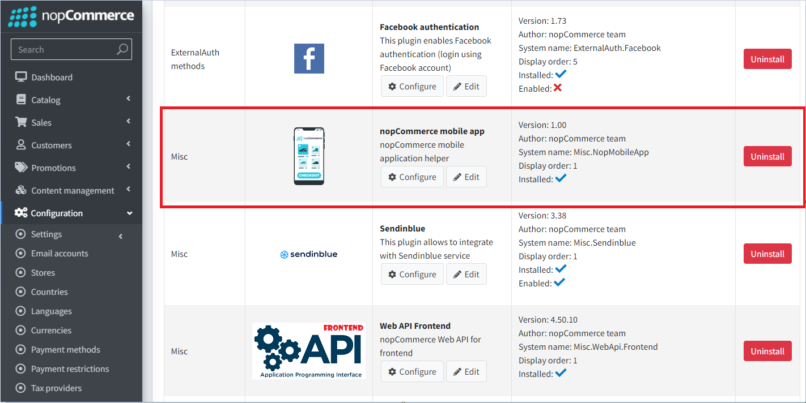
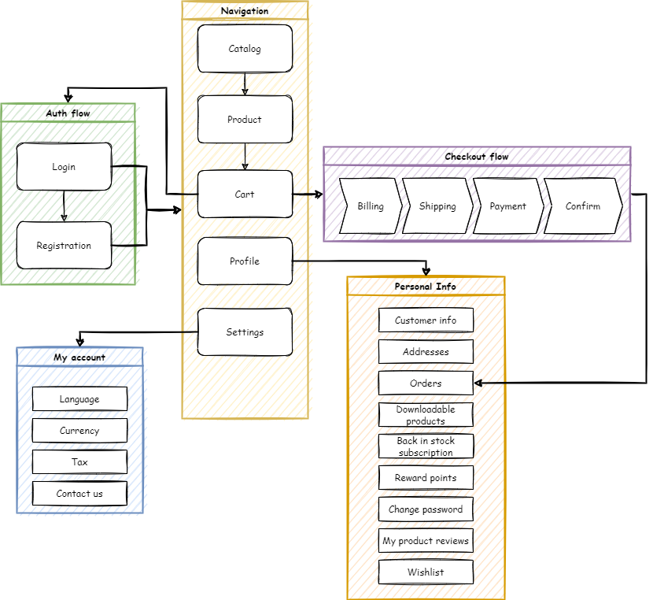
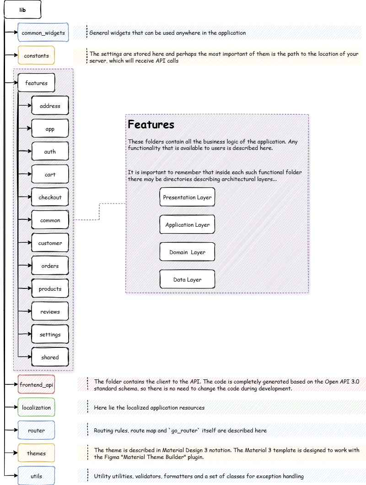
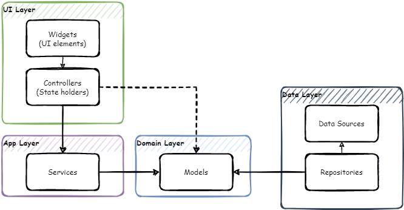

# Mobile app documentation

## Introduction

nopCommerce team provides a [mobile application for iOS and Android](https://www.nopcommerce.com/ecommerce-mobile-app). It will bring enormous value to your business. The mobile app is completely ready-to-go, so you can start selling your products and services straight away. Like the nopCommerce platform, the mobile app comes with the source code and offers unlimited customization options. What’s more, it can seamlessly adapt to your online store design and functionality. No coding or designing skills are required to integrate the app with your nopCommerce store, configure its content and features, publish it on the Google Play Store and App Store, and manage its workflow.

Here are some other significant features that will ensure efficient mobile eCommerce launching, customization, and maintenance:

- Build with latest version of Flutter and Dart

- Compatible with Android and iOS

- Used Riverpod (state management) features

- Easy to use UI and beautiful Material design 3

- Token-Based Authentication

- Internationalization support

- Dark and Light theme support

- Free icons

## Setup

With the "nopCommerce mobile app" plugin, in addition to the "Web API Frontend" plugin, it is possible to manage some application settings.



The following functions are available:

1. It is possible to transfer certain settings to the mobile application. This is done on purpose so as not to give access to absolutely all application settings. If you need additional settings, you must ensure that they are supported in the mobile application.
1. Slider control on the main screen. You can also specify which products users will go to if they click on each slider image.

## Visual Studio Code

The recommended development environment for Flutter is [Android Studio](https://developer.android.com/studio). A convenient alternative is the VS Studio Code editor, below are the basic settings that help you comfortably work with the code, as well as a set of extensions necessary for development and debugging.

### Editor settings

```json
{
    "[dart]": {
        "editor.codeActionsOnSave": {
            "source.fixAll": true
        },
        "editor.selectionHighlight": false,
        "editor.suggest.snippetsPreventQuickSuggestions": false,
        "editor.suggestSelection": "first",
        "editor.tabCompletion": "onlySnippets",
        "editor.wordBasedSuggestions": false,
    },
    "dart.warnWhenEditingFilesOutsideWorkspace": false,
    "dart.renameFilesWithClasses": "prompt",
    "editor.bracketPairColorization.enabled": true,
    "editor.inlineSuggest.enabled": true,
    "editor.formatOnSave": true,
    "explorer.compactFolders": false,
    "dart.debugExternalPackageLibraries": false,
    "dart.debugSdkLibraries": false,
    "editor.minimap.enabled": false
}
```

### Extensions

For development, you will need to install the following extensions:

Name: **Flutter**\
Id: Dart-Code.flutter\
Description: Flutter support and debugger for Visual Studio Code.\
Publisher: Dart Code\
VS Marketplace Link: <https://marketplace.visualstudio.com/items?itemName=Dart-Code.flutter>

Name: **Dart**\
Id: Dart-Code.dart-code\
Description: Dart language support and debugger for Visual Studio Code.\
Publisher: Dart Code\
VS Marketplace Link: <https://marketplace.visualstudio.com/items?itemName=Dart-Code.dart-code>

Name: **Adobe XD**\
Id: adobe.xd\
Description: The new Adobe XD Extension for Visual Studio Code allows developers to visually map design sources, created in XD and available in Creative Cloud Libraries, to platform-specific code using design tokens. DesignOps teams will be able to create shareable Design System Packages (DSPs) that contain all the information developers need to consume while coding, including code snippets and documentation. \
Publisher: Adobe\
VS Marketplace Link: <https://marketplace.visualstudio.com/items?itemName=Adobe.xd>

## Start development and customization

Open the source code from the archive that you will receive after purchasing the application in the Visual Studio Code editor.

Immediately after opening the project in the code editor, you will be prompted to download the included libraries. You can also do it yourself by running the following command in the terminal:

```bash
flutter pub get
```

Now you need to specify an endpoint to connect to the server to access the API. This setting is in the `lib\constants\app_constants.dart` file:

```dart
class AppConstants {
  static const String storeUrl = 'https://yourstore.com';
}
```

Now everything is ready to run the application:

```bash
flutter run
```

## Project structure

A mobile application developed on Flutter carries the functions of interacting with a public store using the Web API (Frontend). All the main processes of user interaction with the application are presented in the diagram below:



The approach that focuses on the fact that the functions of the application are root folders will be applied. And inside this folder, we describe the architectural layers inherent in this particular function in the form of subfolders. Thus, everything related to the functionality of interest to us is located in one folder, which greatly simplifies the understanding of the code.



## Technology stack

Frameworks & Libraries used:

- Flutter SDK 3.3.9
- Dart SDK 2.18.5
- flutter_riverpod: 2.1.1
- go_router: 5.2.3
- flutter_secure_storage: 7.0.0
- dio: 4.0.6

## App architecture

The application architecture is built according to generally accepted standards, described in the [Android documentation](https://developer.android.com/topic/architecture). Since the project uses the Riverpod state management system, the architecture has been extended and looks like this:



## Navigation - go_router

For navigation in the application, the [go_router](https://pub.dev/packages/go_router) library is used. It is a declarative routing system built on top of the [Flutter Router API](https://api.flutter.dev/flutter/widgets/Router-class.html).

The navigation map in the app looks like this:

```bash
Full paths for routes:
    splash => /splash
    home => /home
    catalog => /catalog
    category => /catalog/category/:id
    manufacturer => /catalog/manufacturer/:id
    vendor => /catalog/vendor/:id
    productsbytag => /catalog/productsByTag/:id
    productsearch => /catalog/productSearch/:q
    product => /catalog/product/:id
    review => /catalog/product/:id/review
    addreview => /catalog/product/:id/addReview
    cart => /cart
    checkout => /cart/checkout
    account => /account
    logincheckout => /account/logincheckout
    login => /account/login
    forgotpassword => /account/login/forgotPassword
    register => /account/register
    settings => /account/settings
    contactus => /account/contactUs
    wishlist => /account/wishlist
    accountinfo => /account/accountInfo
    accountaddresses => /account/accountAddresses
    createupdateaddress => /account/accountAddresses/createUpdateAddress/:id
    accountorders => /account/accountOrders
    orderdetails => /account/accountOrders/orderDetails/:id
    accountdownloadableproducts => /account/accountDownloadableProducts
    accountbackinstock => /account/accountBackInStock
    accountrewardpoints => /account/accountRewardPoints
    accountchangepassword => /account/accountChangePassword
    accountproductreviews => /account/accountProductReviews
    returnrequest => /account/returnRequest/:id
```

## Web API client generation

Istall the [OpenAPI Generator](https://openapi-generator.tech/) (Requires [Node.js](https://nodejs.org/en/download/))

To update the version of OpenAPI Generator, use the following command and select the latest stable version from the list provided.

```bash
openapi-generator-cli version-manager list
```

Create a file *openapitools.json*.
Use the [dart-dio](https://openapi-generator.tech/docs/generators/dart-dio) generator.

```json
{
  "$schema": "node_modules/@openapitools/openapi-generator-cli/config.schema.json",
  "spaces": 2,
  "generator-cli": {
    "version": "6.0.1",
    "generators": {
        "frontend": {
            "input-spec": "swagger.json",
            "generator-name": "dart-dio",
            "output": "frontend_api",
            "additionalProperties": {
                "pubName": "frontend_api"
            }
        }
    }
  }
}
```

It is necessary that the OpenAPI schema *swagger.json* be in the directory with the generator installed.

1. Call the following command to generate the client:

    ```bash
    openapi-generator-cli generate
    ```

1. The standard openapi-generator will only generate base code that uses libraries that rely on Dart's own code generation. Therefore, after the completion of the base generation, it is necessary to start the Dart generator:

    ```bash
    cd frontend_api
    flutter pub get  
    flutter pub run build_runner build -d
    ```

    As a result, we get a ready-made package, which will be located where you specified in  the configuration file or console command. It remains to include it in *pubspec.yaml*:

    ```yaml
    frontend_api: # <- nopCommerce generated api library
        path: lib/frontend_api
    ```
