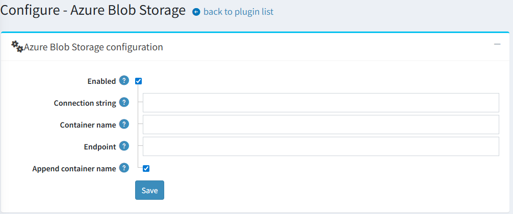
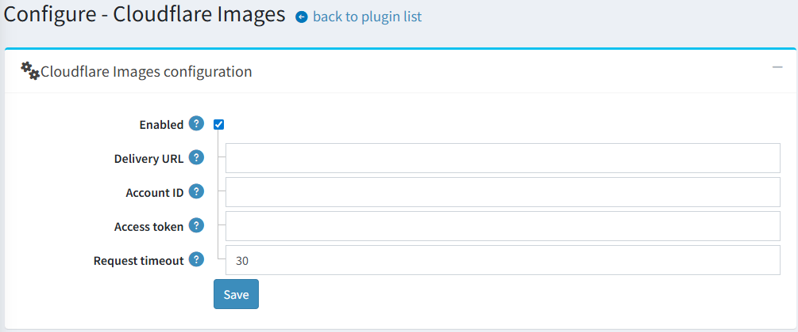

# Cloudflare Images Integration

## Overview

Starting with version 4.90, thumbnail management has been refactored for greater flexibility. A new interface, `IThumbService`, has been introduced to handle all thumbnail-related operations previously managed by 'IPictureService`.

The following methods have been moved to `IThumbService`:

- `GetThumbLocalPathAsync`
- `GeneratedThumbExistsAsync`
- `SaveThumbAsync`
- `GetThumbLocalPathByFileNameAsync`
- `GetThumbUrlAsync`
- `DeletePictureThumbsAsync`

As part of this change, thumbnail storage logic has been decoupled from the core application into standalone plugins. The existing **Azure Blob Storage** functionality is now a separate plugin. A new plugin has been developed to integrate **Cloudflare Images** as a thumbnail storage solution.

> [!NOTE]
>
> By default, both the Azure Blob and Cloudflare Images plugins (`Misc.AzureBlob` and `Misc.CloudflareImages`) are listed in the `InstallationConfig.DisabledPlugins` property. This ensures that neither plugin is installed during a fresh setup, allowing store owners to choose and install the storage solution that best fits their needs.

## Configuration Azure Blob Storage

We can use *Azure Blob Storage* to store blob data. nopCommerce already has a feature integrated for that, we just need to set the following information correctly to use this feature. Values for these settings can be obtained for *Azure* while you create the storage account.



- **ConnectionString** This setting expects a string value. Here you need to add your `AzureBlobStorage` connection string.
- **ContainerName** Value for this setting is also of type string. In this setting, we set the container name for *Azure BLOB storage*.
- **EndPoint** This setting also expects a string value. Here we need to set the endpoint for *Azure BLOB storage*.
- **AppendContainerName** This setting expects a boolean value. Set the value to **`true`** or **`false`** based on whether the Container Name is appended to the `EndPoint` when constructing the URL.

## Configuration Cloudflare Images

The plugin settings are straightforward, consisting of four fields in addition to the master enable/disable switch.



A critical field is the **Delivery URL**. It must be configured in the following specific format:

```bash
https://imagedelivery.net/[account_hash]/<image_id>/<variant_name>
```

This URL acts as a template. The plugin will dynamically insert the required `image_id` and `variant_name` to generate the final URLs for the thumbnails displayed on the website.

## Usage

Once configured and enabled, the plugin operates automatically in the background, similar to the Azure Blob storage integration. It seamlessly handles:

- Uploading new thumbnails to the Cloudflare Images service.
- Replacing local thumbnail URLs with the corresponding Cloudflare Images URLs on all public-facing pages.
