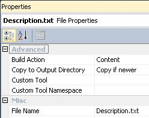

# How to write a plugin for nopCommerce 3.90 (and previous versions)

> In computing, a plug-in (or plugin) is a set of software components that add specific abilities to a larger software application (Wikipedia).

Plugins are used to extend the functionality of nopCommerce. nopCommerce has several types of plugins. For example, payment methods (such as PayPal), tax providers, shipping method computation methods (such as UPS, USP, FedEx), widgets (such as 'live chat' block), and many others. nopCommerce is already distributed with many different plugins. You can also search various plugins on the [nopCommerce official site](https://www.nopcommerce.com/marketplace) to see if someone has already created a plugin that suits your needs. If not, this article will guide you through the process of creating your plugin.

## The plugin structure, required files, and locations

1. First thing you need to do is to create a new "Class Library" project in the solution. It's a good practice to place all plugins into the `\Plugins` directory in the root of your solution (do not mix up with \Plugins subdirectory located in `\Nop.Web` directory which is used for already deployed plugins). It's a good practice to place all plugins into the "Plugins" solution folder (you can find more information about solution folders [here](http://msdn.microsoft.com/library/sx2027y2.aspx)).

    A recommended name for a plugin project is "Nop.Plugin.{Group}.{Name}". {Group} is your plugin group (for example, "Payment" or "Shipping"). {Name} is your plugin name (for example, "PayPalStandard"). For example, the PayPal Standard payment plugin has the following name: Nop.Plugin.Payments.PayPalStandard. But please note that it's not a requirement. And you can choose any name for a plugin. For example, "MyGreatPlugin".

    

1. Once the plugin project is created update the project build output path. Set it to `..\..\Presentation\Nop.Web\Plugins\{Group}.{Name}`. For example, Authorize.NET payment plugin has the following output path: `..\..\Presentation\Nop.Web\Plugins\Payments.AuthorizeNet`. After it's done, appropriate plugin DLLs will be automatically copied to the `\Presentation\Nop.Web\Plugins` directory which is searched by the nopCommerce core for valid plugins. But please note that it's also not a requirement. And you can choose any output directory name for a plugin.

    

    - On the Project menu, click Properties.
    - Click the Build tab.
    - Click the Browse button next to the Output path box and select a new build output directory.

    You should do the steps described above to all existing configurations ("Debug" and "Release").

1. The next step is creating a `Description.txt` file required for each plugin. This file contains meta-information describing your plugin. Just copy this file from any other existing plugin and modify it for your needs. For example, the PayPal Standard payment plugin has the following `Description.txt` file:

    ```txt
    Group: Payment methods
    FriendlyName: PayPal Standard
    SystemName: Payments.PayPalStandard
    Version: 1.28
    SupportedVersions: 3.90
    Author: nopCommerce team
    DisplayOrder: 1
    FileName: Nop.Plugin.Payments.PayPalStandard.dll
    Description: This plugin allows paying with PayPal Standard
    ```

    All fields are self-descriptive, but here are some notes. **SystemName** field should be unique. **Version** field is a version number of your plugin; you can set it to any value you like. **SupportedVersions** field can contain a list of supported nopCommerce versions separated by commas (ensure that the current version of nopCommerce is included in this list, otherwise, it will not be loaded). **FileName** field has the following format *Nop.Plugin.{Group}.{Name}.dll* (it is your plugin assembly filename). Ensure that the "Copy to Output Directory" property of this file is set to "Copy if newer".

    

1. You should also created a web.config file and ensure that it's copied to the output. Just copy it from any existing plugin.

    > [!IMPORTANT]
    > Going forward make sure "Copy local" properties of all third-party assembly references (including core libraries such as Nop.Services.dll or Nop.Web.Framework.dll) are set to "False" (do not copy)

1. The last required step is to create a class that implements the IPlugin interface (Nop.Core.Plugins namespace). nopCommerce has BasePlugin class which already implements some IPlugin methods and allows you to avoid source code duplication. nopCommerce also provides you with some specific interfaces derived from IPlugin. For example, we have the "IPaymentMethod" interface which is used for creating new payment method plugins. It contains some methods which are specific only for payment methods such as ProcessPayment() or GetAdditionalHandlingFee(). Currently, nopCommerce has the following specific plugin interfaces:

   - **IPaymentMethod**. These plugins are used for payment processing.
   - **IShippingRateComputationMethod**. These plugins are used for retrieving accepted delivery methods and appropriate shipping rates. For example, UPS, UPS, FedEx, etc.
   - **IPickupPointProvider**. These plugins are used for providing pickup points.
   - **ITaxProvider**. Tax providers are used for getting tax rates.
   - **IExchangeRateProvider**. Used for getting currency exchange rate.
   - **IDiscountRequirementRule**. Allows you to create new discount rules such as "Billing country of a customer should be…"
   - **IExternalAuthenticationMethod**. Used for creating external authentication methods such as Facebook, Twitter, OpenID, etc.
   - **IWidgetPlugin**. It allows you to create widgets. Widgets are rendered on some parts of your site. For example, it can be a "Live chat" block on your site's left column.
   - **IMiscPlugin**. If your plugin doesn't fit any of the interfaces above.

> [!IMPORTANT]
> After each project build, clean the solution before making changes. Some resources will be cached and can lead to developer insanity.

## Handling requests. Controllers, models, and views

Now you can see the plugin by going to **Admin area → Configuration → Plugins**. But as you guessed our plugin does nothing. It does not even have a user interface for its configuration. Let's create a page to configure the plugin.

What we need to do now is create a controller, a model, and a view.

- MVC controllers are responsible for responding to requests made against an ASP.NET MVC website. Each browser request is mapped to a particular controller.
- A view contains the HTML markup and content that is sent to the browser. A view is the equivalent of a page when working with an ASP.NET MVC application.
- An MVC model contains all of your application logic that is not contained in a view or a controller.

You can find more information about the MVC pattern [here](http://www.asp.net/mvc/tutorials/older-versions/overview/understanding-models-views-and-controllers-cs).

So let's start:

- **Create the model**. Add a Models folder in the new plugin, and then add a new model class that fits your need.
- **Create the view**. Add a Views folder in the new plugin, then add a {Name} folder (where {Name} is your plugin name), and finally add a cshtml file named `Configure.cshtml`. Important note: for versions 2.00-3.30 the view should be marked as an embedded resource. And starting version 3.40 views, ensure that the "Build Action" property of the view file is set to "Content", and the "Copy to Output Directory" property is set to "Copy if newer".
- **Create the controller**. Add a Controllers folder in the new plugin, and then add a new controller class. A good practice is to name plugin controllers `{Group}{Name}Controller.cs`. For example, PaymentAuthorizeNetController. Of course, it's not a requirement to name controllers this way (but just a recommendation). Then create an appropriate action method for the configuration page (in the admin area). Let's name it "Configure". Prepare a model class and pass it to the following view. For nopCommerce versions 2.00-3.30 you should pass embedded view path - "Nop.Plugin.{Group}.{Name}.Views. {Group}{Name}.Configure". And starting nopCommerce version 3.40 you should pass physical view path - `~/Plugins/{PluginOutputDirectory}/Views/{ControllerName}/Configure.cshtml`. For example, open the Authorize.NET payment plugin and look at its implementation of PaymentAuthorizeNetController.

    > [!TIP]
    >
    > - The easiest way to complete the steps described above is by opening any other plugin and copying these files into your plugin project. Then just rename appropriate classes and directories.
    >
    > - If you want to limit access to a certain action method of the controller to administrators (store owners), then just mark it with the [AdminAuthorize] attribute.

    For example, the project structure of the Authorize.NET plugin looks like the image below

    

## Routes

Now we need to register appropriate plugin routes. ASP.NET routing is responsible for mapping incoming browser requests to particular MVC controller actions. You can find more information about routing [here](http://www.asp.net/mvc/tutorials/older-versions/controllers-and-routing/asp-net-mvc-routing-overview-cs). So follow the next steps:

- Some of the specific plugin interfaces (described above) and the "IMiscPlugin" interface have the following method: "GetConfigurationRoute". It should return a route to a controller action that is used for plugin configuration. Implement the "GetConfigurationRoute" method of your plugin interface. This method informs nopCommerce about what route is used for plugin configuration. If your plugin doesn't have a configuration page, then "GetConfigurationRoute" should return null. For example, see the code below:

    ```csharp
    public void GetConfigurationRoute(out string actionName,
                out string controllerName,
                out RouteValueDictionary routeValues)
    {
        actionName = "Configure";
        controllerName = "PaymentAuthorizeNet";
        routeValues = new RouteValueDictionary()
        {
            { "Namespaces", "Nop.Plugin.Payments.AuthorizeNet.Controllers" },
            { "area", null }
        };
    }
    ```

- (optional) If you need to add some custom route, then create the `RouteProvider.cs` file. It informs the nopCommerce system about plugin routes. For example, the following RouteProvider class adds a new route which can be accessed by opening your web browser and navigating to `http://www.yourStore.com/Plugins/PaymentPayPalStandard/PDTHandler` URL (used by PayPal plugin):

    ```csharp
    public partial class RouteProvider : IRouteProvider
    {
        public void RegisterRoutes(RouteCollection routes)
        {
             routes.MapRoute("Plugin.Payments.PayPalStandard.PDTHandler",
                 "Plugins/PaymentPayPalStandard/PDTHandler",
                 new { controller = "PaymentPayPalStandard", action = "PDTHandler" },
                 new[] { "Nop.Plugin.Payments.PayPalStandard.Controllers"  }
            );
        }

        public int Priority
        {
            get
            {
                return 0;
            }
        }
    }
    ```

    Once you have installed your plugin and added the configuration method you will find a link to configure your plugin under Admin → Configuration → Plugins.

## Handling "Install" and "Uninstall" methods

This step is optional. Some plugins can require additional logic during plugin installation. For example, a plugin can insert new locale resources. So open your IPlugin implementation (in most cases it'll be derived from BasePlugin class) and override the following methods:

- Install. This method will be invoked during plugin installation. You can initialize any settings here, insert new locale resources, or create some new database tables (if required).
- Uninstall. This method will be invoked during plugin uninstallation.

> [!IMPORTANT]
> If you override one of these methods, do not hide its base implementation.

For example, the project structure of the Authorize.NET plugin looks like the image below

```csharp
public override void Install()
{
    var settings = new AuthorizeNetPaymentSettings()
    {
        UseSandbox = true,
        TransactMode = TransactMode.Authorize,
        TransactionKey = "123",
        LoginId = "456"
    };
    _settingService.SaveSetting(settings);
    base.Install();
}
```

> [!TIP]
> The list of installed plugins is located in `\App_Data\InstalledPlugins.txt`. The list is created during installation.

## Upgrading nopCommerce may break plugins

Some plugins may become outdated and no longer work with the newer version of nopCommerce. If you have issues after upgrading to the newer version, delete the plugin and visit the official nopCommerce website to see if a newer version is available. Many plugin authors will upgrade their plugins to accommodate the newer version, however, some will not and their plugin will become obsolete with the improvements in nopCommerce. But in most cases, you can simply open an appropriate `plugin.json` file and update the **SupportedVersions** field.

## Conclusion

Hopefully, this will get you started with nopCommerce and prepare you to build more elaborate plugins.
