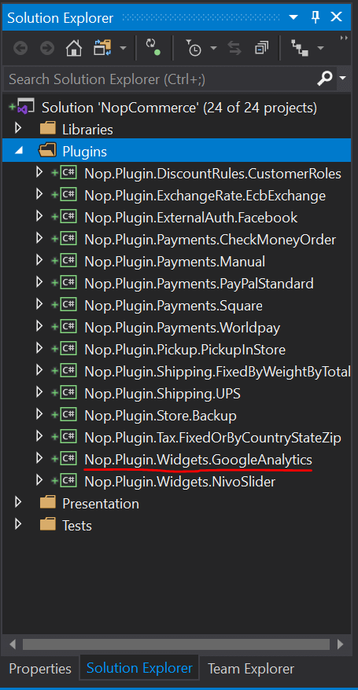
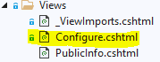
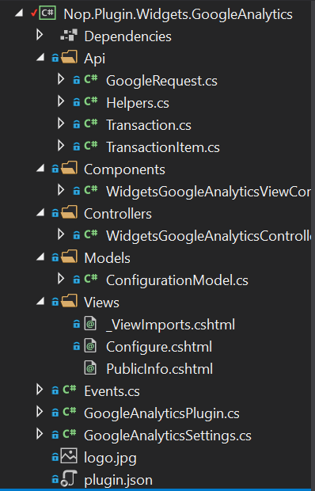

---
title: How to write a widget for nopCommerce
uid: en/developer/plugins/how-to-write-widget-for-nopCommerce
author: git.nopsg
contributors: git.nopsg, git.DmitriyKulagin, git.cromatido
---

# How to write a widget for nopCommerce

To extend nopCommerce functionality, widgets are used. There are various types of widgets like [NivoSlider](https://github.com/nopSolutions/nopCommerce/tree/master/src/Plugins/Nop.Plugin.Widgets.NivoSlider) and [Google Analytics](https://github.com/nopSolutions/nopCommerce/tree/master/src/Plugins/Nop.Plugin.Widgets.GoogleAnalytics) which are already contained in the nopCommerce's repo. nopCommerce marketplace already contains various widgets (both free and paid) which may meet your requirement(s). If you have not found one, then you are at the right place because this article will guide you through the process of creating a widget according to your need.

## The widget structure, required files, and locations

1. Start by creating a new **Class Library** project in the solution. It is recommended to place your widget in the **Plugins** directory, located in the root folder of the source, where other widgets and plugins already reside.

    

    > [!NOTE]
    > Do not get confused this directory with the one which exists in *Presentation\Nop.Web* directory. The *Plugins* directory in the *Nop.Web* directory contains the plugin's compiled files.

    A recommended name for a widget project is `Nop.Plugin.Widgets.{Name}`. `{Name}` is your widget name (for example, "**GoogleAnalytics**"). For example, *Google Analytics widget* has the following name: `Nop.Plugin.Widgets.GoogleAnalytics`. But please note that it's not a requirement. And you can choose any name for a widget. For example, "*MyFirstNopWidget*". The *Plugins* directory structure of a solution looks like the following.

    

1. Once the widget project is created, the **.csproj** file content should be updated using any available text editor application. Replace the content with the following one:

    ```xml
    <Project Sdk="Microsoft.NET.Sdk">
        <PropertyGroup>
            <TargetFramework>net7.0</TargetFramework>
            <Copyright>SOME_COPYRIGHT</Copyright>
            <Company>YOUR_COMPANY</Company>
            <Authors>SOME_AUTHORS</Authors>
            <PackageLicenseUrl>PACKAGE_LICENSE_URL</PackageLicenseUrl>
            <PackageProjectUrl>PACKAGE_PROJECT_URL</PackageProjectUrl>
            <RepositoryUrl>REPOSITORY_URL</RepositoryUrl>
            <RepositoryType>Git</RepositoryType>
            <OutputPath>..\..\Presentation\Nop.Web\Plugins\WIDGET_OUTPUT_DIRECTORY</OutputPath>
            <OutDir>$(OutputPath)</OutDir>
            <!--Set this parameter to true to get the dlls copied from the NuGet cache to the output of your    project. You need to set this parameter to true if your plugin has a nuget package to ensure that   the dlls copied from the NuGet cache to the output of your project-->
            <CopyLocalLockFileAssemblies>true</CopyLocalLockFileAssemblies>
        </PropertyGroup>
        <ItemGroup>
            <ProjectReference Include="..\..\Presentation\Nop.Web.Framework\Nop.Web.Framework.csproj" />
            <ClearPluginAssemblies Include="$(MSBuildProjectDirectory)\..\..\Build\ClearPluginAssemblies.csproj" />
        </ItemGroup>
        <!-- This target execute after "Build" target -->
        <Target Name="NopTarget" AfterTargets="Build">
            <!-- Delete unnecessary libraries from plugins path -->
            <MSBuild Projects="@(ClearPluginAssemblies)" Properties="PluginPath=$(MSBuildProjectDirectory)\ $(OutDir)" Targets="NopClear" />
        </Target>
    </Project>
    ```

    > [!NOTE]
    > The **WIDGET_OUTPUT_DIRECTORY** should be replace by the plugin name, for example *Widgets.GoogleAnalytics*.

1. After updating the *.csproj* file, the **plugin.json** file should be added which is required for a widget.  This file contains meta-information describing your widget. Just copy this file from any other existing plugin/widget and modify it for your needs. For information about the `plugin.json` file, please see [plugin.json file](xref:en/developer/plugins/plugin_json).

    The last required step is to create a class which implements **BasePlugin** (*Nop.Core.Plugins* namespace) and **IWidgetPlugin** interface (*Nop.Services.Cms* namespace). IWidgetPlugin allows you to create widgets. Widgets are rendered on some parts of your site. For example, it can be a live chat block on the bottom right of your site.

## Handling requests. Controllers, models, and views

Now you can see the widget by going to **Admin area** → **Configuration** → **Local Plugins**.


When a plugin/widget is installed, you will see the **Uninstall** button. *For performance improvement, it is a good practice that you uninstall plugins/widgets which are not necessary*.


There will be the **Install** and **Delete** buttons when a plugin/widget is not installed or uninstalled. *Deleting will remove physical files from the server*.

But as you guessed our widget does nothing. It does not even have a user interface for its configuration. Let's create a page to configure the widget.

What we need to do now is create a controller, a model, a view, and a view component.

- **MVC controllers** are responsible for responding to requests made against an *ASP.NET MVC* website. Each browser request is mapped to a particular controller.
- A view contains the **HTML** markup and content that is sent to the browser. A view is the equivalent of a page when working with an *ASP.NET MVC* application.
- A view component that implements **NopViewComponent** which contains logic and codes to render a view.
- The **MVC model** contains all of your application logic that is not contained in a view or a controller.

So let's start:

1. Create the model. Add a `Models` folder in the new widget, and then add a new model class that fits your need.

1. Create the view. Add a `Views` folder in the new widget, and then add a `cshtml` file named `Configure.cshtml`. Set "**Build Action**" property of the view file is set to "**Content**", and the "**Copy to Output Directory**" property is set to "**Copy always**". Note that the configuration page should use the "**_ConfigurePlugin**" layout.

    ```cs
    @{
        Layout = "_ConfigurePlugin";
    }
    ```

1. Also make sure that you have **_ViewImports.cshtml** file into your `Views` directory. You can just copy it from any other existing plugin or widget.

    

1. Create the controller. Add a `Controllers` folder in the new widget, and then add a new controller class. A good practice is to name plugin controllers `Widgets{Name}Controller.cs`. For example, **WidgetsGoogleAnalyticsController**. Of course, it's not a requirement to name controllers this way, but just a recommendation. Then create an appropriate action method for the configuration page (in the admin area). Let's name it `Configure`. Prepare a model class and pass it to the following view using a physical view path: `~/Plugins/{PluginOutputDirectory}/Views/Configure.cshtml`.

    ```cs
    public async Task<IActionResult> Configure()
    {
        if (!await _permissionService.AuthorizeAsync(StandardPermissionProvider.ManageWidgets))
            return AccessDeniedView();

        //load settings for a chosen store scope
        var storeScope = await _storeContext.GetActiveStoreScopeConfigurationAsync();
        var myWidgetSettings = await _settingService.LoadSettingAsync<MyWidgetSettings>(storeScope);

        var model = new ConfigurationModel
        {
            // configuration model settings here
        };

        if (storeScope > 0)
        {
            // override settings here based on store scope
        }

        return View("~/Plugins/Widgets.MyFirstNopWidget/Views/Configure.cshtml", model);
    }
    ```

1. Use the following attributes for your action method:

    ```cs
    [AutoValidateAntiforgeryToken]
    [AuthorizeAdmin] //confirms access to the admin panel
    [Area(AreaNames.Admin)] //specifies the area containing a controller or action
    [AdminAntiForgery] //Helps prevent malicious scripts from submitting forged page requests.
    ```

    For example, open the `GoogleAnalytics` widget and look at its implementation of `WidgetsGoogleAnalyticsController`.
    Then for each widget that has a configuration page, you should specify a configuration URL. Base class named **BasePlugin** has `GetConfigurationPageUrl` method which returns a configuration URL:

    ```cs
    public override string GetConfigurationPageUrl()
    {
        return $"{_webHelper.GetStoreLocation()}Admin/{CONTROLLER_NAME}/{ACTION_NAME}";
    }
    ```

    Where `{CONTROLLER_NAME}` is the name of your controller and `{ACTION_NAME}` is the name of the action (usually it's "Configure").
    Each widget should specify a list of widget zones. A base class named **IWidgetPlugin** has the `GetWidgetZones` method which returns a list of widget zones where it will be rendered.

    ```cs
    public Task<IList<string>> GetWidgetZonesAsync()
    {
        return Task.FromResult<IList<string>>(new List<string> {PublicWidgetZones.HeadHtmlTag });
    }
    ```

    You can find a list of public widget zones from this [link](https://github.com/nopSolutions/nopCommerce/blob/master/src/Presentation/Nop.Web.Framework/Infrastructure/PublicWidgetZones.cs) and admin widget zones following this [link](https://github.com/nopSolutions/nopCommerce/blob/master/src/Presentation/Nop.Web.Framework/Infrastructure/AdminWidgetZones.cs).
    In addition to `GetWidgetZonesAsync`, **IWidgetPlugin** has `GetWidgetViewComponentName` method which returns ViewComponent name. It accepts "*widgetZone*" name as parameter and can be used to render different view based on the selected widget zone.

    ```cs
    public string GetWidgetViewComponentName(string widgetZone)
    {
        return "MyFirstWidget";
    }
    ```

## Project structure of Google Analytics widget



## Handling "InstallAsync" and "UninstallAsync" methods

This step is optional. Some widgets can require additional logic during their installation. For example, a widget can insert new locale resources or settings values. So open your **IWidgetPlugin** implementation (in most cases it'll be derived from **BasePlugin** class) and override the following methods:

1. **InstallAsync**. This method will be invoked during plugin installation. You can initialize any settings here, insert new locale resources, or create some new database tables (if required).

    ```cs
    public override async Task InstallAsync()
    {
        // custom logic like adding settings, locale resources, and database table(s) here

        await base.InstallAsync();
    }
    ```

1. **UninstallAsync**. This method will be invoked during plugin uninstallation. You can remove previously initialized settings, locale resources, or database tables by widget during installation.

    ```cs
    public override async Task UninstallAsync()
    {
        // custom logic like removing settings, locale resources, and database table(s) which was created during widget installation

        await base.UninstallAsync();
    }
    ```

    > [!IMPORTANT]
    > If you override one of these methods, do not hide its base implementation - **base.InstallAsync()** and **base.UninstallAsync()** which has been marked in the above images.
