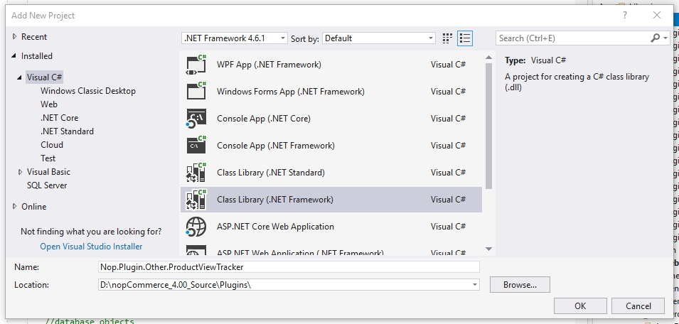
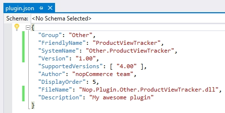

# Plugin with data access

In this tutorial I'll be using the nopCommerce plugin architecture to implement a product view tracker. Before we begin with the development it is very important that you have read, understood, and successfully completed the tutorials listed below. I'll be skipping over some explanations covered in the previous articles, but you can recap using the links provided.

- [Developer tutorials](xref:en/developer/tutorials/index)
- [Updating an existing entity. How to add a new property.](xref:en/developer/tutorials/update-existing-entity)
- [How to write a plugin for nopCommerce 4.20](xref:en/developer/plugins/how-to-write-plugin-4.20)

We will start coding with the data access layer, move on to the service layer, and finally end on dependency injection.

> [!NOTE]
> 
> The practical application of this plugin is questionable, but I couldn't think of a feature that didn't come with nopCommerce and would fit in a reasonable size post. If you use this plugin in a production environment I offer no warranties. I am always interested in success stories and I would be happy to hear that the post provided more than just an educational value.

## Getting started

Create a new class library project "Nop.Plugin.Other.ProductViewTracker".



Add the following folders and `plugin.json` file.


You can view the `plugin.json` file in the image below.



Then add references to the following projects: Nop.Core, Nop.Data, Nop.Web.Framework

## The Data Access Layer (A.K.A. Creating new entities in nopCommerce)

Inside of the "domain" namespace we're going to create a public class named ProductViewTrackerRecord. This class extends BaseEntity, but it is otherwise a very boring file. Something to remember is that all properties are marked as virtual and it isn't just for fun. Virtual properties are required on database entities because of how Entity Framework instantiates and tracks classes. One other thing to note is that we do not have navigation properties (relational properties), and I'll cover those in more detail later.

```csharp
namespace Nop.Plugin.Other.ProductViewTracker.Domain
{
    public class ProductViewTrackerRecord : BaseEntity
    {
        public virtual int ProductId { get; set; }
        public virtual string ProductName { get; set; }
        public virtual int CustomerId { get; set; }
        public virtual string IpAddress { get; set; }
        public virtual bool IsRegistered { get; set; }
    }
}
```

**File Locations**: To figure out where certain files should exist analyze the namespace and create the file accordingly.

The next class to create is the Entity Framework mapping class. Inside of the mapping class we map the columns, table relationships, and the database table.

```csharp
namespace Nop.Plugin.Other.ProductViewTracker.Data
{
    public class ProductViewTrackerRecordMap : NopEntityTypeConfiguration<ProductViewTrackerRecord>
    {
        /// <summary>
        /// Configures the entity
        /// </summary>
        /// <param name="builder">The builder to be used to configure the entity</param>
        public override void Configure(EntityTypeBuilder<ProductViewTrackerRecord> builder)
        {
            builder.ToTable(nameof(ProductViewTrackerRecord));
            //Map the primary key
            builder.HasKey(record => record.Id);
            //Map the additional properties
            builder.Property(record => record.ProductId);
            //Avoiding truncation/failure
            //so we set the same max length used in the product tame
            builder.Property(record => record.ProductName).HasMaxLength(400);
            builder.Property(record => record.IpAddress);
            builder.Property(record => record.CustomerId);
            builder.Property(record => record.IsRegistered);
        }
    }
}
```

The next class is the most complicated and the most important class in the data access layer. The Entity Framework Object Context is a pass-through class that gives us database access and helps track entity state (e.g. add, update, delete). The context is also used to generate the database schema or update an existing schema. In custom context classes we cannot reference previously existing entities because those types are already associated to another object context. That is also why we do not have complex navigation properties in our tracking record.

```csharp
namespace Nop.Plugin.Other.ProductViewTracker.Data
{
    public class ProductViewTrackerRecordObjectContext : DbContext, IDbContext
    {
        public ProductViewTrackerRecordObjectContext(DbContextOptions<ProductViewTrackerRecordObjectContext> options) : base(options)
        {
        }
        protected override void OnModelCreating(ModelBuilder modelBuilder)
        {
            modelBuilder.ApplyConfiguration(new ProductViewTrackerRecordMap());
            base.OnModelCreating(modelBuilder);
        }

        public new virtual DbSet<TEntity> Set<TEntity>() where TEntity : BaseEntity
        {
            return base.Set<TEntity>();
        }

        public virtual string GenerateCreateScript()
        {
            return Database.GenerateCreateScript();
        }

        public virtual IQueryable<TQuery> QueryFromSql<TQuery>(string sql) where TQuery : class
        {
            throw new NotImplementedException();
        }

        public virtual IQueryable<TEntity> EntityFromSql<TEntity>(string sql, params object[] parameters) where TEntity : BaseEntity
        {
            throw new NotImplementedException();
        }

        public virtual int ExecuteSqlCommand(RawSqlString sql, bool doNotEnsureTransaction = false, int? timeout = null, params object[] parameters)
        {
            using (var transaction = Database.BeginTransaction())
            {
                var result = Database.ExecuteSqlCommand(sql, parameters);
                transaction.Commit();
                return result;
            }
        }

        public void Install()
        {
               //create the table
               this.ExecuteSqlScript(GenerateCreateScript());
        }
        public void Uninstall()
        {
               //drop the table
               this.DropPluginTable(nameof(ProductViewTrackerRecord));
        }

        public IList<TEntity> ExecuteStoredProcedureList<TEntity>(string commandText, params object[] parameters) where TEntity : BaseEntity, new()
        {
            throw new NotImplementedException();
        }

        public IEnumerable<TElement> SqlQuery<TElement>(string sql, params object[] parameters)
        {
            throw new NotImplementedException();
        }
        public int ExecuteSqlCommand(string sql, bool doNotEnsureTransaction = false, int? timeout = null, params object[] parameters)
        {
            throw new NotImplementedException();
        }

        public virtual void Detach<TEntity>(TEntity entity) where TEntity : BaseEntity
        {
            throw new NotImplementedException();
        }

        public IQueryable<TQuery> QueryFromSql<TQuery>(string sql, params object[] parameters) where TQuery : class
        {
            throw new NotImplementedException();
        }

        public virtual bool ProxyCreationEnabled
        {
            get => ProxyCreationEnabled;
            set => ProxyCreationEnabled = value;
        }

        public virtual bool AutoDetectChangesEnabled
        {
            get => AutoDetectChangesEnabled;
            set => AutoDetectChangesEnabled = value;
        }
    }
}
```

## Application Startup

This part registers the record object context we created in the previous step.

```csharp
using Microsoft.AspNetCore.Builder;
using Microsoft.Extensions.Configuration;
using Microsoft.Extensions.DependencyInjection;
using Nop.Core.Infrastructure;
using Nop.Plugin.Other.ProductViewTracker.Data;
using Nop.Web.Framework.Infrastructure.Extensions;

namespace Nop.Plugin.Misc.RepCred.Infrastructure
{
    /// <summary>
    /// Represents object for the configuring plugin DB context on application startup
    /// </summary>
    public class PluginDbStartup : INopStartup
    {
        /// <summary>
        /// Add and configure any of the middleware
        /// </summary>
        /// <param name="services">Collection of service descriptors</param>
        /// <param name="configuration">Configuration of the application</param>
        public void ConfigureServices(IServiceCollection services, IConfiguration configuration)
        {
            //add object context
            services.AddDbContext<ProductViewTrackerRecordObjectContext>(optionsBuilder =>
            {
                optionsBuilder.UseSqlServerWithLazyLoading(services);
            });
        }

        /// <summary>
        /// Configure the using of added middleware
        /// </summary>
        /// <param name="application">Builder for configuring an application's request pipeline</param>
        public void Configure(IApplicationBuilder application)
        {
        }

        /// <summary>
        /// Gets order of this startup configuration implementation
        /// </summary>
        public int Order => 11;
    }
}
```

## Service layer

The service layer connects the data access layer and the presentation layer. Since it is bad form to share any type of responsibility in code each layer needs to be isolated. The service layer wraps the data layer with business logic and the presentation layer depends on the service layer. Because our task is very small our service layer does nothing but communicate with the repository (the repository in nopCommerce acts as a facade to the object context).

```csharp
namespace Nop.Plugin.Other.ProductViewTracker.Services
{
    public interface IProductViewTrackerService
    {
        /// <summary>
        /// Logs the specified record.
        /// </summary>
        /// <param name="record">The record.</param>
        void Log(ProductViewTrackerRecord record);
    }
}

namespace Nop.Plugin.Other.ProductViewTracker.Services
{
    public class ProductViewTrackerService : IProductViewTrackerService
    {
        private readonly IRepository<ProductViewTrackerRecord> _productViewTrackerRecordRepository;
        public ViewTrackingService(IRepository<ProductViewTrackingRecord> productViewTrackerRecordRepository)
        {
            _productViewTrackerRecordRepository = productViewTrackerRecordRepository;
        }

        /// <summary>
        /// Logs the specified record.
        /// </summary>
        /// <param name="record">The record.</param>
        public virtual void Log(ProductViewTrackerRecord record)
        {
            if (record == null)
                throw new ArgumentNullException(nameof(record));
            _productViewTrackerRecordRepository.Insert(record);
        }
    }
}
```

## Dependency Injection

Martin Fowler has written a great description of dependency injection or Inversion of Control. I'm not going to duplicate his work, and you can find his article here. Dependency injection manages the life cycle of objects and provides instances for dependent objects to use. First we need to configure the dependency container so it understands which objects it will control and what rules might apply to the creation of those objects.

```csharp
namespace Nop.Plugin.Other.ProductViewTracker.Infrastructure
{
    public class DependencyRegistrar : IDependencyRegistrar
    {
        private const string CONTEXT_NAME = "nop_object_context_product_view_tracker";

        public virtual void Register(ContainerBuilder builder, ITypeFinder typeFinder, NopConfig config)
        {
            builder.RegisterType<ProductViewTrackerService>().As<IProductViewTrackerService>().InstancePerLifetimeScope();

            //data context
            builder.RegisterPluginDataContext<ProductViewTrackerRecordObjectContext>(CONTEXT_NAME);

            //override required repository with our custom context
            builder.RegisterType<EfRepository<ProductViewTrackerRecord>>()
            .As<IRepository<ProductViewTrackerRecord>>()
            .WithParameter(ResolvedParameter.ForNamed<IDbContext>(CONTEXT_NAME))
            .InstancePerLifetimeScope();
        }

        public int Order => 1;
    }
}
```

In the code above we register different types of objects so they can later be injected into controllers, services, and repositories. Now that we've covered the new topics I'll bring back some of the older ones so we can finish the plugin.

## The view component

Let's create a view component:

```csharp
namespace Nop.Plugin.Other.ProductViewTracker.Components
{
    [ViewComponent(Name = "ProductViewTracker")]
    public class ProductViewTrackerViewComponent : NopViewComponent
    {
        private readonly IProductService _productService;
        private readonly IProductViewTrackerService _productViewTrackerService;
        private readonly IWorkContext _workContext;
        public ProductViewTrackerViewComponent(IWorkContext workContext,
        IProductViewTrackerService productViewTrackerService,
        IProductService productService)
        {
            _workContext = workContext;
            _productViewTrackerService = productViewTrackerService;
            _productService = productService;
        }
        public IViewComponentResult Invoke(int productId)
        {
            //Read from the product service
            Product productById = _productService.GetProductById(productId);
            //If the product exists we will log it
            if (productById != null)
            {
                //Setup the product to save
                var record = new ProductViewTrackerRecord();
                record.ProductId = productId;
                record.ProductName = productById.Name;
                record.CustomerId = _workContext.CurrentCustomer.Id;
                record.IpAddress = _workContext.CurrentCustomer.LastIpAddress;
                record.IsRegistered = _workContext.CurrentCustomer.IsRegistered();
                //Map the values we're interested in to our new entity
                _productViewTrackerService.Log(record);
            }
            return Content("");
        }
    }
}
```

## Plugin installer

```csharp
namespace Nop.Plugin.Other.ProductViewTracker
{
    public class ProductViewTrackerPlugin : BasePlugin
    {
        private readonly ProductViewTrackerRecordObjectContext _context;
        public ProductViewTrackerPlugin(ProductViewTrackerRecordObjectContext context)
        {
            _context = context;
        }
        public override void Install()
        {
            _context.Install();
            base.Install();
        }
        public override void Uninstall()
        {
            _context.Uninstall();
            base.Uninstall();
        }
    }
}
```

## The usage

The tracking code should be added to `ProductTemplate.Simple.cshtml` and `ProductTemplate.Grouped.cshtml` files. These ones are product templates.

```csharp
@await Component.InvokeAsync("ProductViewTrackerIndex", new { productId = Model.Id })
```

P.S. You can also implement it as a widget. In this case you won't need to edit a cshtml file.
