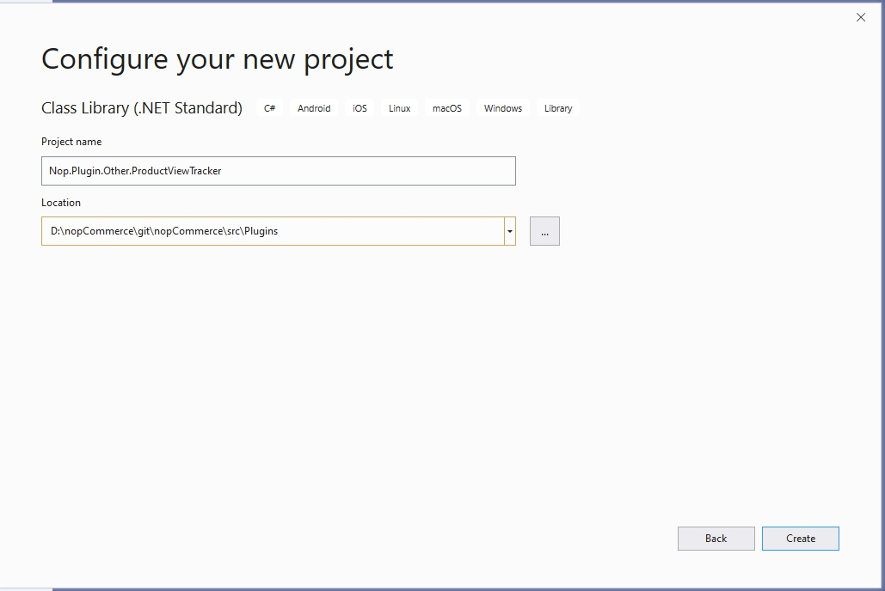
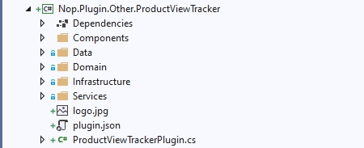

# Plugin with data access

In this tutorial I'll be using the nopCommerce plugin architecture to implement a product view tracker. Before we begin with the development it is very important that you have read, understood, and successfully completed the tutorials listed below. I'll be skipping over some explanations covered in the previous articles, but you can recap using the links provided.

- [Developer tutorials](xref:en/developer/tutorials/index)
- [Updating an existing entity. How to add a new property.](xref:en/developer/tutorials/update-existing-entity)
- [How to write a plugin for nopCommerce 4.30](xref:en/developer/plugins/how-to-write-plugin-4.30)

We will start coding with the data access layer, move on to the service layer, and finally end on dependency injection.

> [!NOTE]
> 
> The practical application of this plugin is questionable, but I couldn't think of a feature that didn't come with nopCommerce and would fit in a reasonable size post. If you use this plugin in a production environment I offer no warranties. I am always interested in success stories and I would be happy to hear that the post provided more than just an educational value.

## Getting started

Create a new class library project "Nop.Plugin.Other.ProductViewTracker".



Add the following folders and `plugin.json` file.



You can view the `plugin.json` file content below:

```JSON
{
  "Group": "Other",
  "FriendlyName": "Product view tracker",
  "SystemName": "Other.ProductViewTracker",
  "Version": "1.00",
  "SupportedVersions": [ "4.30" ],
  "Author": "nopCommerce team",
  "DisplayOrder": 1,
  "FileName": "Nop.Plugin.Other.ProductViewTracker.dll",
  "Description": "My awesome plugin"
}
```

Then add references to the **Nop.Web.Framework** projects. This will be enough for us, as other dependencies, such as **Nop.Core** and **Nop.Data**, will be connected automatically

## The Data Access Layer (A.K.A. Creating new entities in nopCommerce)

Inside of the "domain" namespace we're going to create a public class named ProductViewTrackerRecord. This class extends BaseEntity, but it is otherwise a very boring file. Something to remember is that we do not have navigation properties (relational properties), because Linq2DB framework, which we use to work with databases does not support the navigation properties.

```csharp
namespace Nop.Plugin.Other.ProductViewTracker.Domain
{
    public class ProductViewTrackerRecord : BaseEntity
    {
        public int ProductId { get; set; }
        public string ProductName { get; set; }
        public int CustomerId { get; set; }
        public string IpAddress { get; set; }
        public bool IsRegistered { get; set; }
    }
}
```

**File Locations**: To figure out where certain files should exist analyze the namespace and create the file accordingly.

The next class to create is the FluentMigrator entity builder class. Inside of the mapping class we map the columns, table relationships, and the database table.

```csharp
namespace Nop.Plugin.Other.ProductViewTracker.Data
{
    public class ProductViewTrackerRecordBuilder : NopEntityBuilder<ProductViewTrackerRecord>
    {
        /// <summary>
        /// Apply entity configuration
        /// </summary>
        /// <param name="table">Create table expression builder</param>
        public override void MapEntity(CreateTableExpressionBuilder table)
        {
            //map the primary key (not necessary if it is Id field)
            table.WithColumn(nameof(ProductViewTrackerRecord.Id)).AsInt32().PrimaryKey()
            //map the additional properties as foreign keys
            .WithColumn(nameof(ProductViewTrackerRecord.ProductId)).AsInt32().ForeignKey<Product>(onDelete: Rule.Cascade)
            .WithColumn(nameof(ProductViewTrackerRecord.CustomerId)).AsInt32().ForeignKey<Customer>(onDelete: Rule.Cascade)
            //avoiding truncation/failure
            //so we set the same max length used in the product name
            .WithColumn(nameof(ProductViewTrackerRecord.ProductName)).AsString(400)
            //not necessary if we don't specify any rules
            .WithColumn(nameof(ProductViewTrackerRecord.IpAddress)).AsString()
            .WithColumn(nameof(ProductViewTrackerRecord.IsRegistered)).AsInt32();
        }
    }
}
```

The next important class for us will be the migration class, which creates our table directly in the database. You can create as many migrations as you like in your plugin, the only thing you need to keep track of is the version of your migration. We specially created our NopMigration attribute to make it easier for you. By indicating here the most complete and accurate file creation date, you practically guarantee the uniqueness of your migration number

```csharp
namespace Nop.Plugin.Other.ProductViewTracker.Data
{
    [SkipMigrationOnUpdate]
    [NopMigration("2020/05/27 08:40:55:1687541", "Other.ProductViewTracker base schema")]
    public class SchemaMigration : AutoReversingMigration
    {
        protected IMigrationManager _migrationManager;

        public SchemaMigration(IMigrationManager migrationManager)
        {
            _migrationManager = migrationManager;
        }

        public override void Up()
        {
            _migrationManager.BuildTable<ProductViewTrackerRecord>(Create);
        }
    }
}
```

>[!NOTE]
>Pay attention to the **SkipMigrationOnUpdate** attribute, its purpose is described by the name. This attribute allows you to skip migrations when performing the plugin update procedure.

## Service layer

The service layer connects the data access layer and the presentation layer. Since it is bad form to share any type of responsibility in code each layer needs to be isolated. The service layer wraps the data layer with business logic and the presentation layer depends on the service layer. Because our task is very small our service layer does nothing but communicate with the repository (the repository in nopCommerce acts as a facade to the object context).

```csharp
namespace Nop.Plugin.Other.ProductViewTracker.Services
{
    public interface IProductViewTrackerService
    {
        /// <summary>
        /// Logs the specified record.
        /// </summary>
        /// <param name="record">The record.</param>
        void Log(ProductViewTrackerRecord record);
    }
}

namespace Nop.Plugin.Other.ProductViewTracker.Services
{
    public class ProductViewTrackerService : IProductViewTrackerService
    {
        private readonly IRepository<ProductViewTrackerRecord> _productViewTrackerRecordRepository;
        public ProductViewTrackerService(IRepository<ProductViewTrackerRecord> productViewTrackerRecordRepository)
        {
            _productViewTrackerRecordRepository = productViewTrackerRecordRepository;
        }

        /// <summary>
        /// Logs the specified record.
        /// </summary>
        /// <param name="record">The record.</param>
        public virtual void Log(ProductViewTrackerRecord record)
        {
            if (record == null)
                throw new ArgumentNullException(nameof(record));
            _productViewTrackerRecordRepository.Insert(record);
        }
    }
}
```

## Dependency Injection

Martin Fowler has written a great description of dependency injection or Inversion of Control. I'm not going to duplicate his work, and you can find his article [here](https://martinfowler.com/articles/injection.html). Dependency injection manages the life cycle of objects and provides instances for dependent objects to use. First we need to configure the dependency container so it understands which objects it will control and what rules might apply to the creation of those objects.

```csharp
namespace Nop.Plugin.Other.ProductViewTracker.Infrastructure
{
    /// <summary>
    /// Dependency registrar
    /// </summary>
    public class DependencyRegistrar : IDependencyRegistrar
    {
        /// <summary>
        /// Register services and interfaces
        /// </summary>
        /// <param name="builder">Container builder</param>
        /// <param name="typeFinder">Type finder</param>
        /// <param name="config">Config</param>
        public virtual void Register(ContainerBuilder builder, ITypeFinder typeFinder, NopConfig config)
        {
            builder.RegisterType<ProductViewTrackerService>().As<IProductViewTrackerService>().InstancePerLifetimeScope();
        }

        /// <summary>
        /// Order of this dependency registrar implementation
        /// </summary>
        public int Order => 1;
    }
}
```

In the code above we register different types of objects so they can later be injected into controllers, services, and repositories. Now that we've covered the new topics I'll bring back some of the older ones so we can finish the plugin.

## The view component

Let's create a view component:

```csharp
namespace Nop.Plugin.Other.ProductViewTracker.Components
{
    [ViewComponent(Name = "ProductViewTracker")]
    public class ProductViewTrackerViewComponent : NopViewComponent
    {
        private readonly ICustomerService _customerService;
        private readonly IProductService _productService;
        private readonly IProductViewTrackerService _productViewTrackerService;
        private readonly IWorkContext _workContext;

        public ProductViewTrackerViewComponent(ICustomerService customerService,
            IProductService productService,
            IProductViewTrackerService productViewTrackerService,
            IWorkContext workContext)
        {
            _customerService = customerService;
            _productService = productService;
            _productViewTrackerService = productViewTrackerService;
            _workContext = workContext;
        }

        public IViewComponentResult Invoke(string widgetZone, object additionalData)
        {
            if (!(additionalData is ProductDetailsModel model))
                return Content("");

            //Read from the product service
            var productById = _productService.GetProductById(model.Id);
            //If the product exists we will log it
            if (productById != null)
            {
                //Setup the product to save
                var record = new ProductViewTrackerRecord
                {
                    ProductId = model.Id,
                    ProductName = productById.Name,
                    CustomerId = _workContext.CurrentCustomer.Id,
                    IpAddress = _workContext.CurrentCustomer.LastIpAddress,
                    IsRegistered = _customerService.IsRegistered(_workContext.CurrentCustomer)
                };
                //Map the values we're interested in to our new entity
                _productViewTrackerService.Log(record);
            }

            return Content("");
        }
    }
}
```

## The main plugin class

> [!IMPORTANT]
>
> We implement our plugin as a widget. In this case we won't need to edit a cshtml file.

```csharp
namespace Nop.Plugin.Other.ProductViewTracker
{
    public class ProductViewTrackerPlugin : BasePlugin, IWidgetPlugin
    {
        /// <summary>
        /// Gets a value indicating whether to hide this plugin on the widget list page in the admin area
        /// </summary>
        public bool HideInWidgetList => true;

        /// <summary>
        /// Gets a name of a view component for displaying widget
        /// </summary>
        /// <param name="widgetZone">Name of the widget zone</param>
        /// <returns>View component name</returns>
        public string GetWidgetViewComponentName(string widgetZone)
        {
            return "ProductViewTracker";
        }

        /// <summary>
        /// Gets widget zones where this widget should be rendered
        /// </summary>
        /// <returns>Widget zones</returns>
        public IList<string> GetWidgetZones()
        {
            return new List<string>{ PublicWidgetZones.ProductDetailsTop };
        }
    }
}
```
