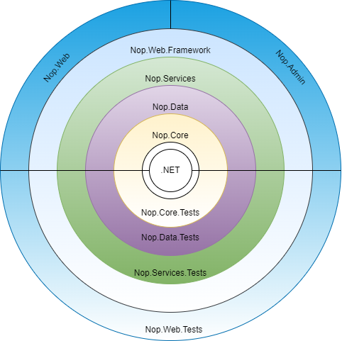

# Architecture of nopCommerce

## Introduction

nopCommerce is a highly customizable and flexible, multi-store, multi-vendor, SEO friendly, full-featured open-source E-Commerce solution. Which is built on top of Microsoft `ASP.NET Core` framework. nopCommerce is always up to date with the latest technology and follows best practices.

## Overview

This document provides a comprehensive architectural overview of the nopCommerce system. This documentation is targeted at new nopCommerce developers. In this documentation, we will be exploring each project in nopCommerce solution, dependencies between those projects, etc.

## Overview of nopCommerce Architecture

nopCommerce is one of the most popular and successful `Dot NET based` open-source `E-Commerce` solution. The success of nopCommerce is not only because it contains most of the features required by modern E-Commerce solution out of the box and its UI is highly customizable and User friendly, but also because the nopCommerce solution is equally organized and developer-friendly. The main strength of nopCommerce is its flexible, extendable architecture and well-organized source code. The nopCommerce architecture is very close to the onion architecture. Which is mainly focused on controlling the code coupling. According to this architecture, all code can depend on layers more central, but code cannot depend on layers further out from the core.  In other words, all coupling is toward the center.

This means projects can only have a dependency on the other projects which reside inward from the current project. For example, if you see the above diagram `Nop.Data` project can depend on the `Nop.Core` project and can have `Nop.Core` and dependency, but `Nop.Core` cannot depend on `Nop.Data` similarly `Nop.Services` can have `Nop.Data` and `Nop.Core` and it's a dependency but neither `Nop.Core` nor `Nop.Data` can have `Nop.Service` as their dependency. This means projects can only have another project as dependency only if it resides inward or more center from the layer current project resides. Which is the key for code decoupling. The main feature/advantage of this approach/architecture is that, now if we want to test the Application Core then we can do so even if we do not have any `UI` for our application Because the Application core does not depend on `UI layer`. Or we can change our `UI framework` from `Razor` view engine and `JQuery` to `Angular` or `React` or `Vue` without affecting our Application Core and can use the same core to build Mobile Application or Desktop Application. And all of this without changing a bit of code in our Application Core.

## Explain projects in nopCommerce Solution

### Application Core

This is the innermost layer in the nopCommerce architecture system. It is the core of the application. All the data access logic and Business class reside inside this layer. In the nopCommerce solution, we can find all of the projects for this layer inside the "Libraries" directory. According to nopCommerce architecture, this layer contains further three layers/projects.

#### Nop.Core

This project contains a set of core classes for nopCommerce. This project is at the center of architecture. This project does not have any dependencies on other projects in the solution. This project contains core classes that are shared with the entire solution like Domain Entities, Caching, Events, and other Helper classes.

#### Nop.Data

This project lives right after the `Nop.Core` project. So, this project has a dependency on to project that lives towards the middle from this project in the architecture that is `Nop.Core` project. Besides the `Nop.Core` project it does not have any dependency on any other project in the solution. The `Nop.Data` project contains a set of classes and functions for reading from and writing to a database or other data store. It helps separate data-access logic from your business objects.

#### Nop.Services

In nopCommerce architecture, this is the outermost layer of Application Core. This project has a dependency on all other projects that belong to Application Core. This project contains a set of core services, business logic, validations, or calculations related to the data if needed. Some people call it Business Access Layer (BAL). This layer acts as a data access layer for all other layers outside of this layer. This layer contains service classes and follows a repository pattern to expose its features/functionalities. nopCommerce is using this approach to decouple the core to the other layer that lives outside the core layer. With this, if we want to change the logic for the Application core then it does not break other layers that depend on the Application core or at least minimizes the code changes in other layers depending on the Application Core. This approach is also ideal for construction dependency injection.

### UI Layer

This layer resides outside the "Application Core". In the nopCommerce solution, we can find all of the projects for this layer inside the "Presentation" directory. All the presentation logic and UI resides in this layer. This is the layer where the UI which users can interact with presents. In nopCommerce, this layer has further two layers.

#### Nop.Web.Framework

This layer is the inner layer of the "Presentation layer" this layer has a dependency on the "Application Core" layer. This project is a class library project. This project acts as a "Framework" for the presentation layer. It contains shared logic that is used by the both nopCommerce "public Website" and "Admin panel".

#### Nop.Web

In nopCommerce architecture, this is the outermost layer of the "Presentation Layer". This project contains the actual E-Commerce front-end website User Interface. It is the actual website with which users can interact. This is an "Asp .NET Core" application. This project has a dependency on `Nop.Web.Framework` and "Application Core". It depends upon `Nop.Web.Framework` for the common logic that is shared between this and "Admin" and depends upon "Application Core" for the data access and data manipulations.

#### Admin

In nopCommerce it belongs in the same layer as the `Nop.Web` project. This lives inside the `Nop.Web` project as an area. It is also the UI(User Interface), but this part of the Presentation contains UI for the Admin panel. Admin panel is where all the contents for a public website are maintained and from where we can monitor the activities of our public website. A public website can be accessed without any restriction but the "Admin panel" required some Authentication and Authorization to access it since it contains information that only the site admin has the right to access.

### Test Layer

This layer resides in the same layer as the "Presentation Layer", right outside the "Application Core" This layer is all about testing the different parts of the application. Testing in nopCommerce is easy and more reliable due to the architecture it follows for its system design. In the nopCommerce solution, we can find all of the directories for this layer inside the "Tests" directory. nopCommerce uses **NUnit** package for *Unit Testing*.

#### Nop.Tests

This layer is the inner layer of the "Test layer" this layer has a dependency on the "Application Core" layer. This project contains the core logic for testing.

#### Nop.Core.Tests

These tests are built for *Unit Testing* the `Nop.Core` project, it tests for cashing, domain entities, and so on.

#### Nop.Data.Tests

These tests are created for *Unit Testing* the `Nop.Data` project, they test the work of various data providers with operations on an entity, such as insert delete, etc.

#### Nop.Services.Tests

These tests are built for *Unit Testing* the `Nop.Service` project. It contains logic to test every service class for every operation.

#### Nop.Web.Tests

These tests can be used to test the Presentation layer of the nopCommerce, which contains "Public website" and "Admin Panel".
