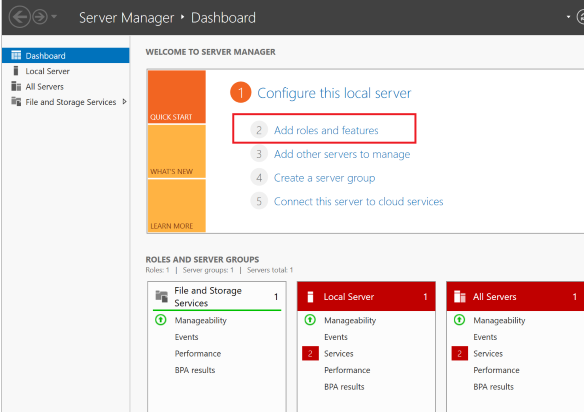
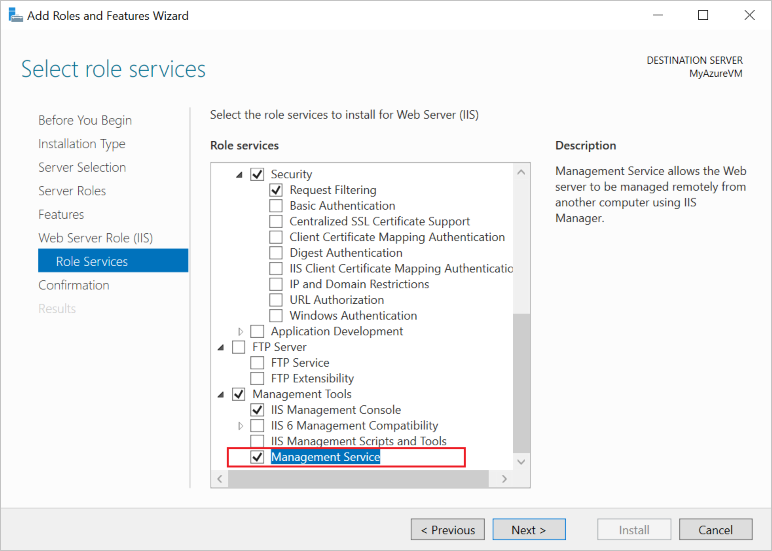
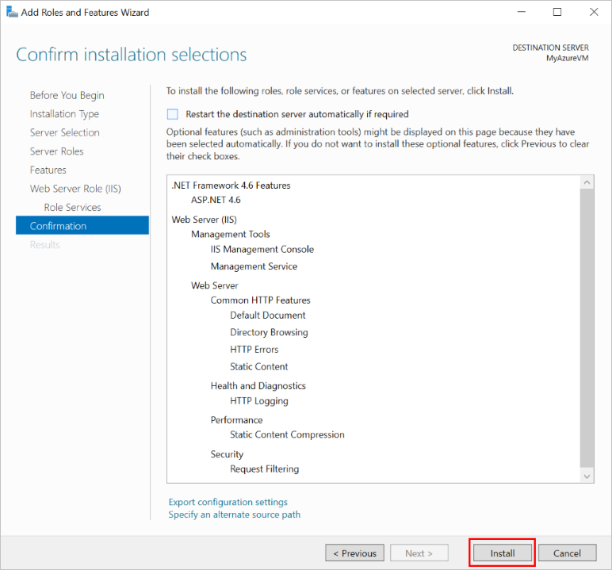
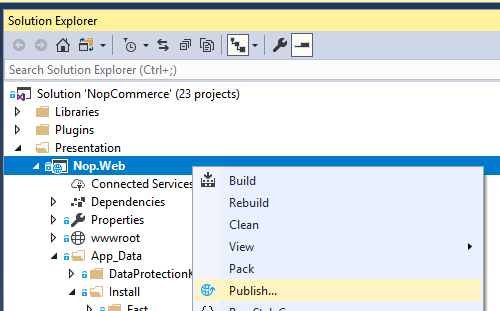

# How to deploy nopCommerce to Azure

## Create a VM on Azure

This instruction of the steps required to set up an Azure virtual machine to host nopCommerce web applications, and to allow them to be published using **WebDeploy**.

### Create a new VM

1. Log in to the [Azure portal](https://portal.azure.com/)
1. Click the **Add** button

    

1. Select *Windows Server 2016 VM* in the *Get Started* category or any Windows Server 2016 in the Compute category, such as **Windows Server 2016 Datacenter**
1. Complete the required fields to configure the new VM.
    - Username/password. You will need it to access the VM. This is the admin account for connecting on VM by RDP.
    - Resource group. This is the name of the "virtual folder" that contains all resources created for this VM. You can delete all the resources created during this process by deleting the resource group.

### Configure components and features on the VM

1. DNS-name:
    - From the [Azure portal](https://portal.azure.com/), navigate to the Overview page of your virtual machine.
    - Under DNS name, click **Configure**
    - Provide a globally unique DNS name. (A green tick appears when the name is validated.)
    - Click **Save** to save the configuration.

### Configure Azure Firewall rules

1. Configure inbound firewall rules in the Azure portal. On the Networking section add an inbound port rule to create new firewall entries:
    - http - Port 80 (Priority 100)
    - WebDeploy - Port 8172 (Priority 1010)
    - RDP - Port 3389 (Priority 320)

    

2. Configure outbound firewall rules in the Azure portal. On the *Networking* section add an outbound port rule to create new firewall entries:
    - RDP - Port 3389 (Priority 100)

### Connect to the VM (RDP) using login and password


### Install IIS (Web Server) and ASP.NET 4.6

1. Open the **Server Manager Dashboard** (Server Manager - Dashboard opens on the first startup)
1. Choose **2 Add roles and features**

    

1. Accept the defaults and press **Next** three times to progress to the Server Roles section.
1. Select **Web Server (IIS)**

    

1. When prompted, confirm the additional installation of *IIS Management Console*.
1. Press **Next** three times to progress to the *Web Server Role (IIS) --> Roles Services section*
1. Select **Management** Service, which is required to enable Web Deploy (through port 8172). When prompted, confirm the additional installation of ASP.NET 4.6.

    

1. Select **Next** to confirm the configuration, then **Install** to complete the IIS setup.

    

    Once installation completes:
    - IIS is installed and running with an internal firewall rule created for port 80.
    - Web Management Service is installed with an internal firewall rule created for port 8172.

### Configure IE Enhanced Security (Off)

On a new Azure VM, default security rules prevent executables from being downloaded via Internet Explorer. To download the WebDeploy executable, you must first disable IE enhanced security.

1. In the **Server Manager**, open the **Local Server** section on the left.
1. In the main panel, next to "**IE Enhanced Security Configuration:**", select On.
1. In the dialog that appears, select **Off for Administrators**, select **On for Users**, then select **OK**.

    

### Install Web Deploy

1. Launch Internet Explorer.
1. Accept default security settings.
1. [Download](https://www.microsoft.com/download/details.aspx?id=43717) *WebDeploy_amd64_en-US.msi*
1. Follow installation steps for Web Deploy
1. Choose the Complete option to install all components

### Install last version [NET Core SDK](https://www.microsoft.com/net/download/all)

### Install package [.NET Core Windows Server Hosting](https://www.microsoft.com/net/download/all)


IIS is used to host ASP.NET Core web applications, its role will be reduced to a proxy server. Hosting of ASP.NET Core applications on IIS occurs using the native *AspNetCoreModuleV2*, which is configured to redirect requests to the *Kestrel* web server. This module controls the start of the external process `dotnet.exe`, within which the application is hosted, and forwards all requests from IIS to this host process.

After installing this package, run the **iisreset** command on the command line or manually restart IIS so that the server applies the changes.

### Configure IIS

1. You must grant permission to the folder `wwwroot`. With the site selected in the **IIS Manager**, choose **Edit Permissions**, and make sure that *IUSR*, *IIS_IUSRS*, or the user configured for the Application Pool is an authorized user with Read & Execute rights. If none of these users are present, add *IUSR* as a user with *Read & Execute* rights.

    

1. Click **Restart** on the right panel to restart the IIS

Now everything is ready to publish the project.

## Publish nopCommerce to an Azure VM from Microsoft Visual Studio

Publishing the nopCommerce application is no different from publishing any other ASP.NET Core application. Therefore, there will be described the minimum requirements to run the publication. More details can be found [here](https://docs.microsoft.com/aspnet/core/tutorials/publish-to-azure-webapp-using-vs?view=aspnetcore-2.1#deploy-the-app-to-azure).

## Publish project `Nop.Web`

1. Open your web app solution in Microsoft Visual Studio. Right-click the project in *Solution Explorer* and choose **Publish**.

    

1. Use the arrow on the right of the page to scroll through the publishing options until you find **Microsoft Azure Virtual Machines**. Select the appropriate VM from the list of Existing Virtual Machines.
1. Click **Create Profile**.

    

1. To view and modify the publish profile settings, select **Configure**. Use the **Validate Connection** button to confirm that you have entered the right information.

    

1. If you want to ensure that the webserver has a clean copy of the web application after each upload (and that no other files are left hanging around from a previous deployment), you can check the **Remove additional files at destination** checkbox in the **Settings** tab. Warning: Publishing with this setting deletes all files that exist on the webserver (*wwwroot* directory). Be sure you know the state of the machine before publishing with this option enabled.

    

1. Click **Save**.
1. Click **Publish** to begin publishing.

You have now published your web app to an Azure virtual machine.

## Potential problems and solutions

To [more](https://docs.microsoft.com/aspnet/core/host-and-deploy/aspnet-core-module) accurately understand what the problem is, you need to enable logging - enabled stdoutLog in `web.config`:

```sh
stdoutLogEnabled="true" stdoutLogFile=".\logs\stdout"
```

## IIS not able to locate the web.config

Solution:  [support.microsoft.com](http://support.microsoft.com/kb/942055)
