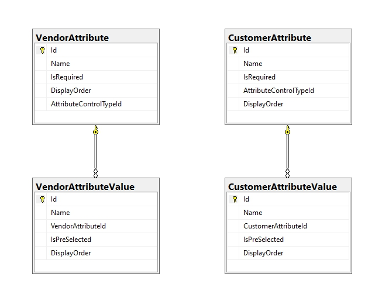
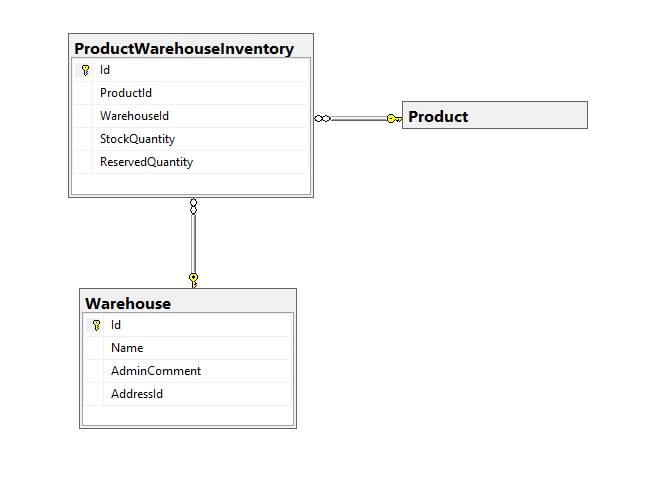
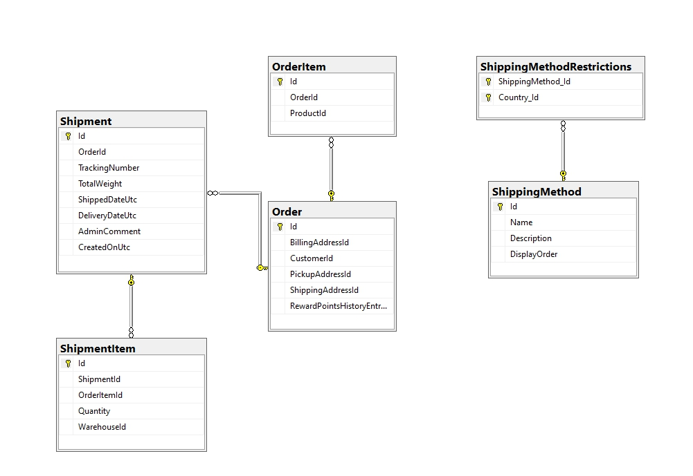

# Default database schema

In this article, we will look at the database schema that is installed during initial installation and which remains unchanged in 90% of cases.

We won't bring the entire schema as a whole but will describe the default installation that provides for the creation of 126 tables.

To understand such a scheme easily let's split it into parts. Below, we grouped the tables most naturally and understandably:

* [Customers info](#customers-info)
* [Products info](#products-info)
  * [Product attributes](#product-attributes)
  * [Tier price](#tier-price)
  * [Inventory by warehouses](#inventory-by-warehouses)
* [Orders](#orders)
* [Shipments](#shipments)
* [Discounts](#discounts)
* [Shopping cart](#shopping-cart)
* [Addresses](#addresses)
* [Database naming convention](#database-naming-convention)

## Customers info


This diagram shows a set of tables that contain basic customer information. It also indicates the direction of links.

We won't delve into the purpose of tables and fields, since their names are self-descriptive enough.

### Features (Customers info)

* In the **Customer** table we have three fields which in fact should be defined as foreign keys but in practice, they are not:
    1. AffiliateId
    1. VendorId
    1. RegisteredInStoreId

    This is done intentionally so as not to overload the system with unnecessary connections, since these fields are not used in every online store.

* Some of the user data is stored in the **GenericAttribute** table. You can find all of them at `\src\Libraries\Nop.Core\Domain\Customers\NopCustomerDefaults.cs`.

    The structure of this table is presented below:

    

    Besides the mentioned customer data, this table can store any data for other entities as well. We added this table on purpose so that you could extend any entity without changing the structure of the tables.

    Additionally, this table stores custom **Customer attributes** and **Vendor attributes** with the chosen values for vendors and customers in the XML format. See the following rows to understand what it looks like:

    

    On the example of the XML string from the *Value* column we can see how exactly the attribute values are stored for a certain vendor:

    ```csharp
    <Attributes><VendorAttribute ID="2"><VendorAttributeValue><Value>1</Value></VendorAttributeValue></VendorAttribute></Attributes>
    ```

    As you can see the vendor with ID 1 has only one vendor attribute filled. This attribute has ID 2 and its value is 1.

    Custom customer attributes have the same structure as vendor attributes. The following screenshot represents the relationships between **Customer attributes** and **Vendor attributes** and their values:

    

## Products info


In the diagram, you can see the base data for the product (the schema of the product information table below). As a rule, this data is used in 99% of cases.


### Features (Products info)

Depending on the store settings, additional tables may be connected to this scheme. For example, to distribute product quantity among multiple warehouses.



Or if you want to use the product reviews functionality:


### Product attributes

Then let's consider the scheme of attributes and their combinations presented below:


### Tier price

If you use tier pricing for products you should also pay attention to the following scheme:


### Inventory by warehouses

Although this feature is not used often, it might be useful to give a scheme for accounting for goods in a particular warehouse:


## Orders


In this diagram, we can see the tables related to the order data. The **Order** table has the following structure:


There is no need to comment on anything since everything should be clear from the diagram and the names of the fields are self-descriptive enough. It should only be noted that the **RewardPointsHistory** table is used only if the *Reward points system* is activated for the store.

## Shipments



The purpose of all tables in the diagram, as before, raises no questions. Nevertheless, let's dwell on a few points. The **ShippingMethod** table is used to manage the list of connected plugins, and the specific shipping method is stored in the *ShippingRateComputationMethodSystemName* and *ShippingMethod* fields of the **Order** table.

The *OrderItemId* field of the **ShipmentItem** table is essentially a reference to the **OrderItem** table.

## Discounts


From the diagram above, we can see that discounts can be applied to three groups: **Products**, **Manufacturers**, **Categories**
And can be configured with various rules which are controlled by plugins (``IDiscountRequirementRule``).

In the **DiscountRequirement** table, the *InteractionTypeId* field must contain one of the values specified in the ``RequirementGroupInteractionType`` enumeration:

```csharp
/// <summary>
/// Represents an interaction type within the group of requirements
/// </summary>
public enum RequirementGroupInteractionType
{
    /// <summary>
    /// All requirements within the group must be met
    /// </summary>
    And = 0,

    /// <summary>
    /// At least one of the requirements within the group must be met 
    /// </summary>
    Or = 2
}
```

## Shopping cart

Another important part of the store is a shopping cart. In our case the scheme of this mechanism is very simple:


The only thing worth noting is that this scheme is also used for a wishlist. To separate these two types, the *ShoppingCartTypeId* field is used. The values in this field must match the values from the **ShoppingCartType** enumeration:

```csharp
/// <summary>
/// Represents a shopping cart type
/// </summary>
public enum ShoppingCartType
{
    /// <summary>
    /// Shopping cart
    /// </summary>
    ShoppingCart = 1,

    /// <summary>
    /// Wishlist
    /// </summary>
    Wishlist = 2
}
```

## Addresses

Perhaps you will also be interested in the table schema involved in storing addresses, both delivery, and the customer addresses:


As you understand, the standard installation includes much more tables. We don't describe them all, since many of them have no connections and serve only for a specific purpose, while others are used very rarely.

## Database naming convention

You may have noticed that the database uses a mixed approach to naming of tables and columns (with `_` char, without `_`, CamelCase). Long time ago we used `_` char. But now we've completely switched to using **CamelCase** notation. But we decide not to change names of the existing tables or columns because many of our users already could write a huge amount of their custom scripts that would inevitably stop working.

For backward compatibility with the new standards, we added the `INameCompatibility` interface which allows you to redefine the names of tables and columns for the correct mapping of objects with tables created according to the old naming standards. You can see the complete list of overrides in the [BaseNameCompatibility](https://github.com/nopSolutions/nopCommerce/blob/develop/src/Libraries/Nop.Data/Mapping/BaseNameCompatibility.cs) class from the `Nop.Data.Mapping` namespace.
