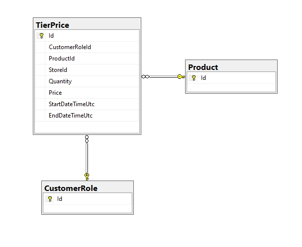
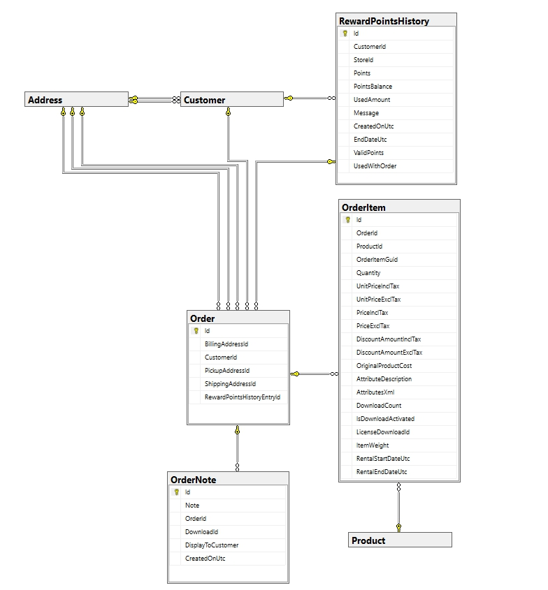
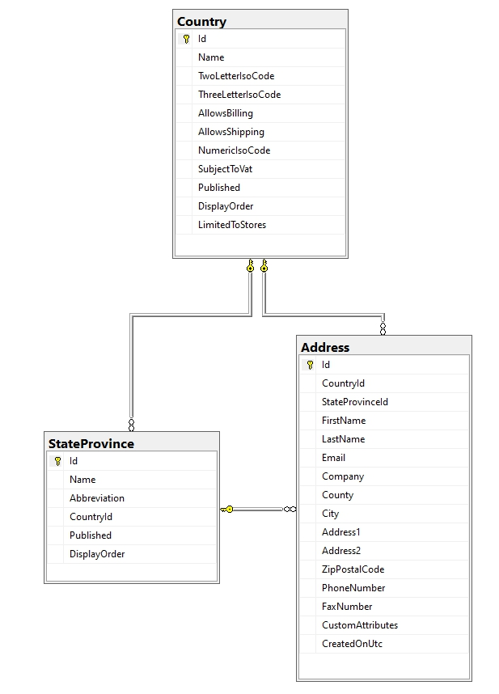

In this article, we will look at the database schema that is installed during initial installation and which remains unchanged in 90% cases.

We could try to bring the entire schema as a whole, but the default installation provides for the creation of 126 tables.

I think it will be inpossible to understand such a scheme anyway, so we will split it into component parts. I will try to group tables in the most natural and understandable way. Then you can see the description of the circuit in the following blocks:

* [Customers info](#customers-info)
* [Products info](#products-info)
  * [Product attributes](#product-attributes)
  * [Tier price](#tier-price)
  * [Inventory by warehouses](#inventory-by-warehouses)
* [Orders](#orders)
* [Shipments](#shipments)
* [Discounts](#discounts)
* [Shopping cart](#shopping-cart)
* [Addresses](#addresses)

## Customers info


This diagram shows a set of tables for basic information about the user, indicating the direction of links.

We will not delve into the purpose of tables and fields, since their purpose can be easily read from the name

### Features (Customers info)

* In the **Customer** table we have three fields, which in fact should contain links to external tables, but in practice they are not:
    1. AffiliateId
    1. VendorId
    1. RegisteredInStoreId

    This is done intentionally so as not to overload the system with unnecessary connections, since these fields are not used in every online store

* Not all user data is in this schema, some of the data is in the **GenericAttribute** table. By default, in this table we store the following data:
  * First name
  * Last name
  * Gender
  * Date of birthday
  * Company
  * Customer Address
  * Phone

    The structure of this table is presented below:

    

    Besides the mentioned data, this table can store any other data. We added this table on purpose so that you could extend any entity without changing the structure of the tables.

    additionally, this table stores xml views for two groups of attributes **Vendor attributes** and **Customer attributes**

    

## Products info


In the diagram you see the base data for the product (the schema of the product information table below), as a rule, this data is used in 99% of cases


### Features (Products info)

Depending on the store settings, additional tables may be connected to this scheme, for example, to distribute the quantity of products among warehouses


or product reviews functions:


### Product attributes

Separately for products, you should consider the scheme of attributes and their combinations, this scheme is below:


### Tier price

If you are using tier price for products, then you should also pay attention to the following scheme:



### Inventory by warehouses

Despite the fact that this feature is not used so often, I think it might be useful to give a scheme for accounting for the number of goods in a particular warehouse:


## Orders



In this diagram, we can see the main tables involved in the formation of order data. Since the table itself with the basic order data is very large, we present its contents below:


In this case, there is no need to comment on anything, everything should be clear from the diagram and the names of the fields. It should only be noted that the **RewardPointsHistory** table is not always used, but only if the Reward points system is activated for the store

## Shipments


I think that the purpose of all tables in the diagram, as before, raises no questions. Nevertheless, let us dwell on a few points. The **ShippingMethod** table is used to manage the list of connected plugins, and the specific shipping method is stored in the **ShippingRateComputationMethodSystemName** and **ShippingMethod** fields of the **Order** table.

The OrderItemId field of the ShipmentItem table is essentially a reference to the OrderItem table.

## Discounts


From the diagram above, we can see that discounts can be applied to three groups: **Products**, **Manufacturers**, **Categories**
And can be configured with various rules that are controlled by plugins (``IDiscountRequirementRule``).

In the DiscountRequirement table, the InteractionTypeId field must contain one of the values specified in the ``RequirementGroupInteractionType`` enume:

```csharp
/// <summary>
/// Represents an interaction type within the group of requirements
/// </summary>
public enum RequirementGroupInteractionType
{
    /// <summary>
    /// All requirements within the group must be met
    /// </summary>
    And = 0,

    /// <summary>
    /// At least one of the requirements within the group must be met 
    /// </summary>
    Or = 2
}
```

## Shopping cart

Another important part of the store is the basket, in our case the scheme of this mechanism is very simple:


The only thing worth noting is that this scheme is also used for the wishlist, to separate the two types, the ShoppingCartTypeId field is used. The values in this field must match the values from the ShoppingCartType enumeration:

```csharp
/// <summary>
/// Represents a shopping cart type
/// </summary>
public enum ShoppingCartType
{
    /// <summary>
    /// Shopping cart
    /// </summary>
    ShoppingCart = 1,

    /// <summary>
    /// Wishlist
    /// </summary>
    Wishlist = 2
}
```

## Addresses

Perhaps you will also be interested in the table schema involved in storing addresses, both delivery and the customer themselves:



On this we will end the review of the database schema, as you understand, this is not all the tables included in the standard installation, since many of them have no connection and serve only for a specific purpose, while others are used very rarely.
