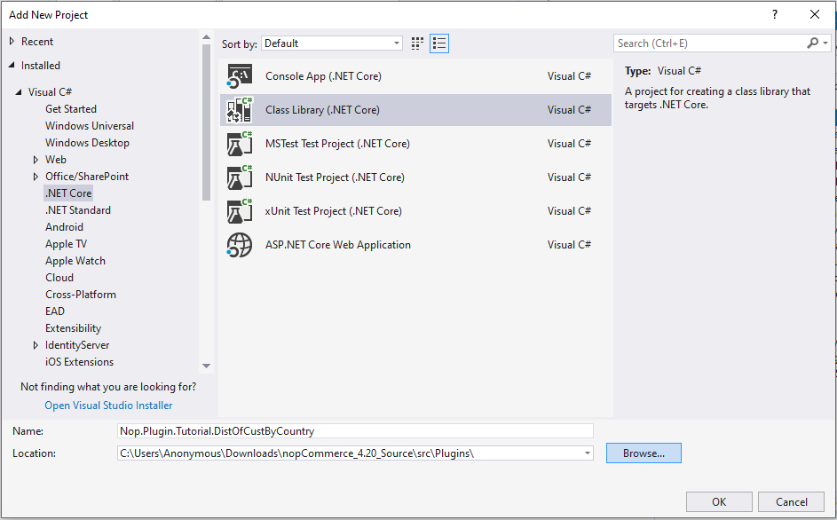

---
title: Description of plugin system
uid: en/developer/tutorials/description-of-plugin-system
author: git.nopsg
contributors: git.nopsg, git.DmitriyKulagin
---

# Description of plugin system

Topics we will be covering in this tutorial

1. Initialize a new plugin system for nopCommerce.
1. How to search and use plugins from nopCommerce store.
1. Explain IPlugin, IPluginManager, PluginDescriptor

## How to initialize a new Plugin system (How to create a new plugin project)

nopCommerce uses plugins system to extend the functionality of nopCommerce store. Plugins are a set of independent programs or components which can be added to an existing system to extend some specific functionality and also can be removed from system without effecting the main system during the process.

There are a bunch of steps and process we need to follow to initialize a new plugin project.

nopCommerce uses its file structure to manage projects in its solution. So it is good practice to create all plugin projects inside `Plugins` directory in the root of the solution. And compiled version of plugin must be stored inside `Presentation/Nop.Web/Plugins` directory. This is the location from where nopCommerce loads all of its plugins to display in plugin list under menu Admin/Configuration/LocalPlugins.  

So let us create a new plugin (Class Library) project inside root `Plugins` directory. To create a project right click on the plugin folder and in the context menu under **Add** click **New Project**.


This will open a new window where we can choose which type of project we want to create. Here under **Visual C#** click **.Net Core** since nopCommerce 4.2 uses .Net core 2.2 under that choose **Class Library**. nopCommerce uses some specific naming convention for plugin so the recommended name for a plugin project is **Nop.Plugin.{Group}.{Name}**. **{Group}** is your plugin group. For example we are using this `Nop.Plugin.Tutorial.DistOfCustByCountry` here `Tutorial` is the group and `DisOfCustByCountry` is the name that describes what our plugin is about. To get better idea about what your group name should be you can look at the previously available plugins name for reference. But please note that it's not a requirement. Also, you can choose any name for a plugin. After you choose appropriate name for your plugin change the location to your plugin folder and click **Ok**.



After the plugin project is created we need to configure the project so that we can use that project as a plugin. To do so open your newly created plugin projects **.csproj** file in edit mode. For that right click on your plugin project and click **Edit your plugin project name.csproj** menu shown in the context menu. It will open your **.csproj** in edit mode.


Now replace its content with following code.

```xml
<Project Sdk="Microsoft.NET.Sdk">
    <PropertyGroup>
        <TargetFramework>netcoreapp2.2</TargetFramework>
        <Copyright>SOME_COPYRIGHT</Copyright>
        <Company>YOUR_COMPANY</Company>
        <Authors>SOME_AUTHORS</Authors>
        <PackageLicenseUrl>PACKAGE_LICENSE_URL</PackageLicenseUrl>
        <PackageProjectUrl>PACKAGE_PROJECT_URL</PackageProjectUrl>
        <RepositoryUrl>REPOSITORY_URL</RepositoryUrl>
        <RepositoryType>Git</RepositoryType>
        <OutputPath>..\..\Presentation\Nop.Web\Plugins\<PLUGIN_OUTPUT_DIRECTORY></OutputPath>
        <OutDir>$(OutputPath)</OutDir>
        <!--Set this parameter to true to get the dlls copied from the NuGet cache to the output of your    project. You need to set this parameter to true if your plugin has a nuget package to ensure that   the dlls copied from the NuGet cache to the output of your project-->
        <CopyLocalLockFileAssemblies>true</CopyLocalLockFileAssemblies>
    </PropertyGroup>
    <ItemGroup>
        <ProjectReference Include="..\..\Presentation\Nop.Web.Framework\Nop.Web.Framework.csproj" />
    </ItemGroup>
    <!-- This target execute after "Build" target -->
    <Target Name="NopTarget" AfterTargets="Build">
        <!-- Delete unnecessary libraries from plugins path -->
        <MSBuild Projects="@(ClearPluginAssemblies)" Properties="PluginPath=$(MSBuildProjectDirectory)\ $(OutDir)" Targets="NopClear" />
    </Target>
</Project>
```

> [!NOTE]
> Here you need to replace `PLUGIN_OUTPUT_DIRECTORY` with your plugin directory name.

Now we need to create a **plugin.json** file inside the root directory of our plugin project. Each nopCommerce plugin must have this file. This file contains the Meta information description which is used by nopCommerce to determine which group this plugin belongs to,  if the plugin is compatible with the current version of nopCommerce or not, what is the version of the plugin is and several other informations. Which will be describe below. But first copy the text below to your **plugin.json** file. This was copied from the existing `Nop.Plugin.Payments.PayPalStandard` plugin provided by nopCommerce. We need to modify this file with the information related to our plugin.

```json
{
    "Group": "Payment methods",
    "FriendlyName": "PayPal Standard",
    "SystemName": "Payments.PayPalStandard",
    "Version": "1.49",
    "SupportedVersions": [ "4.20" ],
    "Author": "nopCommerce team",
    "DisplayOrder": 1,
    "FileName": "Nop.Plugin.Payments.PayPalStandard.dll",
    "Description": "This plugin allows paying with PayPal Standard"
}
```

Let's me explain about each property this json file contains.

- **Group**. It is used by nopCommerce to identify or search or filter plugin by its group name in the plugin list under `Admin/Configuration/LocalPlugin` menu.

- **FriendlyName**. It is the display name for the plugin. It is used to identify our plugin from the plugin list.

- **SystemName**. It is used by nopCommerce to identify the plugin uniquely, so it needs to be unique from all other plugin. We cannot register more than one plugin with the same `SystemName`.

- **Version**. This is to identify which version of plugin is it currently installed in the nopCommerce application.

- **SupportedVersions**. It is the array of string. It contains one or more than one versions of nopCommerce that this plugin is supported on or we can say this plugin is target for. During development ensure that the current version of nopCommerce in which you are developing this plugin is included in this list, otherwise, it will not be loaded in the plugin list.

- **Author**. This is the information about the creator of plugin. It may be a person name or a company name or a team who created this plugin.

- **DisplayOrder**. It is used to set the order in which this plugin should be displayed in the plugin list. Its value is of type number.

- **FileName**. It has the following format **Nop.Plugin.{Group}.{Name}.dll** (it is your plugin assembly filename).

- **Description**. It contains a short description about your plugin like what this plugin is all about, what this plugin does. This is shown in the Plugin list under plugin name.

After you edit your **plugin.json** file's content you need to set its `Copy to Output Directory` property value to `copy if newer`. It is required because we need this file to be copied to compiled directory from where nopCommerce can access this file to display our plugin in the plugin list in admin panel.

Now we need to create a class which inherent from **`IPlugin`** interface from `Nop.Services.Plugins` namespace. nopCommerce has `BasePlugin` class which already implements some `IPlugin` methods and allows you to avoid source code duplication. Now if we want to add some logic to our plugin during installation and uninstallation process then we can override two methods `Install` and `Uninstall`. Which looks something like below.

```cs
public override void Install()
{
    //here put your logic you want to add during installation of your plugin.
    base.Install();
}

public override void Uninstall()
{
    //here put your logic you want to add during UnInstallation of your plugin.
    base.Uninstall();
}
```

If you have done all of the above process without any error then your plugin project is initialized and configured successfully. Now you may want to create folders and files containing logic to create a fully functioning plugin for nopCommerce.

Now you need to build your project and run your application for your plugin to take effect. After that login as an administrator and navigate to admin panel  and go to `Configure/LocalPlugins` menu scroll to find your newly created plugin. If you don't find your plugin listed in the plugin list then you may need to click **Reload list of plugins** button which will restart your application and list all available installed and uninstalled plugins from `Presentation/Nop.Web/Plugins` directory.

After you find your plugin click install button present in your plugin. After that a button with **Restart application to apply changes** will appear, you need to click that button. And that's it now your plugin is installed. But as you know we don't have created any functionality in our plugin so, it will not going to do anything. So, now you need to add your logic and create a functional plugin.

> [!NOTE]
> For more information about how to create a plugin you can visit [**this page**.](xref:en/developer/plugins/index)

## How to Search and use plugins from nopCommerce store

nopCommerce already have several plugins pre built and available to use out of the box. You can also search and find several plugins already available from nopCommerce official store and see if someone has already created a plugin that suits your needs. If not then you always can build your won plugin according to your requirement. But here let's see how to find and use plugins from nopCommerce store. For that nopCommerce has a market place where we can find different themes and plugins. You can visit to go to the [nopCommerce Marketplace](https://www.nopcommerce.com/marketplace).


Here you can see three tabs. **All tab** contains all themes and extensions, **Themes tab** contains all nopCommerce themes which is for nopCommerce website skin, and lastly **Extensions tab** where we can find plugins. So go to Extensions tab. Here you can find all free and commercial plugins. To find a specific plugin you want, you can search from here. In the right side you can find the filtration section from where you can narrow down your filtering. After you find your searched plugin just download and install. Each plugin has a full description about how to use plugin, in its download page, so don't forget to read those descriptions.

## Interface `IPlugin`

`IPlugin` is an interface that exposes the functionalities used while installing or uninstalling the plugin. Every plugin project must have a class that inherent form this interface in order for nopCommerce to treat that project as plugin. nopCommerce invokes the install method defined in the class implementing the interface to initiate the `Install` process for plugin. And same goes for `Uninstall` process. Except `Install` and `Uninstall` it exposes few other properties and methods like.

### Method `GetConfigurationPageUrl`

```cs
string GetConfigurationPageUrl()
```

This should return the URL for configuration view. When we install the plugin we will see a `Configuration` button, so if we implement this method in our class then the string value we return form this method will be used as the URL for that `configuration` button.

#### Method `PreparePluginToUninstall`

```cs
void PreparePluginToUninstall()
```

This method will be invoked when we click `Uninstall` button for the plugin. Code inside this method will be executed before the nopCommerce uninstalls the plugin from system. In this method we may want to write the logic to validate our plugin from uninstallation. For example here we can check if there are other plugins which are depending on the plugin we are trying to uninstall. If so we may not want users to uninstall the plugin until the plugin depending on the current plugin is uninstalled.

### Property `PluginDescriptor`

```cs
PluginDescriptor PluginDescriptor{ get; set; }
```

This property is used to get or set the information that describes the current plugin. When we write a new plugin or widget we need to create a **plugin.json** file. nopCommerce uses the same file to initialize the value for this property.

## Class `PluginDescriptor`

This class as name implies holds the information that describes about the plugin. If you compare the "properties" from this class to "key" from **plugin.json** file, you will see similar structure. That is because this class **PluginDescriptor.cs** is used to map that **plugin.json** file to c# class, so that the information provided in **plugin.json** can be used by nopCommerce. Except those properties `PluginDescriptor` class contains some more properties and helper methods like.

### Property `Installed`

```cs
bool Installed
```

This property is used to verify if plugin is installed in our nopCommerce application or not.

### Property `PluginType`

```cs
Type PluginType
```

It is used to get or set the type of the plugin. This type reference the class that implements the `IPlugin` interface in the plugin project.

### Property `OriginalAssemblyFile`

```cs
string OriginalAssemblyFile
```

It is used to get or set the original assembly file that a shadow copy was made from.

### Property `ReferencedAssembly`

```cs
Assembly ReferencedAssembly
```

It is to gets or sets the assembly that has been shadow copied that is active in the application.

### Property `ShowInPluginsList`

```cs
bool ShowInPluginsList
```

This property is used to indicate whether we want to show the plugin in the plugin list or not.

### Method GetPluginDescriptorFromText

```cs
PluginDescriptor GetPluginDescriptorFromText(string text)
```

This method takes *json string* as input and parse the *json string* to type `PluginDescriptor`. And returns `PluginDescriptor` parsed from the *json string*.

### Method `Save`

```cs
void Save()
```

It is to save plugin description from `PluginDescriptor` to **plugin.json** file.

### Method `Equals`

```cs
bool Equals(object value)
```

It checks to determine wether the *SystemName* of the current instance of `PluginDescriptor` is equals to the *SystemName* of the `PluginDescriptor` instance supplied as parameter. If matches then returns true else false.

### Method `CompareTo`

```cs
int CompareTo(PluginDescriptor other)
```

It compares the current instance of `PluginDescriptor` with other instance of `PluginDescriptor` supplied in parameter by comparing the property *FriendlyName* And returns an integer that indicates whether this instance precedes, follows, or appears in the same position in the sort order as the specified parameter.

### Method `Instance`

```cs
TPlugin Instance<TPlugin>() where TPlugin : class, IPlugin
```

This method is used to get the instance of *Plugin* of type `PluginType` property from the current `PluginDescriptor`.

## Interface `IPluginManager`

`IPluginManager` is a generic interface of type class. It contains method decelerations used for loading plugins using different filter parameters. We can find the implementation of this interface in `PluginManager` located under namespace `{Nop.Services.Plugins}`.
