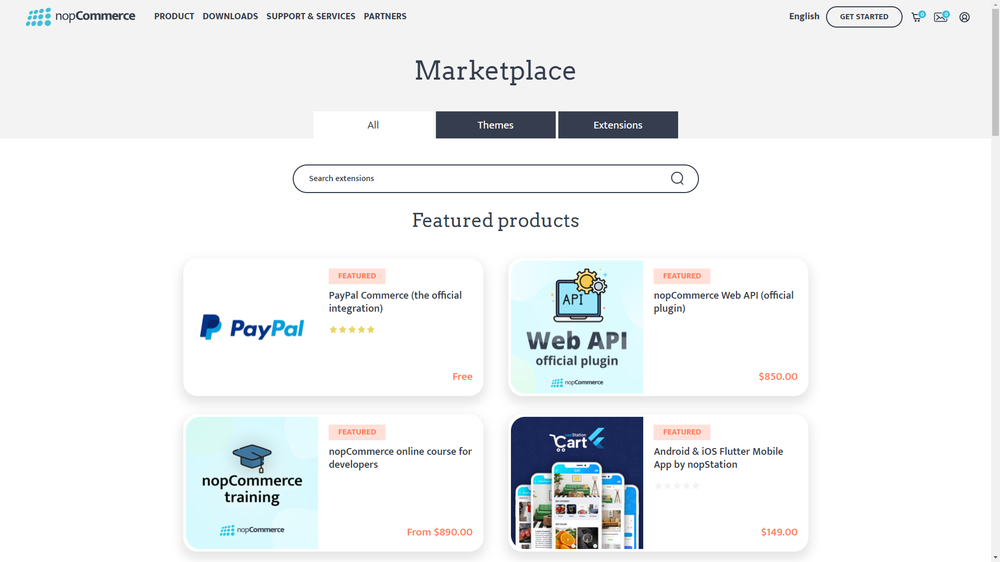

---
title: Description of plugin system
uid: en/developer/tutorials/description-of-plugin-system
author: git.nopsg
contributors: git.nopsg, git.DmitriyKulagin
---

# Description of plugin system

## How to initialize a new Plugin system (How to create a new plugin project)

nopCommerce uses a plugins system to extend the functionality of the nopCommerce store. Plugins are a set of independent programs or components that can be added to an existing system to extend some specific functionality and also can be removed from the system without affecting the main system during the process.

> [!NOTE]
> For more information about how to create a plugin you can visit [**this page**.](xref:en/developer/plugins/index)

## How to Search and use plugins from the nopCommerce store

nopCommerce already has several plugins pre-built and available to use out of the box. You can also search and find several plugins already available from the nopCommerce official store and see if someone has already created a plugin that suits your needs. If not then you always can build your won plugin according to your requirement. But here let's see how to find and use plugins from the nopCommerce store. For that nopCommerce has a marketplace where we can find different themes and plugins. You can visit to go to the [nopCommerce Marketplace](https://www.nopcommerce.com/marketplace).



Here you can see three tabs. **All** tab contains all themes and extensions, **Themes** tab contains all nopCommerce themes which are for nopCommerce website skin, and lastly **Extensions** tab where we can find plugins. So go to the Extensions tab. Here you can find all free and commercial plugins. To find a specific plugin you want, you can search from here. On the right side, you can find the filtration section from where you can narrow down your filtering. After you find your searched plugin just download and install. Each plugin has a full description about how to use the plugin, on its download page, so don't forget to read those descriptions.

## Interface `IPlugin`

`IPlugin` is an interface that exposes the functionalities used while installing or uninstalling the plugin. Every plugin project must have a class inherited from this interface for nopCommerce to treat that project as a plugin.

### Method `GetConfigurationPageUrl`

```cs
string GetConfigurationPageUrl()
```

This should return the URL for configuration view. When we install the plugin we will see a `Configuration` button, so if we implement this method in our class then the string value we return to form this method will be used as the URL for that `configuration` button.

### Property `PluginDescriptor`

```cs
PluginDescriptor PluginDescriptor{ get; set; }
```

This property is used to get or set the information that describes the current plugin. When we write a new plugin or widget we need to create a **plugin.json** file. nopCommerce uses the same file to initialize the value for this property.

### Method `InstallAsync`

```cs
Task InstallAsync();
```

The method is executed when the plugin is installed, this logic usually implements the initialization of settings, locales, and other infrastructure for the correct configuration of the plugin.

### Method `UninstallAsync`

```cs
Task UninstallAsync();
```

The method is the opposite of "InstallAsync", it should completely delete all resources allocated to the plugin after it is uninstalled.

### Method `UpdateAsync`

```cs
Task UpdateAsync(string currentVersion, string targetVersion);
```

The method is used to update the plugin to the specified version.

### Method `PreparePluginToUninstallAsync`

```cs
Task PreparePluginToUninstallAsync()
```

This method will be invoked when we click the `UninstallAsync` button for the plugin. Code inside this method will be executed before the nopCommerce uninstalls the plugin from the system. In this method, we may want to write the logic to validate our plugin from uninstallation. For example, here we can check if there are other plugins which are depending on the plugin we are trying to uninstall. If so we may not want users to uninstall the plugin until the plugin depending on the current plugin is uninstalled.

## Class `PluginDescriptor`

This class as the name implies holds the information that describes the plugin. If you compare the *properties* from this class to *key* from the **plugin.json** file, you will see a similar structure. That is because this class **PluginDescriptor.cs** is used to map that **plugin.json** file to C# class so that the information provided in **plugin.json** can be used by nopCommerce. Except for those properties `PluginDescriptor` class contains some more properties and helper methods.

### Property `Installed`

```cs
public virtual bool Installed { get; set; }
```

This property is used to verify if a plugin is installed in our nopCommerce application or not.

### Property `PluginType`

```cs
public virtual Type PluginType { get; set; }
```

It is used to get or set the type of the plugin. This type reference the class that implements the `IPlugin` interface in the plugin project.

### Property `OriginalAssemblyFile`

```cs
public virtual string OriginalAssemblyFile { get; set; }
```

It is used to get or set the original assembly file that a shadow copy was made from.

### Property `ReferencedAssembly`

```cs
public virtual Assembly ReferencedAssembly { get; set; }
```

It is to gets or set the assembly that has been shadow copied that is active in the application.

### Property `ShowInPluginsList`

```cs
public virtual bool ShowInPluginsList { get; set; } = true;
```

This property is used to indicate whether we want to show the plugin in the plugin list or not.

### Method GetPluginDescriptorFromText

```cs
public static PluginDescriptor GetPluginDescriptorFromText(string text)
```

This method takes *json string* as input and parses the *json string* to type `PluginDescriptor`. And returns `PluginDescriptor` parsed from the *json string*.

### Method `Save`

```cs
public virtual void Save()
```

It is to save plugin description from `PluginDescriptor` to the **plugin.json** file.

### Method `CompareTo`

```cs
public int CompareTo(PluginDescriptor other)
```

It compares the current instance of `PluginDescriptor` with other instances of `PluginDescriptor` supplied in parameter by comparing the property *FriendlyName* And returns an integer that indicates whether this instance precedes, follows, or appears in the same position in the sort order as the specified parameter.

### Method `Instance`

```cs
public virtual TPlugin Instance<TPlugin>() where TPlugin : class, IPlugin
```

This method is used to get the instance of *Plugin* of type `PluginType` property from the current `PluginDescriptor`.

## Interface `IPluginManager`

`IPluginManager` is a generic interface of type class. It contains method decelerations used for loading plugins using different filter parameters. We can find the implementation of this interface in `PluginManager` located under namespace `{Nop.Services.Plugins}`.
