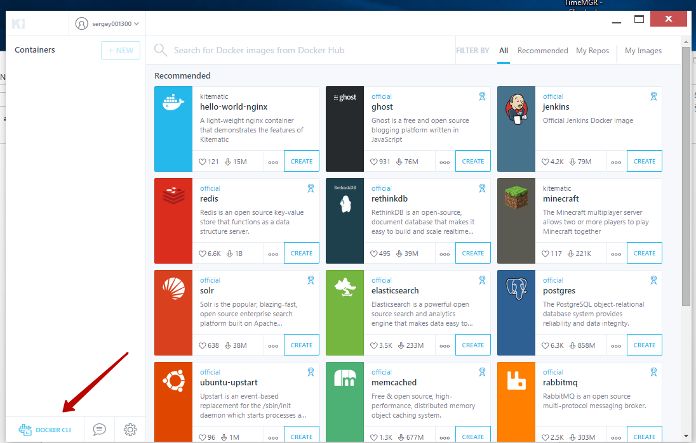

# Docker

This document describes a step-by-step guide to building and running a Docker container.

1. **Preparing for the deployment of virtual Docker** in Windows environment.

    You need to download and install the [Kitematic](https://kitematic.com/) application. This program will allow us to deploy a Linux virtual machine in VirtualBox with Docker installed and manage it from our main computer. After the first launch, we choose that we will work through VirtualBox and wait until the application installs and starts the virtual machine.

1. **Run the command shell** to the Docker via the [Kitematic](https://kitematic.com/)  interface. To do this, simply click on the inconspicuous button in the interface.

    

    All further work will take place in the familiar PowerShell window.

1. **We collect the Docker container**. For the convenience of executing commands, go to the directory where Dockerfile is located (the root directory of the nopCommerce source files).

    The command that we need:

    ```csharp
    [docker build -t nopcommerce]
    ```

    This command builds the container according to the instructions described in the “Dockerfile” file. The first launch of the assembly will take a lot of time, since it will require downloading two basic images for .Net Core applications.

    The first image containing the SDK is required for the intermediate container, which will assemble the application by repairing all the dependencies, and then execute the process of publishing the `Nop.Web` application to a separate directory, from which you will create the resulting container with the name *nopcommerce* later (you can create an image without name, but the name is more convenient. To specify the name of the container during assembly, you must specify the flag [–t], as was done in our case).

    After installation, if everything went well, executing the next command:

    ```csharp
    [docker images]
    ```

    We should see something similar to this:

    

    This is a list of all loaded containers, among which we can easily see our container, it is created and ready to go.

1. **Run and test the container.**

    First, let's start the container with the command:

    ```csharp
    [docker run -d -p 80:80 nopcommerce]
    ```

    This command will launch our container in the background (flag [-d]) and set port 80 from the container to port 80 of the host machine (flag [–p]).

    > [!TIP]
    > 
    > You can view the list of running containers using the next command:
    > 
    > `csharp
  [docker ps]`

    Since we are launching the docker through a virtual machine, we need to first get an IP address at which we can test the operation of the application. To do this, execute the command, which will start the redirection service and give us the IP address on which we can verify that the application has started.

    ```csharp
    [docker-machine ip]
    ```

    Having clicked on this address, we should see the page with the installation of nopCommerce.

    

    This will be our verification that the container is being created, launched and successfully operating.

1. But to **fully test** the operation of the application in this way will only work if you have a SQL server that our container can access. But, as a rule, ours and user environments are limited, so we have prepared a layout file that will allow you to deploy the nopCommerce container in conjunction with the container containing the SQL server.

    To begin, stop all containers so as not to interfere. Use the command for this:

    ```csharp
    [docker stop $ (docker ps -a -q)]
    ```

    To deploy container composition, use the command:

    ```csharp
    [docker-compose up -d]
    ```

    This command uses the docker-compose.yml file for deployment, which describes the creation of two containers “nopcommerce_web” and “nopcommerce_database”, which provide a bundle of applications and a database. Now we will get the IP address for the tests by executing the command:

    ```csharp
    [docker-machine ip]
    ```

    And by opening the page at this address in the browser, we will be able to test everything we want. To connect to the database server, we use the following data (as described in the docker-compose.yml file):

    ```csharp
    Server name: nopcommerce_mssql_server
    User: sa
    Password: nopCommerce_db_password
    ```

1. After testing is complete, you can remove all containers so that they do not interfere next time. Two commands will help to execute it:

    ```csharp
    [docker stop $ (docker ps -a -q)]
    ```

    and

    ```csharp
    [docker system prune -a]
    ```
