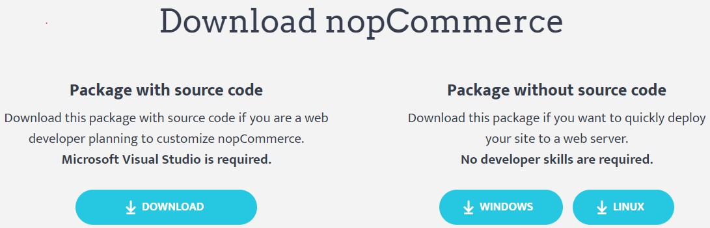
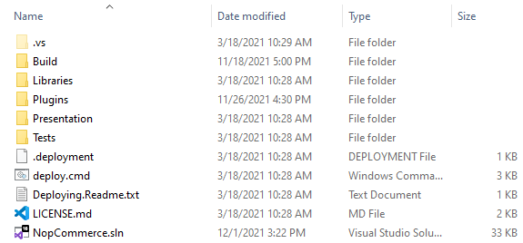

# Instruction on how to start developing on nopCommerce

nopCommerce is an open-source Microsoft ASP.NET-based eCommerce solution. This is a basic guide for developers on how to start developing on nopCommerce.

## 1. Tools Required for Development

You can learn about technology and system requirement from the **"[Tools Required for Development](xref:en/developer/tutorials/system-requirements-for-developing#2-tools-required-for-development)"** article.

## 2. Stack of technologies used in nopCommerce

The best part of nopCommerce is that its source code is fully customizable and its pluggable architecture makes it easy to develop custom functionality and follow any business requirements by using a plugin system. It follows well-known software architectures, patterns, and best security practices. And above all of that, it runs on the latest technologies to offer the best experience possible to end-users. So, to achieve all of this nopCommerce uses a stack of technologies in its architecture.

* Application Layer
  * Razor View Engine

    It is to render an HTML page on the client side. Razor View engine is a markup syntax that helps us to write HTML and server-side code in web pages using C# or VB.NET.
  * JQuery

    It is a javascript library used to extend the UI & UX functionality of HTML pages.
  * Kendo UI

    Kendo UI is a comprehensive HTML5 user interface framework for building interactive and high-performance websites and applications

* Business Layer
  * Fluent Validation

    It is a validation library for .NET that uses a fluent interface and lambda expressions for building validation rules.
  * AutoMapper

    AutoMapper is a simple library that helps us to transform one object type to another. It is a convention-based object-to-object mapper that requires very little configuration.
  * ASP.NET Core internal dependency injection

    ASP IOC manages the dependencies between classes so that applications stay easy to change as they grow in size and complexity.
  * Linq2DB

    Linq2DB is an open-source ORM framework for .NET applications. It is a .NET Foundation project. It enables developers to work with data using objects of domain-specific classes without focusing on the underlying database tables and columns where this data is stored. So, it is the bridge between Business Layer and Data Layer.
  * FluentMigrator

    Fluent Migrator is a migration framework for .NET. Migrations are a structured way to alter your database schema and are an alternative to creating lots of SQL scripts that have to be run manually by every developer involved. Migrations solve the problem of evolving a database schema for multiple databases (for example, the developer's local database, the test database, and the production database). Database schema changes are described in classes written in C# that can be checked into a version control system.
* Data Layer
  * Microsoft SQL Server

    SQL Server is Microsoft's full-featured relational database management system (RDBMS).
  * MySQL Server

    MySQL is the world's most popular open-source database. With its proven performance, reliability, and ease of use, MySQL has become the leading database choice for web-based applications.
  * PostgreSQL

    PostgreSQL is a powerful, open-source object-relational database system with over 30 years of active development that has earned it a strong reputation for reliability, feature robustness, and performance.
  * Redis (cache)

    Redis is an open-source (BSD licensed), in-memory data structure store, used as a database, cache, and message broker. So, in nopCommerce Redis is used to store old data as an in-memory cache dataset. Which boosts the speed and performance of an application.
  * Microsoft Azure(Optional)

    Azure is a public cloud computing platform with solutions including Infrastructure as a Service (IaaS), Platform as a Service (PaaS), and Software as a Service (SaaS) that can be used for services such as analytics, virtual computing, storage, networking, and much more.

## 3. How to download the project and run it on the local machine

Before we begin to work with nopCommerce we need to ensure that our local machine is configured and need to ensure that all of our tools required to develop in nopCommerce are installed properly and working correctly. Now, let us go to step-by-step instructions on how to download and run nopCommerce on our local machine.

### Step 1: Download nopCommerce source code

To download please visit [www.nopcommerce.com](https://www.nopcommerce.com/download-nopcommerce). There you can see two download buttons one with a source code and one without source code as shown in the picture below.

Since we are downloading nopCommerce for development purposes so we need to download the one that says "Package with source code" which contains all source code of nopCommerce. To download nopCommerce you need to be logged in or register a new account. Now you can download nopCommerce as a RAR file, and extract it to your desired folder location.

### Step 2: Open nopCommerce solution in Microsoft Visual Studio

Open the folder. Inside that folder, you will see a bunch of files and folders which contain all of the sources code for nopCommerce.

In there you will also see a solution file with an extension of `.sln`, please double click that solution file to open the nopCommerce project in your Microsoft Visual Studio.

### Step 3: Running nopCommerce project using Microsoft Visual Studio

nopCommerce does not require you to have any further configuration just to run the project. nopCommerce is ready to run out of the box. So, now you can run a project using Microsoft Visual Studio by hitting ctrl+F5 or just F5 to run a project in debugging mode, or you can run using a physical button with a play icon in Microsoft Visual Studio. After you run the project for the first time you will see an installation page like below:

Here you need to fill in all required information to complete your installation.

#### Store information

Here you are required to provide an email address and password which then be used as your administrator account in your nopCommerce shop.

#### Database information

Here you need to provide the information you want to use for this project.

Here you have to choose your database storage. You can use `MS SQL Server` or `MySQL` or `PostgreSQL`. It is your decision which one you want to use.

For the sake of this tutorial, we will be using the `MS SQL Server`.

Also, you will see the checkbox asking if you want to create a database if not exist, please check the checkbox.

Moving further you need to set up your connection string. For that, you have two options. One is to fill a form with "**Server name**" and "**Database name**". In "Server name" you need to provide your server's name and in "Database name" you need to provide a database name you want to create or if you already have one then it will not create but use the existing one. However, you also can choose the option "**Enter raw connection string (advanced)**" then you need to write the whole connection string by yourself. After that, you need to provide your SQL server's credentials for authentication.

After you fill in all of this information you need to press the "install" button, it will take about 1 minute to complete the installation, then you will be redirected to the online shop homepage.

### 4. How to configure nopCommerce to run on HTTPS

To set SSL/HTTPS for your nopCommerce you need to go to the property window of the `Nop.Web` project under the *Presentation* folder since it is the startup project for nopCommerce. To open the property window right-click on the `Nop.Web` project and at the bottom of the context menu you will see a menu named "Properties", just click on that menu then a property window will appear. In the property, window navigate to the "**Debug**" tab.

Check the "**Use SSL**", and enter the HTTPS URL beside it. Then save this project.

Now run your project again and navigate to the given URL and you can see that now it is running on SSL/HTTPS. So this is the one way for configuring HTTPS in your WebProject but there is also another way to configure SSL. For that go to your `Nop.Web` project and expand the project inside there you will see a virtual file named "Properties" in your project structure just below "Dependencies". Inside Properties there you will find a JSON file called **launchSetting.json**. Open that file and you will see a bunch of configuration settings already written in that file.

Inside that file, you may have a section as shown in the figure above. So to enable SSL you just need to replace 0 under the "**sslPort**" property to the port you want to run for SSL connection, make sure the port is available. To test, run your project and navigate to `https://localhost:{yourPort}`.
