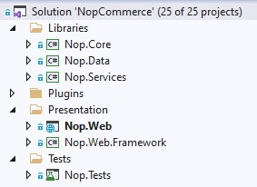

# Source code organization

This document is a developer's guide to the structure of a nopCommerce solution and is intended to help new developers learn the source code. First of all, nopCommerce is an open-source application, so you can download it for free from [GitHub](https://github.com/nopSolutions/nopCommerce). Projects and folders are listed in the order in which they are sorted in *Visual Studio*. We recommend that you open your nopCommerce solution in *Visual Studio* and view projects and files as you read this document.

Most of the projects, directories, and files are named so that you can get a rough idea of their purpose. For example, I don't even have to look inside the project called `Nop.Plugin.Payments.PayPalStandard` to guess what it does.

## `\Libraries\Nop.Core`

The `Nop.Core` project contains a set of core classes for nopCommerce, such as caching, events, helpers, and business objects (for example, `Order` and `Customer` entities).

## `\Libraries\Nop.Data`

The `Nop.Data` project contains a set of classes and functions for reading from and writing to a database or other data store. The `Nop.Data` library helps separate data-access logic from your business objects. nopCommerce uses the *Linq2DB* Code-First approach. Code-First allows a developer to define entities in the source code (all core entities are defined in the `Nop.Core` project), and then use *Linq2DB* and *FluentMigrator* to generate the database from the C# classes. That's why it's called Code-First. You can then query your objects using LINQ, which translates to SQL behind the scenes and is executed against the database. nopCommerce uses [Fluent API](https://fluentmigrator.github.io/articles/technical/fluent-api-create.html) to fully customize the persistence mapping.

## `\Libraries\Nop.Services`

This project contains a set of core services, business logic, validations, or calculations related to the data if needed. Some people call it *Business Access Layer* (BAL).

## Projects into `\Plugins\` solution folder

`Plugins` is a *Visual Studio* solution folder that contains plugin projects. Physically it's located at the root of your solution. But plugins DLLs are automatically copied in the `\Presentation\Nop.Web\Plugins` directory which is used for already deployed plugins because the build output paths of all plugins are set to `..\..\Presentation\Nop.Web\Plugins\{Group}.{Name}`. This allows plugins to contain some external files, such as static content (CSS or JS files) without having to copy files between projects to be able to run the project.

## `\Presentation\Nop.Web`

`Nop.Web` is an MVC web application project, a presentation layer for the public store which also contains an administration panel included as an area. If you haven't used `ASP.NET`  before, please find more info [here](http://www.asp.net/). This is the application that you run. It is the startup project of the application.

## `\Presentation\Nop.Web.Framework`

`Nop.Web.Framework` is a class library project containing some common presentation things for the `Nop.Web` project.

## `\Test\Nop.Tests`

`Nop.Tests` is a class library project containing some common test classes and helpers for other test projects. It does not have any tests. Read more about UNIT testing in nopCommerce in the following article: [UNIT testing](xref:en/developer/tutorials/unit-tests).

### `\Nop.Core.Tests`

Nop.Core.Tests is the test project for the Nop.Core project.

### `\Nop.Services.Tests`

Nop.Services.Tests is the test project for the Nop.Services project.

### `\Nop.Web.Tests`

`Nop.Web.Tests` is the test project for the presentation layer projects.

## Tutorials

- [The Architecture behind the nopCommerce eCommerce Platform](https://www.youtube.com/watch?v=6gLbizzSA9o&list=PLnL_aDfmRHwtJmzeA7SxrpH3-XDY2ue0a)
