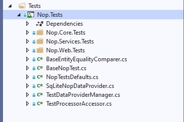

# UNIT testing

I think everyone knows about the concept of UNIT tests. We know what UNIT tests are used for and agree that this is an important part of the process of developing reliable software. In this article, we won't discuss these issues. You can easily find all the necessary information on the Internet, for example, by following the links:

* [https://en.wikipedia.org/wiki/Unit_testing](https://en.wikipedia.org/wiki/Unit_testing)
* [https://docs.microsoft.com/dotnet/core/testing/unit-testing-best-practices](https://docs.microsoft.com/dotnet/core/testing/unit-testing-best-practices)
* [https://en.wikipedia.org/wiki/Test-driven_development](https://en.wikipedia.org/wiki/Test-driven_development)

In this article, we will get acquainted with the features of testing in the nopCommerce project and learn how to add new tests and check their performance. We won't test an abstract task but will write a full-fledged test for the existing functionality from scratch. At the end of the article, you will be provided with a reference to the appropriate commit with all described code changes.

## Features overview



On the screenshot, you can see the structure of the Nop.Tests project. The folders such as ``Nop.Core.Tests`` contain tests for the corresponding projects of the solution. The other files are responsible for the auxiliary and base classes. Let's look at the ``BaseNopTest`` class.

### BaseNopTest

This is the main abstract class that exposes the IoC container for tests and allows us to use all the advantages of DI.


This class contains two methods available for child classes:

* ``PropertiesShouldEqual`` that compares all fields of the database entity with the fields of the model.

* ``GetService`` that allows using the advantages of DI and relieves of creating the classes necessary for testing.

The initialization of the **IoC** container is carried out in the static constructor of the class; this constructor contains the bulk of the code.

## IScheduleTaskService

As an example, we will create tests for a class that implements the ``IScheduleTaskService`` interface.

```csharp
public partial interface IScheduleTaskService
{
    System.Threading.Tasks.Task DeleteTaskAsync(ScheduleTask task);

    Task<ScheduleTask> GetTaskByIdAsync(int taskId);

    Task<ScheduleTask> GetTaskByTypeAsync(string type);

    Task<IList<ScheduleTask>> GetAllTasksAsync(bool showHidden = false);

    System.Threading.Tasks.Task InsertTaskAsync(ScheduleTask task);

    System.Threading.Tasks.Task UpdateTaskAsync(ScheduleTask task);
}
```

As you can see this is a simple interface. But at the same time, it allows nopCommerce to perform very important tasks such as sending email messages to customers. So we need to be sure that it works properly. Next, we will write tests for each of the interface methods.

> [!NOTE]
> We don't use **TDD** but we are not against this approach. The reliability of the functionality is important for us, and not a specific approach to testing.

## ScheduleTaskServiceTests class

Add a new ``ScheduleTaskServiceTests`` class to the project (Nop.Tests\Nop.Services.Tests\Tasks). Its code is shown below:

```csharp
using NUnit.Framework;

namespace Nop.Tests.Nop.Services.Tests.Tasks
{
    [TestFixture]
    public class ScheduleTaskServiceTests : ServiceTest
    {
    }
}
```

This is the class template for testing. From this code, we can see that nopCommerce uses the **NUnit framework** for tests.
There are two points to pay attention to:

1. Our class has the **TestFixture** attribute which tells the engine that this class is a class with tests.
1. We do not directly inherit the ``BaseNopTest`` class but inherit another abstract class - ``ServiceTest`` which adds the main plugins to the configuration.

The next step is to add a method for the initialization of our tests. As a rule, such a method is called **SetUp**. In this method, we get an instance of a class that implements the ``IScheduleTaskService`` interface, which we will be tested.

```csharp
private IScheduleTaskService _scheduleTaskService;

[OneTimeSetUp]
public void SetUp()
{
    _scheduleTaskService = GetService<IScheduleTaskService>();
}
```

As you can see, the **SetUp** method should be declared with the **OneTimeSetUp** attribute as well as you may use the **SetUp** attribute. The difference between these two attributes is only the number of calls to the method itself: in the first case, the **SetUp** method is called once for all tests, and in the second, for each test separately.

Next, let's add tests for CRUD methods. In this service these are methods such as: **InsertTaskAsync**, **GetTaskByIdAsync**, **UpdateTaskAsync**, **DeleteTaskAsync**.

But first, let's add one more field to the class. This will be an instance of the ``ScheduleTask`` class which will be used for testing:

```csharp
 private ScheduleTask _task;
 ```

Update the **SetUp** method the following way:

 ```csharp
 [OneTimeSetUp]
public void SetUp()
{
    _scheduleTaskService = GetService<IScheduleTaskService>();

    _task = new ScheduleTask { Enabled = true, Name = "Test task", Seconds = 60, Type = "nop.test.task" };
}
```

All CRUD testing methods are given below and as you can see there is nothing complicated in them:

```csharp
#region CRUD tests

[Test]
public async System.Threading.Tasks.Task CanInsertAndGetTask()
{
    _task.Id = 0;
    await _scheduleTaskService.InsertTaskAsync(_task);
    var task = await _scheduleTaskService.GetTaskByIdAsync(_task.Id);
    await _scheduleTaskService.DeleteTaskAsync(_task);

    _task.Id.Should().NotBe(0);
    task.Id.Should().Be(_task.Id);
    task.Name.Should().Be(_task.Name);
}

[Test]
public void InsertTaskShouldRaiseExceptionIfTaskIsNull()
{
    Assert.Throws<AggregateException>(() =>
            _scheduleTaskService.InsertTaskAsync(null).Wait());
}

[Test]
public async System.Threading.Tasks.Task GetTaskByIdShouldReturnNullIfTaskIdIsZero()
{
    var task = await _scheduleTaskService.GetTaskByIdAsync(0);
    task.Should().BeNull();
}

[Test]
public async System.Threading.Tasks.Task GetTaskByIdShouldReturnNullIfTaskIdIsNotExists()
{
    var task = await _scheduleTaskService.GetTaskByIdAsync(int.MaxValue);
    task.Should().BeNull();
}

[Test]
public async System.Threading.Tasks.Task CanUpdateTask()
{
    _task.Id = 0;
    await _scheduleTaskService.InsertTaskAsync(_task);
    var task = await _scheduleTaskService.GetTaskByIdAsync(_task.Id);
    task.Name = "new test name";
    await _scheduleTaskService.UpdateTaskAsync(task);
    var task2 = await _scheduleTaskService.GetTaskByIdAsync(_task.Id);
    await _scheduleTaskService.DeleteTaskAsync(_task);

    task.Id.Should().Be(task2.Id);
    task2.Name.Should().NotBe(_task.Name);
}

[Test]
public void UpdateTaskShouldRaiseExceptionIfTaskIsNull()
{
    Assert.Throws<AggregateException>(() =>
        _scheduleTaskService.UpdateTaskAsync(null).Wait());
}

public async System.Threading.Tasks.Task CanDeleteTask()
{
    _task.Id = 0;
    await _scheduleTaskService.InsertTaskAsync(_task);
    await _scheduleTaskService.DeleteTaskAsync(_task);
    var task = await _scheduleTaskService.GetTaskByIdAsync(_task.Id);
    task.Should().BeNull();
}

[Test]
public void DeleteTaskShouldRaiseExceptionIfTaskIsNull()
{
    Assert.Throws<AggregateException>(() =>
        _scheduleTaskService.DeleteTaskAsync(null).Wait());
}

#endregion
```

In addition, the list of connected namespaces has been changed. The updated list is provided below:

```csharp
using System;
using FluentAssertions;
using Nop.Core.Domain.Tasks;
using Nop.Services.Tasks;
using NUnit.Framework;
```

> [!NOTE]
> We have to delete all changes made by a test from the database. In our case, we use the `DeleteTaskAsync` method for this purpose. Also, note that it should be done just before we call test methods such as `task.Should().BeNull();`, `task2.Name.Should().NotBe(_task.Name);` etc. because if the test fails, the database will contain data that can affect other testing processes.

Then let's test the two remaining methods:

```csharp
[Test]
public async System.Threading.Tasks.Task CanGetTaskByType()
{
    _task.Id = 0;
    var task = await _scheduleTaskService.GetTaskByTypeAsync(_task.Type);
    task.Should().BeNull();
    await _scheduleTaskService.InsertTaskAsync(_task);
    task = await _scheduleTaskService.GetTaskByTypeAsync(_task.Type);
    await _scheduleTaskService.DeleteTaskAsync(_task);
    task.Should().NotBeNull();
}

[Test]
public async System.Threading.Tasks.Task GetTaskByTypeShouldReturnNullIfTypeIsNull()
{
    var task = await _scheduleTaskService.GetTaskByTypeAsync(null);
    task.Should().BeNull();
}

[Test]
public async System.Threading.Tasks.Task GetTaskByTypeShouldReturnNullIfTypeIsEmpty()
{
    var task = await _scheduleTaskService.GetTaskByTypeAsync(string.Empty);
    task.Should().BeNull();
}

[Test]
public async System.Threading.Tasks.Task CanGetAllTasks()
{
    _task.Id = 0;
    var tasks = await _scheduleTaskService.GetAllTasksAsync(true);
    tasks.Count.Should().Be(0);
    tasks = await _scheduleTaskService.GetAllTasksAsync(false);
    tasks.Count.Should().Be(0);

    await _scheduleTaskService.InsertTaskAsync(_task);
    var tasksWithHidden = await _scheduleTaskService.GetAllTasksAsync(true);
    var tasksWitoutHidden = await _scheduleTaskService.GetAllTasksAsync(false);
    await _scheduleTaskService.DeleteTaskAsync(_task);

    tasksWithHidden.Count.Should().Be(1);
    tasksWitoutHidden.Count.Should().Be(1);

    _task.Enabled = false;

    await _scheduleTaskService.InsertTaskAsync(_task);
    tasksWithHidden = await _scheduleTaskService.GetAllTasksAsync(true);
    tasksWitoutHidden = await _scheduleTaskService.GetAllTasksAsync(false);
    await _scheduleTaskService.DeleteTaskAsync(_task);
    _task.Enabled = true;

    tasksWithHidden.Count.Should().Be(1);
    tasksWitoutHidden.Count.Should().Be(0);
}
```

Finally, let's add one more standard method for many tests which is usually called **TearDown**. In this method, we will carry out the final cleaning of the database from possible changes made by us during the testing process. This method must have the **OneTimeTearDown** or **TearDown** attribute, similar to the attributes of the SetUp method.

```csharp
[OneTimeTearDown]
public async System.Threading.Tasks.Task TearDown()
{
    var tasks = await _scheduleTaskService.GetAllTasksAsync(true);

    foreach (var task in tasks.Where(t=>t.Type.Equals(_task.Type, StringComparison.InvariantCultureIgnoreCase))) 
        await _scheduleTaskService.DeleteTaskAsync(task);
}
```

That's it, our test class is ready. As I promised at the beginning, you can find the entire class at [this link](https://github.com/nopSolutions/nopCommerce/blob/develop/src/Tests/Nop.Tests/Nop.Services.Tests/Tasks/ScheduleTaskServiceTests.cs) and the commit with its addition by [this link](https://github.com/nopSolutions/nopCommerce/commit/81c31e1ee754f771ddfdc26e9b95a729e38b2d29).
