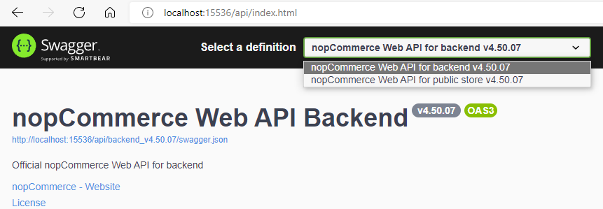
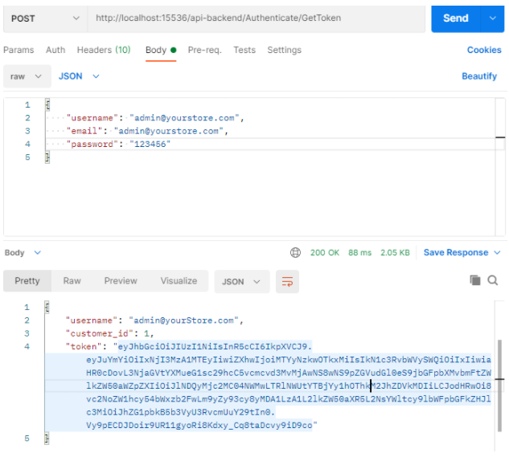
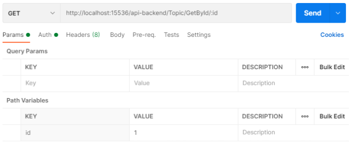
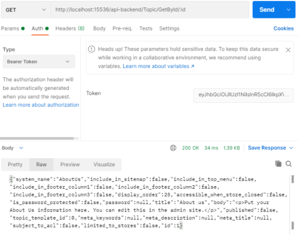

# Web API documentation

## Introduction

[Web API](https://www.nopcommerce.com/web-api) for nopCommerce provides access to all platform functions as well as full control over database entities. It is a RESTful API built according to the [OpenAPI 3.0 specification (OAS)](https://swagger.io/). Using a tool like Swagger UI or within the [SwaggerHub platform](https://swagger.io/tools/swaggerhub/) you can convert your OAS contract into an interactive API console that developers can use to interact with the API and quickly learn how the API is supposed to behave. nopCommerce offers a suite of APIs that allow developers to use and extend the platform’s built-in features. These APIs allow developers to read and write merchant data, interoperate with other systems and platforms, and add new functionality to nopCommerce.

## Available APIs (method coverage)

The Web API framework provides integrators and developers the means to use web services that communicate with the nopCommerce system.

### Frontend methods

The Web API Frontend offers you a way to implement the nopCommerce buying capabilities in any application, whenever it is a website or mobile app. Using the API is essential when sellers want to reach a wider audience and their requirements go beyond the standard nopCommerce functionality. The Web API Frontend provides methods that allow using the built-in public store functionality outside of the nopCommerce store. Even if you have customizations in your nopCommerce store you will be able to use this plugin since it is provided with the source code.

After installing the plugin you will be able to see a list of the existing API methods using the following Swagger UI endpoint:
**`{store location}/api/index.html`**

> [!TIP]
> You can't use multi-factor authentication (MFA) through the Frontend API.

### Backend methods

The Web API Backend provides access to all nopCommerce admin area functionality. Meaning, using the Web API Backend methods you can get full control over such functionality as customer management, creating and updating products, sales monitoring, and actually whatever you want to control in the admin area of the nopCommerce store. Use this API to build such applications as CRM and ERP systems, social network integrations, and other apps that require accessing the store business processes.

After installing the plugin you will be able to see a list of the existing API methods using the following Swagger UI endpoint:
**`{store location}/api/index.html`**

> [!IMPORTANT]
> After installing the backend and frontend APIs, switching between them is implemented directly through the Swagger UI page in the dropdown list of available definitions.
> 

#### Scopes and permissions

To use the API, the client application should have appropriate permissions (ACL) in a nopCommerce store where the API plugin is installed. For example, to access backend (admin panel) methods through the API, a special "Access Web API Backend" permission is required. By default, this permission is provided for the administrator role only. You can change these settings through the standard ACL used in nopCommerce.

## Authentication

To keep transactions on the nopCommerce platform safe and secure, all apps connecting with our APIs must authenticate when making API calls.

To make a web API call from a client such as a mobile application, an API client has to prove its identity. To do this, the API provides an access token with each request in the Authorization header using the Bearer HTTP authorization scheme. This token acts like an electronic key that lets you access the API.

After you install the Web API plugin, you need to generate a secret key on the plugin configuration page. This key will be used to sign and verify each JWT token.

### Request a token

1. Endpoint

    For each API, there is an unsecured endpoint that serves to obtain an access token:
    * **`/api-backend/Authenticate/GetToken`**
    * **`/api-frontend/Authenticate/GetToken`**

1. Content type

    The content type of the request body. Set this value to either `Content-Type:application/json-patch+json`

1. Credentials

    The username and password for a nopCommerce account. To specify these credentials in a JSON request body, include code similar to the following in the call:

    ```json
    {
        "username":"<user name>", 
        "email":"<Email>", 
        "password":"<password>"
    }
    ```

#### Examples

The following example uses the curl command to request a token for a customer account:

```rest
curl -X 'POST' \
  'http://localhost:15536/api-backend/Authenticate/GetToken' \
  -H 'accept: application/json' \
  -H 'Content-Type: application/json-patch+json' \
  -d '{
   "username": "admin@yourstore.com",
   "email": "admin@yourstore.com",
   "password": "123456"
}'
```

### Authentication token response

A successful request returns a response body with the token, as follows:

```json
{
  "username": "admin@yourStore.com",
  "customer_id": 1,
  "token": <authentication token>
}
```

### Using the token in a Web API request

Any web API call accessing a resource that requires a permission level higher than anonymous should contain an authentication token in the header. To do this, the HTTP header is sent in the following format:

```rest
curl -X 'GET' \
  'http://localhost:15536/api-backend/BlogPost/GetById/1' \
  -H 'accept: application/json' \
  -H 'Authorization: <authentication token>'
```

## Testing

The *Developer mode* is provided especially for the convenience of testing API endpoints. By activating this mode on the plugin configuration page, the token verification is essentially disabled.
You can test the APIs using the following tools:

1. [Swagger UI](https://swagger.io/swagger-ui/). It offers a web-based UI that provides information about the service, using the generated OpenAPI specification.
1. [Postman](https://www.getpostman.com/). It is a tool for testing APIs.

Below are instructions on how to use Postman to authenticate a user to get a JWT token from the API, and then make an authenticated request with the JWT token to retrieve a list of topics from the API.

### How to authenticate a user with Postman

To authenticate a user and get a JWT token, follow these steps:

1. Open a *new request* tab by clicking the plus(+) button at the end of the tabs.
1. Change the HTTP request method to "POST" using the dropdown selector on the left of the URL input field.
1. In the URL field, enter the authentication URL of your API: **`{storeURL}/api-backend/Authenticate/GetToken`**.
1. Select the "Body" tab below the URL field, change the body type radio button to "raw", and change the format using the dropdown selector to "JSON (application/json)".
1. Enter a JSON object containing the test username and password into the "Body" textarea.
1. Click the "Send" button. You should receive a "200 OK" response with the user details including a JWT token in the response body. Copy the token value because we'll be using it in the next step to make an authenticated request.

Here's a screenshot of Postman after the request is sent and the user has been authenticated:



### How to make an authenticated request to retrieve a topic by ID

To make an authenticated request using the JWT token from the previous step, follow these steps:

1. Open a new request tab by clicking the plus (+) button at the end of the tabs.
1. Change the HTTP request method to "GET" using the dropdown selector on the left of the URL input field.
1. In the URL field, enter the “Get topic” URL of your API: `{storeURL}/api-backend/Topic/GetById/:id`.
1. Select the "Authorization" tab below the URL field, change the type to "Bearer Token" in the type dropdown selector, and paste the JWT token from the previous authentication step into the "Token" field.
 
1. Click the "Send" button. You should receive a "200 OK" response containing a JSON array with all the user records in the system (just the one test user in the example).
 Here's a screenshot of Postman after making an authenticated request to get a topic by id:
 

## License

The Web API plugin is licensed under the [following terms](https://www.nopcommerce.com/web-api-license-terms).
