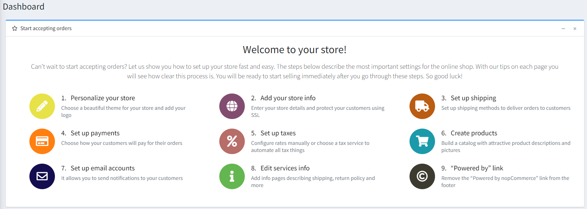
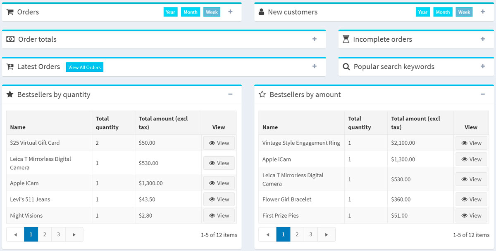
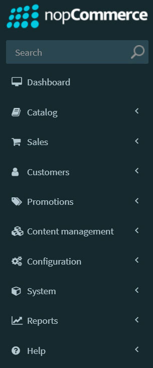
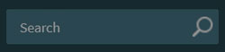
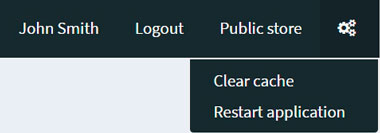

# nopCommerce interface

This chapter covers the basics of the nopCommerce interface.

Once logged in, you should see the **Administration** hyperlink at the top of your website. Or you can simply add `/admin` to the end of your site's URL to open the admin area. For example, `www.example.com/admin`.

The first screen displayed after logging in to the nopCommerce administration area is the *Dashboard*:

The dashboard has the following sections:

* **Start accepting orders** is a section that contains all the main topics related to setting up your store. This wizard will literally take you "by the hand" through the administration panel and tell you how everything works.

* **nopCommerce news** is a section that shows important news, sales and promotions information from nopCommerce.

* **Common statistics** of your webstore, which includes numbers of orders, pending return requests, registered customers, and low-stock products.

* Other sections showing the vital statistics of your webstore: **orders, new customers, order totals, incomplete orders, latest orders, popular search keywords, bestsellers by quantity, bestsellers by amount**:

Learn more about these reports [here](xref:en/running-your-store/reports).

The dashboard sections are easily collapsed by clicking the  icon.

## Common nopCommerce page elements

### Sidebar

The sidebar is placed on the left of each page in the administration area. It allows you to navigate through the nopCommerce administrator's functionality.

The sidebar can be easily collapsed by clicking the "hamburger" icon next to the logo 

### Search field

On the top of the sidebar, there is a search field. Start typing a name of a section you want to navigate to, the search line automatically suggests the options, proceed you directly to the required one.

### System menu

This part of the interface shows the name of a logged-in user, the logout button, the public store link, and a small menu from which a user can select to clear cache or restart the application.

## Basic and advanced modes

On some pages in the administration area, you will see the following switch:

This two-position *Basic-Advanced* switch allows you to switch between page display modes.

For the convenience of use, we created the **Basic** mode where the most frequent settings are shown.

If you cannot find the required setting on the page, switch to the **Advanced** mode to see all available settings.

On some pages, the switch has a **Settings** button beside it. You can use it to set up the basic mode according to your needs by adding/removing the required settings.

Click **Settings** to see a list of the available settings. Select the checkboxes of the **desired setting**. The added settings will then be displayed in the **Basic** mode.

