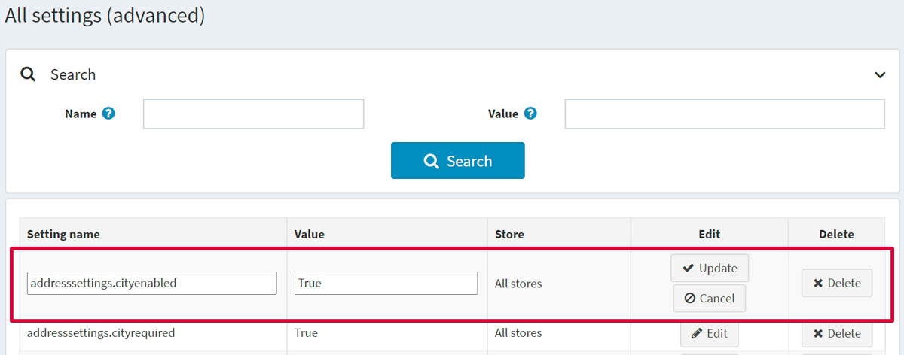

# All settings

*All settings* is an advanced tool for modifying all settings of the site on a single screen. For example, you have multiple stores and need to create an exact copy of the first store setting-wise. Then, doing all the changes on a single screen with the help of *All settings* can save you a lot of time.

> [!NOTE]
>
> Modifying the settings in this window is only recommended for advanced users. It is not recommended to modify these settings unless the user knows the system very well.

To define the settings:

Go to **Configuration → Settings → All settings (advanced)**. The *All settings (advanced)* window will be displayed:

## Add a new setting 

You can add a new setting using the *Add new record* panel at the bottom of the page. Define the following fields for the new setting:

* Enter the **Setting name**.
* Enter the **Value** of the setting.
* Define in which **Store** the setting is applicable.

Click **Add new record** to add this setting.

## Edit the existing setting

To edit the existing setting, click the **Edit** button in the setting line. You will be able to edit the **Setting name** and its **Value**. Then click **Update** to save the changes.

