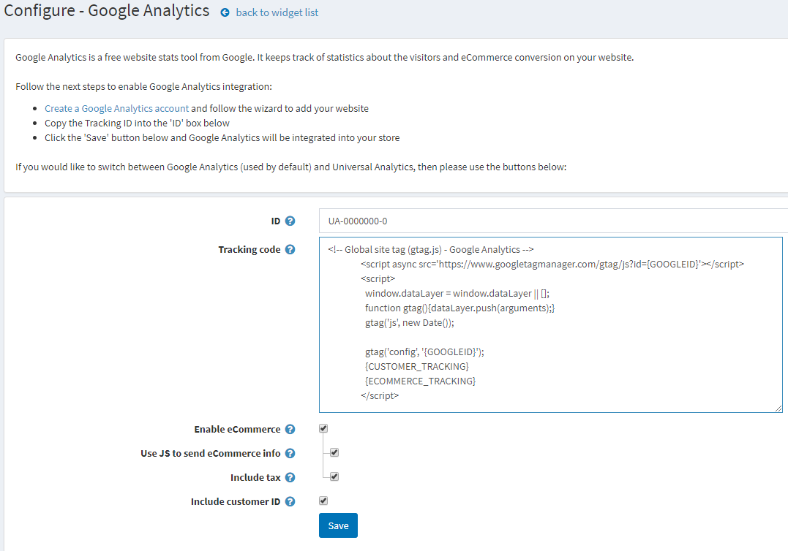

# Google analytics plugin

This section describes how to add and integrate the **Google analytics** plugin into your store.

To configure the Google analytics plugin:

Go to **Configuration → Widgets**. The *Widgets* window will be displayed:

## Activate the plugin

Click **Edit** beside **Google analytics**. The window will be expanded as follows:

Select the **Is active** checkbox to enable the Google analytics plugin. Then click the **Update** button to save the changes.

## Configure the plugin

Click **Configure** beside **Google analytics**. The *Configure – Google analytics* window will be displayed as follows:

Perform the following steps to enable Google analytics integration:

* Create a **Google analytics account** following the link [http://www.google.com/analytics/](http://www.google.com/analytics/) and follow the wizard to add your website
* Copy the **Google analytics ID** into the **ID** box in the form.
* Enter the **Tracking code** generated by Google Analytics. {GOOGLEID} and {CUSTOMER_TRACKING} will be dynamically replaced.
* Select the **Enable eCommerce** checkbox to pass information about orders to the Google eCommerce feature. If selected, the following fields will be displayed:
  * Select **Use JS to send eCommerce info** to use JS code to send e-commerce info from the order completed page. In the case of redirection payment methods, some customers may skip it. Otherwise, e-commerce information will be sent using an HTTP request. Information is sent each time an order is paid, but UTM is not supported in this mode.
  * Select **Include tax** to include tax when generating tracking code for e-commerce part.
* Select the **Include customer ID** checkbox to include customer identifier to the script.

Click **Save**. Google Analytics will be integrated into your store.
