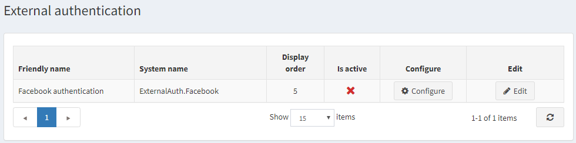
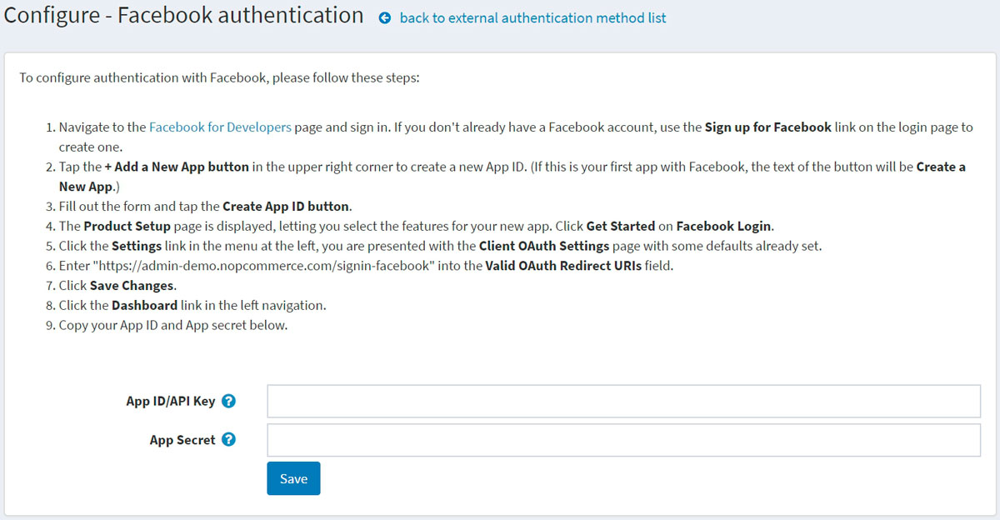

# External authentication methods

External authentication methods allow users to log in to a nopCommerce site without entering their credentials: email and password. Users can be authenticated using an external site (such as Facebook or Google). nopCommerce has a built-in external authentication through Facebook. You can set up other methods using plugins from the [marketplace](https://www.nopcommerce.com/marketplace).

After an external authentication method is configured and marked as active, users will see a new authentication option on the login page.

## Manage the external authentication methods

Go to **Configuration → Authentication → External authentication**. The *External authentication* window will be displayed:

Click **Edit** beside an authentication method and select **Is active** to activate the method. You can also define the method's **Display order**. Then click the **Update** button to save the changes.

Click **Configure** for the method configuration.

## Manage Facebook authentication

The Facebook authentication method is a built-in external authentication plugin. To configure authentication with Facebook, please follow these steps:

1. On the **Configuration → Authentication → External authentication** page, click **Configure** beside the **Facebook authentication**. The *Configure - Facebook authentication* window will be displayed:

   

1. Navigate to the [Facebook for Developers](https://developers.facebook.com/apps) page and sign in. If you have no Facebook account, use the Sign up for Facebook link on the login page to create one.
1. Tap the **+ Add a New App button** in the upper right corner to create a new App ID. (If this is your first app with Facebook, the text of the button will be **Create a New App**.)
1. Fill in the form and tap the **Create App ID button**.
1. The *Product Setup* page will be displayed, letting you select the features for your new app. Click **Get Started** on *Facebook Login*.
1. Click the **Settings** link in the menu on the left; you will be presented with the *Client OAuth Settings* page with some defaults already set.
1. Enter `https://yoursitename.com/signin-facebook` into the **Valid OAuth Redirect URIs** field, replacing `yoursitename.com` with your site URL.
1. Click **Save Changes**.
1. Click the **Dashboard** link in the left navigation.
1. Copy your **App ID/API Key** and **App secret** in the form on the plugin configuration page.

Click the **Save** button. On the login page of the public store, see the newly added authentication method.

## See also

* [Plugins in nopCommerce](xref:en/getting-started/advanced-configuration/plugins-in-nopcommerce)
