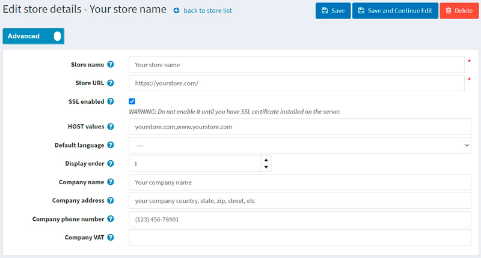

---
title: How to install and configure SSL certificates
uid: en/getting-started/advanced-configuration/how-to-install-and-configure-ssl-certificates
author: git.mariannk
contributors: git.DmitriyKulagin
---

# How to install and configure SSL certificates

What is an SSL certificate? SSL stands for Secure Socket Layer. SSL certificates validate your website's identity and encrypt the information visitors send to (or receive from) your site. When you have an SSL certificate protecting your website, your customers can rest assured that the information they enter on any secured page is private and can't be viewed by cyber crooks.

## How to get an SSL certificate

1. First, to implement SSL on your website, you will need to get an SSL certificate from an SSL Certificate Provider, aka Certification Authority. There are plenty of Certification Authorities for securing an SSL certificate on your website, such as SSL.com, Namecheap, or GoDaddy.

2. Then, you need to install the SSL certificate you bought on your server. The way you do this depends on the server. For more instructions and recommendations, you should refer to the SSL Certificate Provider guideline or your server documentation. In this article, I will just provide you with a link to such guideline by GoDaddy: [Install SSL certificates](https://www.godaddy.com/help/install-ssl-certificates-16623).

3. In the last step, you need to set up your nopCommerce store in the admin area. To do this, go to the **Configuration → Stores** page. Select the store you want to set up and click the **Edit** button beside it. The *Edit store details* window will be displayed as follows:
  

- Enter your **Store URL** with the `https://` prefix.
- Select the **SSL enabled** checkbox.
    > [!WARNING]
    >
    > Do not enable it until you have an SSL certificate installed on the server.

## Troubleshooting

### Admin panel is not available due to problems with SSL certificate

A common problem is when the SSL certificate is not installed on the server or there are problems with the SSL configuration. At the same time, the **SSL enabled** setting was activated in the store (as we have done in the previous section).

**Affected versions**: All

**Solution**:
Run the following SQL Query:

  ```sql
  UPDATE [dbo].[Store] SET [SslEnabled] = 'False'
  ```

### Mixed Content HTTP and HTTPS

Mixed content occurs when a site operates over the SSL security protocol, but some of the resources (for example, images) are loaded over an insecure HTTP connection. This causes errors on the page, as the original request was secured over HTTPS.

When using a load balancer, similar problems can arise due to the fact that it communicates with the application over HTTP.

**Affected versions**: 4.20 and below

**Solutions**:

- Make sure you have activated the setting:

  ```json
  securitysettings.forcesslforallpages = true
  ```
  
- Make sure your website is listening on port 443 on the hosting server.

**Affected versions**: All

**Solutions**:

- Missing field `UseHttpXForwardedProto` in the request header. Try to enable the `UseHttpXForwardedProto` setting in the `appsettings.json` file and restart the website.

  ```json
  "UseHttpXForwardedProto": true
  ```

- You can fix it by adding the CSP "upgrade-insecure-requests" directive. This can be done either in the `web.config` file.
  Or by embedding the same inline directive in the `<head>` section of the document using the `<meta>` element:

  ```XML
  <meta http-equiv = "Content-Security-Policy" content = "upgrade-insecure-requests">
  ```

- In the case of using Cloudflare, check if your SSL setting is in `Full` or `Flexible` mode by logging into your Cloudflare dashboard and clicking the `SSL/TLS app` to check the SSL setting.

### Infinite redirection loop (ERR_TOO_MANY_REDIRECTS)

When an unauthorized user tries to log in or visit the shopping cart, the site enters an infinite redirection loop.

**Affected versions**: All

**Solutions**:

- Try to delete cookies on the site; this procedure may slightly differ depending on the browser used. Alternatively, you can simply open the page in private mode to check if this is the cause of the error.
- Clear Server, Proxy, and Browser Cache.
- Check HTTP to HTTPS Redirects on Server. It could very well be that the HTTPS redirect rules on your server were misconfigured. You can add a redirect rule to your IIS from http to https. The rule pattern has the following form:

  ```xml
  <configuration>
    <system.webServer>
      <rewrite>
        <rules>
          <rule name="http_to_https" stopProcessing="true">
            <match url="(.*)" />
            <conditions logicalGrouping="MatchAll" trackAllCaptures="false">
              <add input="{HTTPS}" pattern="^OFF$" />
            </conditions>
            <action type="Redirect" url="https://{HTTP_HOST}/{R:1}" redirectType="SeeOther" />
          </rule>
        </rules>
      </rewrite>
    </system.webServer>
  </configuration>
  ```

- ERR_TOO_MANY_REDIRECTS is also often commonly caused by reverse-proxy services, such as Cloudflare. This usually happens when their Flexible SSL option is enabled and you already have an SSL certificate installed with your web host. When flexible is selected, all requests to your hosting server are sent over HTTP. Your host server most likely already has a redirect in place from HTTP to HTTPS, and therefore, a redirect loop occurs. To fix this, you need to change the Cloudflare Crypto settings from Flexible to either Full or Full (strict).
