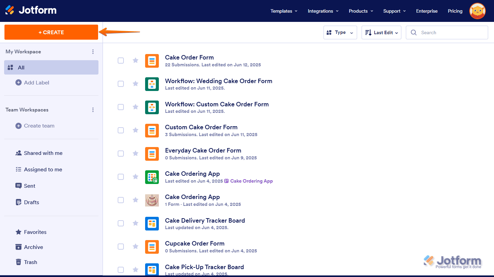
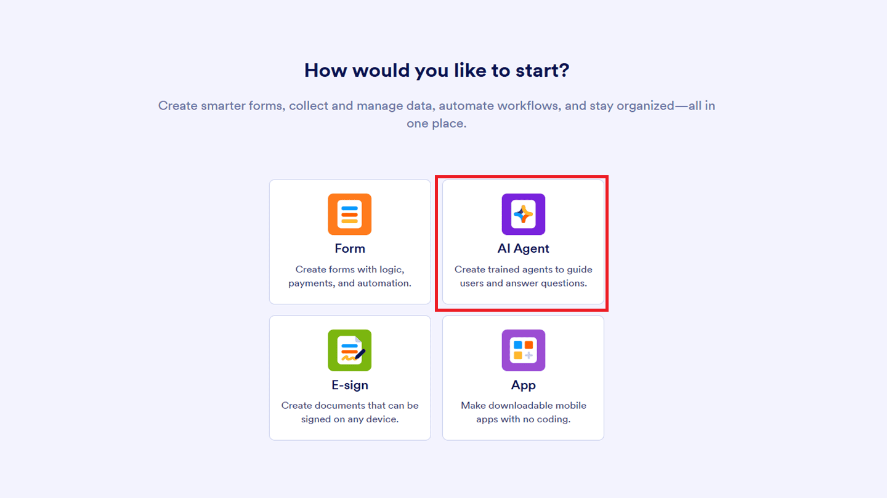
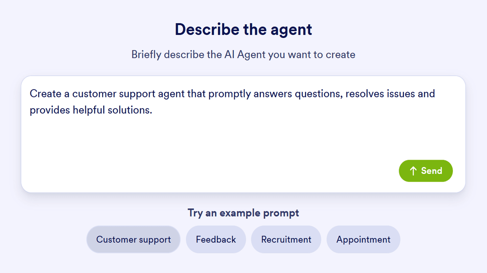
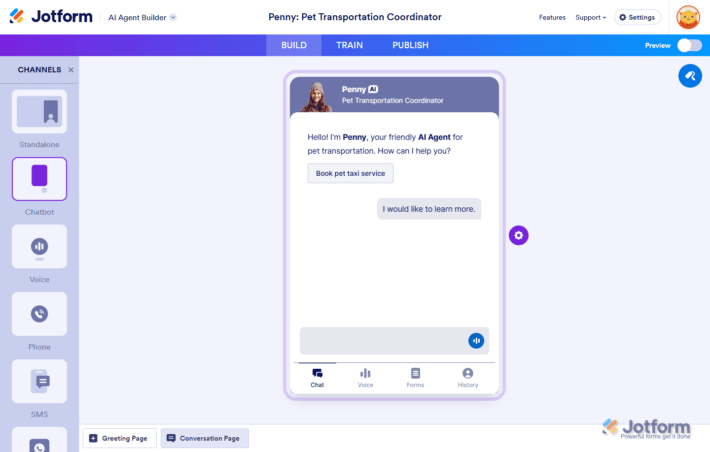
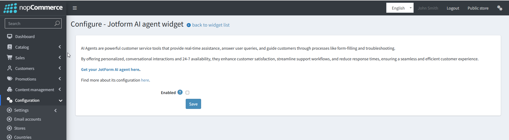
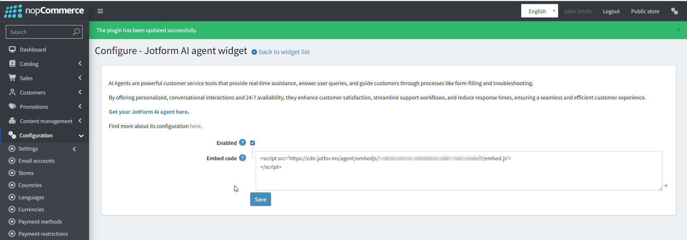

# Integrating Jotform AI Agent into a nopCommerce Store

---

## What are Jotform AI Agent?

[Jotform AI Agent](https://www.jotform.com/ai/agents/?partner=nopCommerce) are powerful customer service tools that provide real-time assistance. Jotform AI Agent isn't just a chatbot. It can answer questions about shipping times, return policies, and product availability instantly, reducing bounce rates during off-hours. It can recommend products based on user input, and guide users to specific product pages within your nopCommerce store.

By offering personalized conversations and 24/7 availability, they enhance customer satisfaction and streamline your support workflows, leading to better retention and higher sales.

---

## First Steps to Get Started

1. [Sign up for a Jotform](https://www.jotform.com/?partner=nopCommerce) (or log in if you already have one).
1. Head on over to your Workspace page and click on the Create button in the top-left corner.

1. Click "AI Agent".

1. On the Describe the Agent page that opens, enter a description of the AI Agent you want to create in the Describe the Agent field. For example: “Create a customer support agent that promptly answers questions, resolves issues and provides helpful solutions.”. Or you can click on one of the buttons below it for a predefined one, and then click on Send.

This creates an AI Agent based on what you wrote and takes you straight to AI Agent Builder so you can tweak and customize it even more.

## How to Customize Agent Persona

Customizing your AI Agent’s persona is simple and helps tailor its interactions to your specific needs. You can easily adjust the AI Agent’s name, role, tone of voice, and even how chatty it is, allowing for a more personalized and effective user experience. By fine-tuning these settings, you can shape how your AI Agent communicates, making each conversation feel more natural and engaging. Whether you want it to be formal, casual, or somewhere in between, the choice is entirely up to you!

For more details, check out Jotform AI Agent guides on:

1. [How to Customize Agent Avatar](https://www.jotform.com/help/how-to-customize-agent-avatar/?partner=nopCommerce/?partner=nopCommerce)
1. [How to Customize Agent Design](https://www.jotform.com/help/how-to-customize-agents-design/?partner=nopCommerce)
1. [How to Customize Agent Persona](https://www.jotform.com/help/how-to-customize-agent-persona/?partner=nopCommerce)
1. [How to Train Your AI Agent](https://www.jotform.com/help/how-to-train-your-ai-agent/?partner=nopCommerce)
1. [How to Customize Agent Actions and Triggers](https://www.jotform.com/help/how-to-customize-agent-actions-and-triggers/?partner=nopCommerce)
1. [How to Teach Your Agent by Chatting](https://www.jotform.com/help/how-to-teach-your-agent-by-chatting/?partner=nopCommerce)
1. [How to Train an AI Agent with URLs](https://www.jotform.com/help/how-to-train-an-ai-agent-with-urls/?partner=nopCommerce)
1. [How to Let Your Agents to Search Specific Keywords in Defined Website](https://www.jotform.com/help/how-to-let-your-agents-to-search-specific-keywords-in-defined-website/?partner=nopCommerce)

## Integration with nopCommerce

* See the "[How to Use Agent as Chatbot](https://www.jotform.com/help/how-to-use-agent-as-chatbot/)" article to understand how to create an embed code
* Then in the plugin settings, check the Enabled box

* You will see the **Embed code** text box input
* Copy the javascript code from jotform.com and press the save button
  