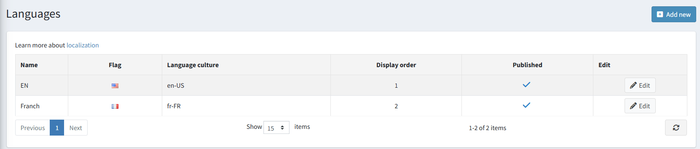
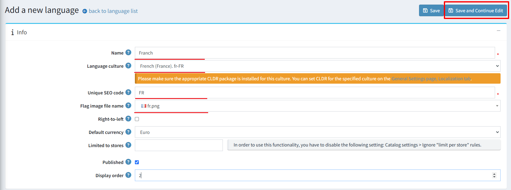
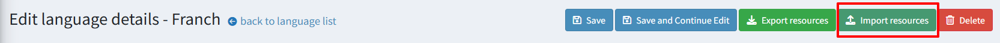
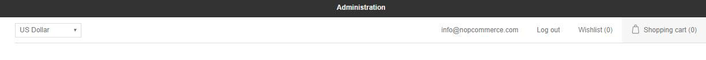
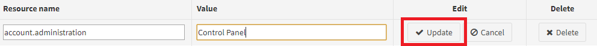
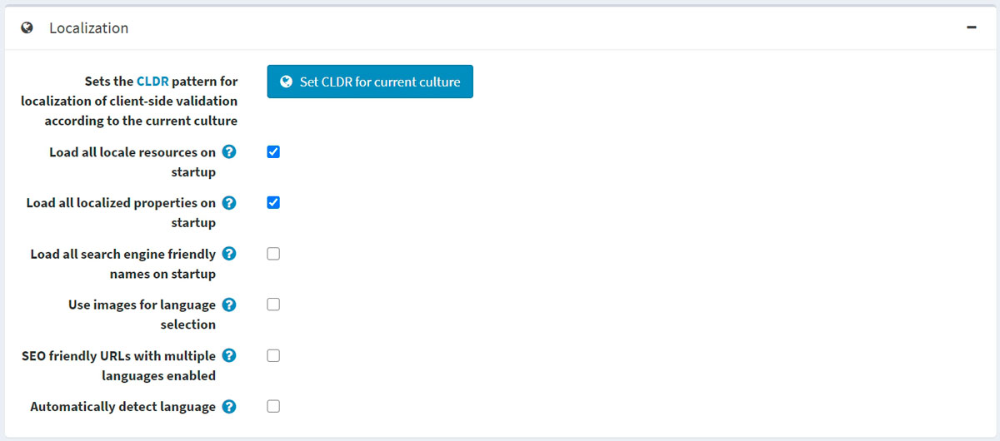
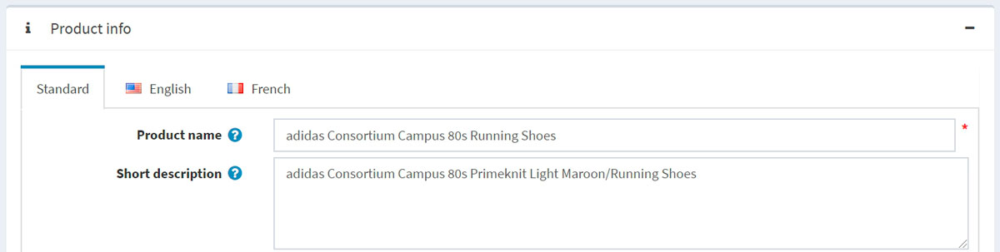

# Localization

In nopCommerce, your store can have several languages installed. However, the customers will only see the data that has been defined in their selected language.

> [!TIP]
>
> By default, the English language is installed.

To see or edit the installed languages, go to **Configuration → Languages**:

> [!NOTE]
>
> You can download new language packs from the official [Marketplace](http://www.nopcommerce.com/marketplace).

## Adding a new language

To add a new language, click **Add new**. In the *Add a new language* window, define the following settings:

* The **Name** of the new language.
* The **Language culture** — a specific language code (for example, de-AT for Austrian German).

  > [!NOTE]
  >
  > When updating the **Language culture** field, please make sure the appropriate CLDR package is installed for this culture. You can set CLDR for the specified culture in the *Localization* panel of the **Configuration → Settings → General Settings** page.

* The **Unique SEO code** — a two-letter language SEO code used to generate URLs like `http://www.yourstore.com/en/` when you have more than one published language.

  > [!NOTE]
  >
  > The **SEO friendly URLs with multiple languages** option should be enabled in the **Configuration → Settings → General settings → Localization settings** panel.

* The **Flag image file name** — enter the flag image file name. The image should be saved under the `…/images/flags` directory. You can also choose an image from a predefined list.
* Select **Right-to-Left** if needed (for example, for Arabic or Hebrew).
  
  > [!NOTE]
  >
  > The active theme should support RTL (have an appropriate CSS style file). This option only affects the public store.

* The **Default currency** for a specific language. If not specified, then the first found one (with the lowest display order) will be used.
* **Limited to stores option** allowing to set this language for a specific store(s). You can choose the store(s) from a precreated list. Leave this field empty if you don't use this option.
  
  > [!NOTE]
  >
  > To use the store limitation, the **Ignore "limit per store" rules (sitewide)** option should be disabled in the **Configuration → Settings → Catalog settings → Performance** panel.

* **Publish** the language to enable it to be visible and selected by visitors to your store.
* **Display order** of the language. 1 represents the top of the list.

Click **Save** to save the changes.

> [!NOTE]
>
> Since language cultures are only loaded when the application is starting, you have to restart the application once a language is added or deleted.
>
> [!NOTE]
>
> After adding a new language, you will be able to import and export string resources using the **Import resources**
and **Export resources** buttons at the top of the page. The *String resources* panel on the language edit page will allow you to view the existing language resources and add new ones manually.

## Import language pack

If you wish to add a new language to your store, you should:

1. Visit the nopCommerce [translations](https://www.nopcommerce.com/translations) page.
1. Choose the nopCommerce version and download the desired language pack.
1. Go to **Configuration → Languages** and click the **AddNew** button.
    

1. Fill in the required fields and click **Save and continue edit**.
  

1. Click **Import resources**. And specify the path to the language pack file (*.xml) that you downloaded.
  

If you found a mistake in translation or want custom naming, you can edit the string resources in the *String resources* panel.

## Manage string resources

Go to **Configuration → Languages**. The *Languages* window will be displayed:

Click the **Edit** button beside the language. In the **Edit language details** window, find the **String resources** panel.

For example, you want to change the name of a panel at the top of the page from "Administration" (on the picture below) to "Control panel."

1. To find the locale resource you need to edit, in the **Resource name** field, enter "administration." If the resource exists, it will be found. Click **Edit** beside it.
1. Enter a new value in the **Value** field and click **Update**.
  

1. The changes will be applied:
  

To add a new string resource, use the **Add new record** panel. This window enables you to add a new resource record to the grid as follows:

* In the **Resource name** field, enter the resource string identifier.
* In the **Value** field, enter a value for this resource string identifier.

Click **Save**.

## Localization settings

To configure localization settings, go to **Configuration  → Settings  → General settings**:

* To set the [CLDR](http://cldr.unicode.org/) pattern for localizing client-side validation to the current culture, click the **Set CLDR for current culture** button.
* Select the **Load all locale resources on startup** checkbox to load all locale resources on the application startup. When enabled, all locale resources will be loaded on the application startup. The application start will be slower, but then all pages can be opened much faster.
* Select the **Load all localized properties on startup** checkbox to load all localized properties on the application startup. When enabled, all localized properties (such as localized product properties) will be loaded on the application startup. The application start will be slower, but then all pages can be opened much faster. It's only used with two or more languages enabled. It is not recommended to enable it when you have a large catalog (several thousand localized entities).
* Select the **Load all search engine friendly names on startup** checkbox to load all search engine friendly names (slugs) on the application startup. When enabled, all slugs will be loaded on the application startup. The application start will be slower, but then all pages can be opened much faster. It is not recommended to enable it when you have a large catalog (several thousand entities).
* Select the **Use images for language selection** checkbox to use images instead of language names.
* Select the **SEO friendly URLs with multiple languages enabled** checkbox to allow SEO-friendly URLs for all languages. When enabled, your URLs will be `http://www.yourStore.com/en/` or `http://www.yourStore.com/ru/` (SEO-friendly).
  > [!NOTE]
  >
  > You must restart the application after the **SEO friendly URLs with multiple languages enabled**  setting is updated. Otherwise, it can cause errors.
* Select the **Automatically detect language** checkbox for detecting language based on customer browser settings.

## Localize entities

If you have more than one language installed in your store, you will be able to enter some fields displayed to customers in different languages. For example:

* In the *Standard tab*, enter the text that will be displayed to customers if the localized fields are not specified.
* In the *tabs with language names*, enter the localized text.
