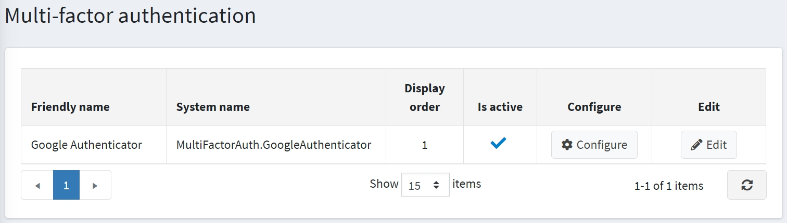

# Multifactor authentication

Multifactor Authentication (MFA) (in our case, it is Two-Factor Authentication – 2FA) is an authentication method that requires a user to provide two or more verification factors to gain access to a resource. MFA is a core component of a strong identity and access management (IAM) policy. Rather than just asking for a username and password, MFA requires one or more additional verification factors, which decreases the likelihood of a successful cyberattack.

nopCommerce implements a built-in multifactor authentication through Google Authenticator. You can set up other methods using plugins from the [marketplace](https://www.nopcommerce.com/marketplace).

## Manage the multifactor authentication methods

By default, the Google Authenticator plugin is not installed. To install the plugin, go to **Configuration → Local plugins**.

1. Search for *Google Authenticator* in the **Plugin name** field.
1. Click the **Install** button.
1. Then click the **Restart application to apply changes** button to apply changes.
1. Go to **Configuration → Authentication → Multi-factor authentication**. The *Multi-factor authentication* window will be displayed:

   

1. Click **Edit** beside an authentication method and select **Is active** to activate the method. You can also define the method's **Display order**. Then click the **Update** button to save the changes.

## Configuring the Google Authenticator plugin

Click **Configure** for the method configuration. The *Configure - Google Authenticator* page will be displayed as follows:

On this page, you have to enter:

- Your **Business prefix** so that users can differentiate the account information for your store in the GoogleAuthenticator app.
- **QRPixelsPerModule** to set the number of pixels per unit. The module is one square in the QR code. By default, it is 3 for a 171 × 171 pixel image.

Then click **Save**.

On this page, you can also search for customers by email using the *Search* panel.

## How it works

To understand how the multifactor authentication works in nopCommerce, see the diagram above.

- The **2FA configured** scheme represents the process when 2FA is already configured by a customer.

- The **2FA setup** scheme represents the process when a 2FA setup is needed to be done by a customer.

## Multifactor authentication page in public store

To configure multi-factor authentication, a customer should visit the **My account - Multi-factor authentication** page, which is displayed as follows:

Steps to activate MFA:

1. Activate the **Is enabled** setting.
1. Choose one of the multifactor authentication providers (by default, there is only one).
1. Save.
1. Configure the selected multifactor authentication provider by following the instructions on the individual settings page of the selected provider.

> [!WARNING]
>
> After saving the selected provider, make sure to configure it; otherwise, you will be denied access the next time you try to enter your account.
