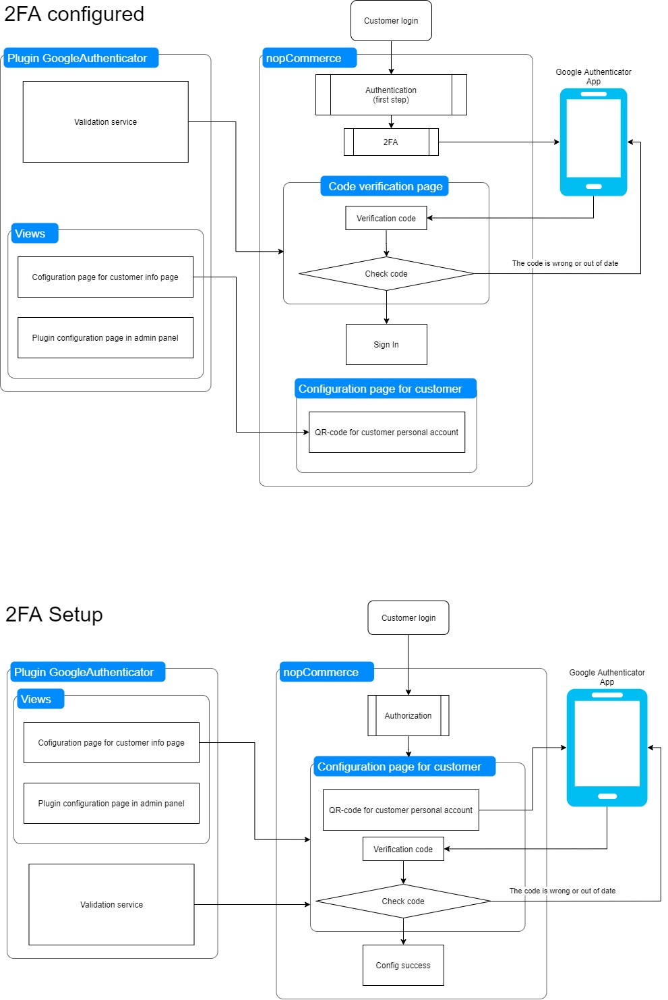

# Multi-factor authentication

Multi-factor Authentication (MFA) is an authentication method that requires a user to provide two or more verification factors to gain access to a resource. MFA is a core component of a strong identity and access management (IAM) policy. Rather than just asking for a username and password, MFA requires one or more additional verification factors, which decreases the likelihood of a successful cyber attack.

nopCommerce implements a built-in multi-factor authentication through Google Authenticator. You can set up other methods using plugins from the [marketplace](https://www.nopcommerce.com/marketplace).

## Manage the multi-factor authentication methods

By default, the Google Authenticator plugin is not installed. To install the plugin go to **Configuration → Local plugins**.

1. Search by *Google Authenticator* in the **Plugin name** field.
1. Click the **Install** button.
1. Then click the **Restart application to apply changes** button to apply changes.
1. Go to **Configuration → Authentication → Multi-factor authentication**. The *Multi-factor authentication* window is displayed:

   

1. Click **Edit** beside an authentication method and tick **Is active** to activate the method. You can also define the method **Display order**. Then click the **Update** button to save the changes.

## Configuring the Google Authenticator plugin

Click **Configure** for the method configuration. The *Configure - Google Authenticator* page will be displayed, as follows:

On this page you have to enter:

- Your **Business prefix** so users can differentiate the account information for your store in the GoogleAuthenticator app.
- **QRPixelsPerModule** to set the number of pixels per unit. The module is one square in the QR code. By default is 3 for a 171x171 pixel image.

Then click **Save**.

On this page, you can also search customers by email using the *Search* panel.

## How it works

To understand how the multi-factor authentication works in nopCommerce see the following diagram:

