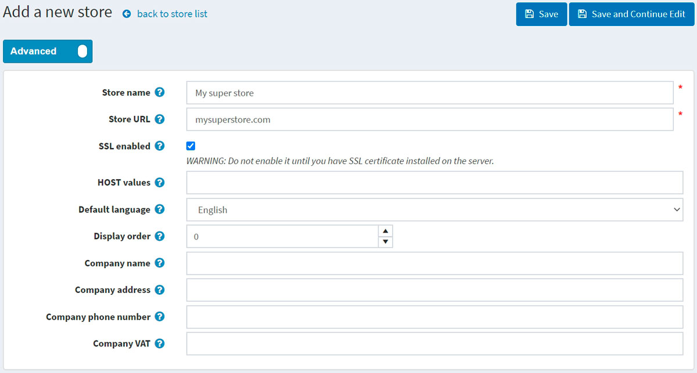
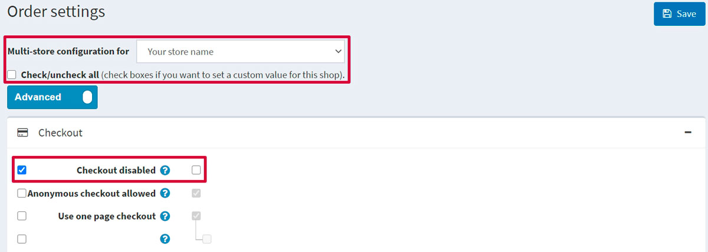

# Multi-store

nopCommerce enables you to run more than one store using one interface from a single nopCommerce installation.

This enables you to host more than one front-end store on different domains and manage all admin operations from your single administration panel. You can share the catalog data between stores, have a product in more than one store, and your customers can log in to all of your stores using the same credentials.

## Configuring multi-store

### 1. Hosting control panel part

In the following example we will describe the setup of two sample stores:

* `www.store1.com`
* `www.store2.com`

1. Upload and install the site on `www.store1.com`. This is the only place where nopCommerce files and DLLs are stored.
      > [!NOTE]
      >
      > Read more about how to install nopCommerce in the following chapter: [Installing nopCommerce](xref:en/installation-and-upgrading/installing-nopcommerce/index).

1. In the control panel of `www.store2.com` (meaning your hosting control panel, not the nopCommerce administration area), ensure that all requests to `www.store2.com` are forwarded (not redirected) to `www.store1.com`. Perform this using CNAME records. This step is crucial.

1. In the control panel of `www.store1.com`, configure a domain alias for `www.store2.com`. This step can be complicated for some users (ask your system administrator to perform this step if you have issues).

    After completing the steps above, when accessing `www.store2.com` from your browser, the content of `www.store1.com` will be displayed. The next step is to configure the stores in the nopCommerce administration area, which will be described below. You can then start uploading content for both stores.

1. Optional (sample): This step can be performed from the Plesk control panel below as follows:
  
      Whenever `www.store2.com` is redirected to `www.store1.com`, the web server for Plesk does not know how to display `www.store2.com` since it uses Name-Based Virtual Hosting. Therefore, you must create a domain alias for `www.store2.com` as described below:

      * Log in to the domain panel of `www.store1.com` either directly or via the **Open in Control Panel** link from the server administration panel.

      * In the **Websites & Domains** tab, select the **Add New Domain Alias** link near the bottom of the tab.

      * Enter the full alias. For example, `store2.com`.

      * Ensure the **Web service** option is selected.

      * The **Mail** service is optional. Select this option if you want emails from `www.store2.com` to be redirected in a similar way.

      * Ensure the **Synchronize DNS zone with the primary domain** option is clear.

### 2. nopCommerce administration area part

Once the installation and technical setup are done, you can manage your stores from the nopCommerce administration area. Go to **Configuration → Stores**. The *Stores* window will be displayed:

> [!NOTE]
>
> By default, only one store is created.

To set up several stores, click **Add new** and define the following store settings:

* Define the **Store name**.
* Enter your **Store URL**.
* Select the **SSL enabled** checkbox if your store is SSL secured. SSL (Secure Sockets Layer) is the standard security technology for establishing an encrypted link between a web server and a browser. This link ensures that all data passed between the web server and browsers remain private and integral. SSL is the industry standard used by millions of websites to protect online transactions with their customers.

  > [!IMPORTANT]
  >
  > Only select this option after you have installed the SSL certificate on your server. Otherwise, you won't be able to access your site and will have to manually edit the appropriate record in your database ([Store] table).
  >
  > [!TIP]
  >
  > Read more about setting SSL up in the following chapter: [How to install and configure SSL certificates](xref:en/getting-started/advanced-configuration/how-to-install-and-configure-ssl-certificates).

* The **HOST values** field is a list of possible HTTP_HOST values of your store (for example, `store1.com`, `www.store1.com`). Filling this field is only required when you have a multi-store solution to determine the current store. This field enables distinguishing requests to distinct URLs and determines the current store. You can also see the current HTTP_HOST value in **System → System information**.
* In the **Default language** field, choose the default language of your store. You may also leave it unselected. In this case, the first found one (with the lowest display order) will be used.
* Define the **Display order** for this store. 1 represents the top of the list.
* Define the **Company name**.
* Define the **Company address**.
* Set your **Company phone number**.
* In the **Company VAT** field, enter the VAT number of your company (used in the EU).

Add another store by clicking the **Add new** button on the **Configuration → Stores** page and filling in the similar fields.

The two stores have now been configured using a single nopCommerce installation:

* www.store1.com
* www.store2.com

> [!NOTE]
>
> The multi-store solution (distinction of stores by HTTP_HOST) does not work for sites in virtual directories on the same domain.

For example, you cannot have one store on `http://www.site.com/store1` and the second store on `http://www.site.com/store2` since the HTTP_HOST value for both sites is the same (`www.site.com`).

## Configuring entities for multi-store

Once the stores have been set up and configured, you can define your entities for each store. Do this by filling the **Limited to stores** field of the details pages for each of the following: [Products](xref:en/running-your-store/catalog/products/index), [Categories](xref:en/running-your-store/catalog/categories), [Manufacturers](xref:en/running-your-store/catalog/manufacturers), [Languages](xref:en/getting-started/advanced-configuration/localization), [Currencies](xref:en/getting-started/configure-payments/advanced-configuration/currencies), [Message templates](xref:en/running-your-store/content-management/message-templates), [Blogs](xref:en/running-your-store/content-management/blog), [News](xref:en/running-your-store/content-management/news), [Topics](xref:en/running-your-store/content-management/topics-pages).

Scroll down to the **Limited to stores** field and choose the name of the existing store from the dropdown menu as shown in the *Edit product details* screen below:

## Configuring settings for multi-store

Different [themes](xref:en/getting-started/design-your-store/choose-and-install-a-theme) can also be configured for different stores.

In addition, you can override any setting value per store. For example, go to **Settings → Order settings** and see the **Multi-store configuration for** dropdown list where you can choose the store you want to override the settings for:

When you choose the store, the page will be refreshed, and you will be able to define any field for the chosen store. Then just click **Save** to save the settings.
