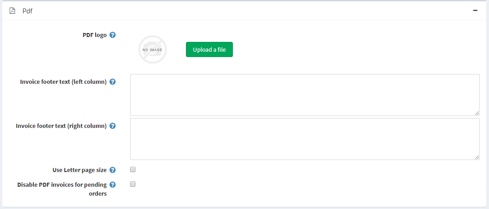

# PDF settings

When running a store you might need automatically generated PDF files, like invoices and terms of agreement.

To define PDF settings go to **Configuration → Settings → General Settings** and find PDF settings panel:

* In the **PDF logo area**, drag and drop the logo file to be uploaded. This image file will be displayed on the PDF order invoices. It is recommended to use a small image.
* In the **Invoice footer text** (left column) field, enter the text that will appear at the bottom of the generated invoices (left column).
* In the **Invoice footer text** (right column) field, enter the text that will appear at the bottom of the generated invoices (right column).
* Tick **Use Letter page size** if you want your PDF documents to have the Letter page size. When this checkbox is unticked, the A4 page size is used by default.
* Tick **Disable PDF invoices for pending orders** if you don’t want your customers to be able to print PDF invoices for pending orders.

## Tutorials

* [Adding business information (branding) on PDF invoice](https://youtu.be/TeXmuNWsdD4)
