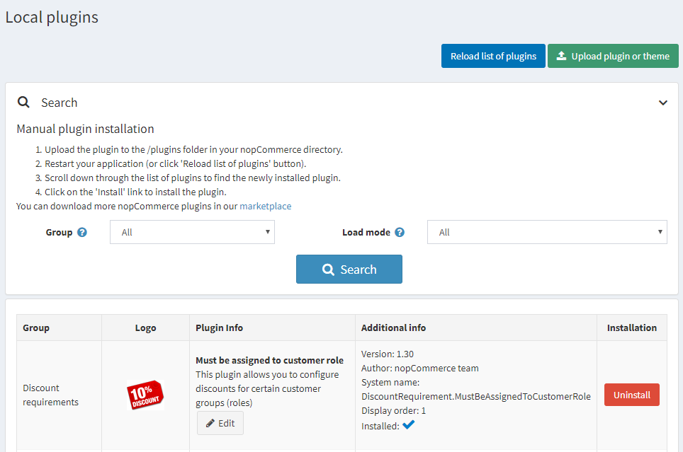

# Plugins in nopCommerce

Plugins are a set of components adding specific capabilities to a nopCommerce store. Examples of plugins include payment modules, shipping rate computation methods, and more. This section describes how to install plugins manually.

nopCommerce [marketplace](http://www.nopcommerce.com/marketplace) has a variety of plugins expanding your store functions. Plugins can be installed either by downloading from the marketplace or accessing the storefront directly from the admin panel.

The plugins on the marketplace can be sorted by category, version, name or rating and can be free or paid.

The plugins available on the marketplace are developed by the nopCommerce team, solution partners or third-party vendors.

> [!NOTE]
>
> Plugins labeled "By nopCommerce team" are developed by the nopCommerce team and distributed freely. Third-party services connectors are developed within the *technology partnership program*; they are subject to the nopCommerce [premium support services](http://www.nopcommerce.com/nopcommerce-premium-support-services) and distributed freely as well.

## To install a plugin

1. A user has two options for uploading a plugin. You can use any of your convenience:
    * Upload the plugin to the `/plugins` folder in your nopCommerce directory. And restart your application (or click the **Reload list of plugins** button).
    * Upload the plugin or theme using the **Upload plugin or theme** button indicating the path to the location of the archive with the plugin in your local storage.

    > [!TIP]
    >
    > You can download more nopCommerce plugins in our [extensions directory](https://www.nopcommerce.com/marketplace).

    

1. Scroll down through the list of plugins to find the newly installed plugin.
1. Click the **Install** link to install the plugin.
1. Click the **Restart application to apply changes** button in the top panel to finish the installation process.
1. The plugin will be displayed in the plugins list (**Configuration → Local plugins**).

    > [!NOTE]
    >
    > If you're running nopCommerce in medium trust, then it's recommended to clear your `\Plugins\bin\` directory.

## To configure a plugin

1. Go to **Configuration → Local plugins**. The plugins list will be displayed:
    
1. Click the **Configure** link beside the plugin to go to the plugin's configuration page. If there is no **Configure** button beside a plugin, this indicates the plugin requires no configuration.

## To change the plugin's friendly name, display order, and limitations

1. Go to **Configuration → Local Plugins**. The plugins list will be displayed:
    
1. Click the **Edit** button beside the plugin. Edit plugin details as follows:
    
1. Enter the **Friendly name**.
1. In the **Display order** field, define the required location to display this plugin. 1 represents the top of the list.
1. Select the **Is enabled** field if you want to enable the plugin in the store.
1. From the **Limited to customer roles** dropdown list, choose roles you want to be able to use this plugin.
1. In the **Limited to stores** field, define the stores in which the plugin will be used.
1. Click **Save** at the top of the page.

## To uninstall a plugin

1. Go to **Configuration → Local plugins**. The plugins list will be displayed:

1. Click the **Uninstall** link beside the plugin to uninstall. The plugin will be uninstalled. The link in the **Installation column** will change to **Install**, enabling you to reinstall the plugin at any time.
1. Click the **Restart application to apply changes** button in the top panel to finish the uninstallation process.

## Tutorials

* [Installing a plugin (for versions 3.90 - 4.10)](https://youtu.be/eLDsSm-4gKA)
* [Managing access to plugins per customer role](https://www.youtube.com/watch?v=52lVVpQ3Qag)
