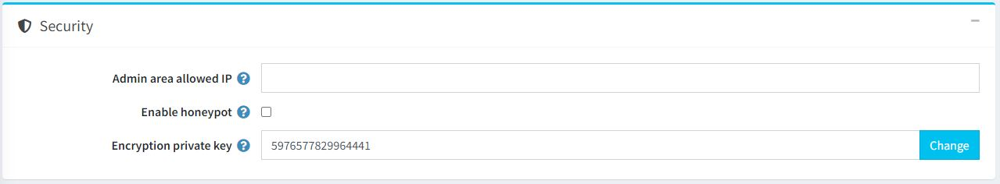
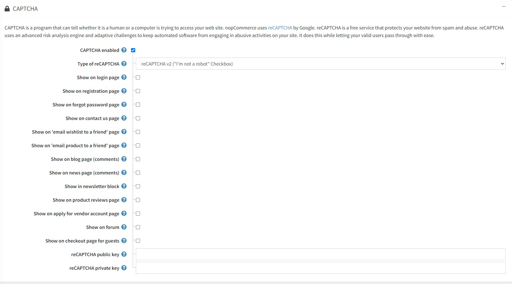

# Security settings

To manage security settings, go to **Configuration → Settings → General settings**.

This page enables multi-store configuration; it means that the same settings can be defined for all stores or differ from store to store. If you want to manage settings for a certain store, choose its name from the multi-store configuration dropdown list and select all the checkboxes needed on the left to set custom values for them. For further details, refer to [Multi-store](xref:en/getting-started/advanced-configuration/multi-store).

## Security

Define the *Security* settings as follows:

* In the **Admin area allowed IP** field, enter the IP addresses that are allowed to access the back end. Leave this field empty if you do not want to restrict access to the back end. Use commas between the IP addresses (for example, 127.0.0.10, 232.18.204.16).
* Select **Enable honeypot** to enable [honeypot](https://en.wikipedia.org/wiki/Honeypot_(computing)). In computer terminology, a honeypot is a trap set to detect, deflect or, in some manner, counteract attempts of unauthorized use of information systems.
* In the **Encryption private key** field, enter the encryption private key used for storing sensitive data. Click **Change** at any time to change this key. All sensitive data are encrypted using this private key.

> [!NOTE]
>
> It is recommended to make a backup of your database before you change the encryption key. Sensitive data include all credit card information (only when this credit card information is stored in the store database).

## CAPTCHA

CAPTCHA is a program that can tell whether a human or a computer is trying to access your website. nopCommerce uses reCAPTCHA by Google. reCAPTCHA is a free service that protects your website from spam and abuse. reCAPTCHA uses an advanced risk analysis engine and adaptive challenges to keep automated software from engaging in abusive activities on your site while letting your valid users pass with ease.

Define the *CAPTCHA* settings as follows:

This panel will reveal the following settings when **CAPTCHA enabled** is selected:

* **Type of reCAPTCHA**: choose `reCAPTCHA v2` or `reCAPTCHA v3`. The difference between them is that reCAPTCHA v2 shows the "I'm not a robot" checkbox, whereas reCAPTCHA v3 is invisible to customers. Read more about [reCAPTCHA v2](https://developers.google.com/recaptcha/docs/display) and [reCAPTCHA v3](https://developers.google.com/recaptcha/docs/v3).
* **reCAPTCHA v3 score threshold** is enabled when reCAPTCHA v3 is selected. Read more about the score threshold [here](https://developers.google.com/recaptcha/docs/v3).
* Show CAPTCHA on the **login** page.
* Show CAPTCHA on the **registration** page.
* Show CAPTCHA on the **forgot password** page.
* Show CAPTCHA on the **contact us** page.
* Show CAPTCHA on the **email wishlist to a friend** page.
* Show CAPTCHA on the **email product to a friend** page.
* Show CAPTCHA on the **blog page (comments)**.
* Show CAPTCHA on the **news page (comments)**.
* Show CAPTCHA on the **product reviews** page.
* Show CAPTCHA on the **apply for vendor account** page.
* Show CAPTCHA on the **forum** page.
* Show CAPTCHA on the **guest checkout** page.
* Enter the reCAPTCHA **public key**.
* Enter the reCAPTCHA **private key**.

> [!NOTE]
>
> Dropped support for Recaptcha v1.
