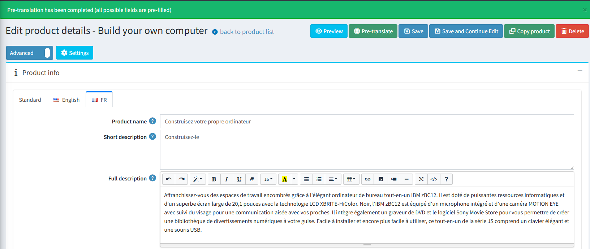

# Automated Content Translation

## Overview

This feature integrates automated translation capabilities into the core application, allowing store administrators to translate website content into multiple languages using two of the most popular machine translation platforms: **DeepL** and **Google Translate**.

Currently, automated translation is supported for the following entities:

- Category
- Manufacturer
- Product
- Product Attribute
- Specification Attribute

## Configuration

All settings for this feature are located on the **General settings** page within the **Translation** section.

Key configuration options include:

- **Allow to pre-translate**: A master switch to turn the entire translation functionality on or off.
- **Translate from the language**: In the "standard" tab, you can specify the default language from which all translations will be generated.
- **Languages to ignore**: A list of languages that should be excluded from the automated translation process.
- **Translation service**: A dropdown menu to select the translation service to use (DeepL or Google Translate).
  - **DeepL**: Requires an **Auth key**.
  - **Google Translate**: Requires an **API key**.

> [!NOTE]
>
> The system will not automatically translate a field that already contains a manually saved value.

## How to Use

Once the feature is enabled, using it is very straightforward. A new button will appear in the main button container on the edit pages for all supported entities. For example, on the product edit page, it looks like this:

1. Click the **"Pre-translate"** button.
1. If the translation is successful, a confirmation message will appear. The localized fields for other languages will be populated with the translated text.

    

1. If an error occurs during the translation process, a warning message will be displayed.

    

> [!WARNING]
>
> It is important to note that this function acts as a **pre-translation** tool. The translated content is populated in the fields but is **not saved automatically**. This gives the user full control to review, edit, or discard the translations before manually saving the changes.
